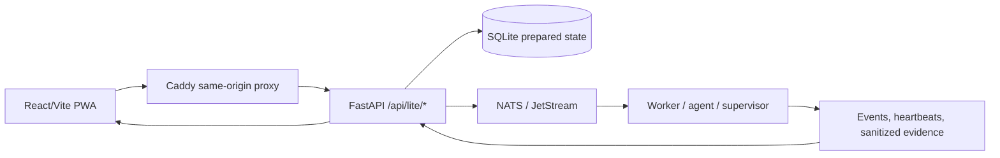

# Lite architecture as code

Verified
Development guidance

This page is generated from the active Lite source layout and architectural constraints.

Mandatory boundaries: the frontend never talks directly to NATS, never executes shell commands, and never stores backend secrets. Bootstrap commands remain backend-generated; agents and supervisors own execution and recovery.

## Active screen modules

- `src/lite/LiteHome.jsx`
- `src/lite/LiteDevices.jsx`
- `src/lite/LiteCatalog.jsx`
- `src/lite/LiteRecovery.jsx`
- `src/lite/LiteSecurity.jsx`
- `src/lite/LiteIdentity.jsx`
- `src/lite/LiteRules.jsx`