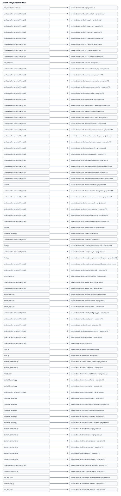

# Event encyclopedia

## Event-flow model

{ loading=lazy }

## `pocketlab.commands`

**Domain:** unknown
**Publisher:** workflow_engine.py
**Consumers:** unobserved-in-canonical-AsyncAPI
**Schema:** AsyncAPI channel metadata; payload schema is unobserved when channel has no message binding
**Lifecycle:** command
**Durability / replay:** incomplete / incomplete
**Ordering:** subject/consumer scoped; no global ordering inferred
**Idempotency:** consumer-specific; only canonical operation guarantees apply
**Acknowledgment:** incomplete
**Failure handling:** incomplete
**Audit:** sanitized lifecycle evidence must remain observable where runtime path declares audit/event ownership
**UI state:** FastAPI projection only; browser never subscribes to NATS
**Tests:** No exact source-derived test link
**Source/runtime owner:** pocket-lab-final-structure/runtime/api_fastapi/routers/events.py:134, pocket-lab-final-structure/runtime/api_fastapi/services/nats_bus.py:29, pocket-lab-final-structure/runtime/api_fastapi/services/nats_bus.py:540, pocket-lab-final-structure/runtime/api_fastapi/services/nats_bus.py:643, pocket-lab-final-structure/runtime/api_fastapi/services/nats_bus.py:695, pocket-lab-final-structure/runtime/api_fastapi/services/workflow_engine.py:1174, pocket-lab-final-structure/runtime/api_fastapi/services/workflow_engine.py:251, pocket-lab-final-structure/runtime/api_fastapi/services/workflow_engine.py:277, pocket-lab-final-structure/runtime/api_fastapi/services/workflow_engine.py:284, pocket-lab-final-structure/runtime/api_fastapi/services/workflow_engine.py:830, pocket-lab-final-structure/runtime/api_fastapi/services/workflow_projection_process.py:302, pocket-lab-final-structure/runtime/workers/pocketlab_worker.py:1279, pocket-lab-final-structure/runtime/workers/pocketlab_worker.py:42, pocket-lab-final-structure/runtime/workers/pocketlab_worker.py:564 / publisher/consumer processes listed above

## `pocketlab.commands.catalog.refresh`

**Domain:** catalog
**Publisher:** unobserved-in-canonical-AsyncAPI
**Consumers:** unobserved-in-canonical-AsyncAPI
**Schema:** AsyncAPI channel metadata; payload schema is unobserved when channel has no message binding
**Lifecycle:** command
**Durability / replay:** incomplete / incomplete
**Ordering:** subject/consumer scoped; no global ordering inferred
**Idempotency:** consumer-specific; only canonical operation guarantees apply
**Acknowledgment:** incomplete
**Failure handling:** incomplete
**Audit:** sanitized lifecycle evidence must remain observable where runtime path declares audit/event ownership
**UI state:** FastAPI projection only; browser never subscribes to NATS
**Tests:** No exact source-derived test link
**Source/runtime owner:** pocket-lab-final-structure/runtime/api_fastapi/routers/catalog.py:29, pocket-lab-final-structure/runtime/api_fastapi/services/domain_commands.py:1363 / publisher/consumer processes listed above

## `pocketlab.commands.drift.apply`

**Domain:** drift
**Publisher:** unobserved-in-canonical-AsyncAPI
**Consumers:** unobserved-in-canonical-AsyncAPI
**Schema:** AsyncAPI channel metadata; payload schema is unobserved when channel has no message binding
**Lifecycle:** command
**Durability / replay:** incomplete / incomplete
**Ordering:** subject/consumer scoped; no global ordering inferred
**Idempotency:** consumer-specific; only canonical operation guarantees apply
**Acknowledgment:** incomplete
**Failure handling:** incomplete
**Audit:** sanitized lifecycle evidence must remain observable where runtime path declares audit/event ownership
**UI state:** FastAPI projection only; browser never subscribes to NATS
**Tests:** No exact source-derived test link
**Source/runtime owner:** pocket-lab-final-structure/runtime/api_fastapi/services/domain_commands.py:1370 / publisher/consumer processes listed above

## `pocketlab.commands.drift.approve`

**Domain:** drift
**Publisher:** unobserved-in-canonical-AsyncAPI
**Consumers:** unobserved-in-canonical-AsyncAPI
**Schema:** AsyncAPI channel metadata; payload schema is unobserved when channel has no message binding
**Lifecycle:** command
**Durability / replay:** incomplete / incomplete
**Ordering:** subject/consumer scoped; no global ordering inferred
**Idempotency:** consumer-specific; only canonical operation guarantees apply
**Acknowledgment:** incomplete
**Failure handling:** incomplete
**Audit:** sanitized lifecycle evidence must remain observable where runtime path declares audit/event ownership
**UI state:** FastAPI projection only; browser never subscribes to NATS
**Tests:** No exact source-derived test link
**Source/runtime owner:** pocket-lab-final-structure/runtime/api_fastapi/services/domain_commands.py:1367 / publisher/consumer processes listed above

## `pocketlab.commands.drift.ignore`

**Domain:** drift
**Publisher:** unobserved-in-canonical-AsyncAPI
**Consumers:** unobserved-in-canonical-AsyncAPI
**Schema:** AsyncAPI channel metadata; payload schema is unobserved when channel has no message binding
**Lifecycle:** command
**Durability / replay:** incomplete / incomplete
**Ordering:** subject/consumer scoped; no global ordering inferred
**Idempotency:** consumer-specific; only canonical operation guarantees apply
**Acknowledgment:** incomplete
**Failure handling:** incomplete
**Audit:** sanitized lifecycle evidence must remain observable where runtime path declares audit/event ownership
**UI state:** FastAPI projection only; browser never subscribes to NATS
**Tests:** No exact source-derived test link
**Source/runtime owner:** pocket-lab-final-structure/runtime/api_fastapi/services/domain_commands.py:1373 / publisher/consumer processes listed above

## `pocketlab.commands.drift.preview`

**Domain:** drift
**Publisher:** unobserved-in-canonical-AsyncAPI
**Consumers:** unobserved-in-canonical-AsyncAPI
**Schema:** AsyncAPI channel metadata; payload schema is unobserved when channel has no message binding
**Lifecycle:** command
**Durability / replay:** incomplete / incomplete
**Ordering:** subject/consumer scoped; no global ordering inferred
**Idempotency:** consumer-specific; only canonical operation guarantees apply
**Acknowledgment:** incomplete
**Failure handling:** incomplete
**Audit:** sanitized lifecycle evidence must remain observable where runtime path declares audit/event ownership
**UI state:** FastAPI projection only; browser never subscribes to NATS
**Tests:** No exact source-derived test link
**Source/runtime owner:** pocket-lab-final-structure/runtime/api_fastapi/routers/drift.py:92, pocket-lab-final-structure/runtime/api_fastapi/services/domain_commands.py:1366 / publisher/consumer processes listed above

## `pocketlab.commands.drift.rescan`

**Domain:** drift
**Publisher:** unobserved-in-canonical-AsyncAPI
**Consumers:** unobserved-in-canonical-AsyncAPI
**Schema:** AsyncAPI channel metadata; payload schema is unobserved when channel has no message binding
**Lifecycle:** command
**Durability / replay:** incomplete / incomplete
**Ordering:** subject/consumer scoped; no global ordering inferred
**Idempotency:** consumer-specific; only canonical operation guarantees apply
**Acknowledgment:** incomplete
**Failure handling:** incomplete
**Audit:** sanitized lifecycle evidence must remain observable where runtime path declares audit/event ownership
**UI state:** FastAPI projection only; browser never subscribes to NATS
**Tests:** No exact source-derived test link
**Source/runtime owner:** pocket-lab-final-structure/runtime/api_fastapi/services/domain_commands.py:1365 / publisher/consumer processes listed above

## `pocketlab.commands.drift.scan`

**Domain:** drift
**Publisher:** unobserved-in-canonical-AsyncAPI
**Consumers:** unobserved-in-canonical-AsyncAPI
**Schema:** AsyncAPI channel metadata; payload schema is unobserved when channel has no message binding
**Lifecycle:** command
**Durability / replay:** incomplete / incomplete
**Ordering:** subject/consumer scoped; no global ordering inferred
**Idempotency:** consumer-specific; only canonical operation guarantees apply
**Acknowledgment:** incomplete
**Failure handling:** incomplete
**Audit:** sanitized lifecycle evidence must remain observable where runtime path declares audit/event ownership
**UI state:** FastAPI projection only; browser never subscribes to NATS
**Tests:** No exact source-derived test link
**Source/runtime owner:** pocket-lab-final-structure/runtime/api_fastapi/routers/operations.py:81, pocket-lab-final-structure/runtime/api_fastapi/services/domain_commands.py:1364 / publisher/consumer processes listed above

## `pocketlab.commands.drift.{action}`

**Domain:** drift
**Publisher:** unobserved-in-canonical-AsyncAPI
**Consumers:** unobserved-in-canonical-AsyncAPI
**Schema:** AsyncAPI channel metadata; payload schema is unobserved when channel has no message binding
**Lifecycle:** command
**Durability / replay:** incomplete / incomplete
**Ordering:** subject/consumer scoped; no global ordering inferred
**Idempotency:** consumer-specific; only canonical operation guarantees apply
**Acknowledgment:** incomplete
**Failure handling:** incomplete
**Audit:** sanitized lifecycle evidence must remain observable where runtime path declares audit/event ownership
**UI state:** FastAPI projection only; browser never subscribes to NATS
**Tests:** No exact source-derived test link
**Source/runtime owner:** pocket-lab-final-structure/runtime/api_fastapi/routers/drift.py:85, pocket-lab-final-structure/runtime/api_fastapi/routers/drift.py:99 / publisher/consumer processes listed above

## `pocketlab.commands.fleet.join`

**Domain:** fleet
**Publisher:** lite_invites.py
**Consumers:** unobserved-in-canonical-AsyncAPI
**Schema:** AsyncAPI channel metadata; payload schema is unobserved when channel has no message binding
**Lifecycle:** command
**Durability / replay:** incomplete / incomplete
**Ordering:** subject/consumer scoped; no global ordering inferred
**Idempotency:** consumer-specific; only canonical operation guarantees apply
**Acknowledgment:** incomplete
**Failure handling:** incomplete
**Audit:** sanitized lifecycle evidence must remain observable where runtime path declares audit/event ownership
**UI state:** FastAPI projection only; browser never subscribes to NATS
**Tests:** No exact source-derived test link
**Source/runtime owner:** pocket-lab-final-structure/runtime/api_fastapi/routers/fleet.py:661, pocket-lab-final-structure/runtime/api_fastapi/routers/operations.py:72, pocket-lab-final-structure/runtime/api_fastapi/services/domain_commands.py:1376, pocket-lab-final-structure/runtime/api_fastapi/services/lite_invites.py:902 / publisher/consumer processes listed above

## `pocketlab.commands.fleet.save_tailscale_key`

**Domain:** fleet
**Publisher:** unobserved-in-canonical-AsyncAPI
**Consumers:** unobserved-in-canonical-AsyncAPI
**Schema:** AsyncAPI channel metadata; payload schema is unobserved when channel has no message binding
**Lifecycle:** command
**Durability / replay:** incomplete / incomplete
**Ordering:** subject/consumer scoped; no global ordering inferred
**Idempotency:** consumer-specific; only canonical operation guarantees apply
**Acknowledgment:** incomplete
**Failure handling:** incomplete
**Audit:** sanitized lifecycle evidence must remain observable where runtime path declares audit/event ownership
**UI state:** FastAPI projection only; browser never subscribes to NATS
**Tests:** No exact source-derived test link
**Source/runtime owner:** pocket-lab-final-structure/runtime/api_fastapi/services/domain_commands.py:1377 / publisher/consumer processes listed above

## `pocketlab.commands.health.check`

**Domain:** health
**Publisher:** unobserved-in-canonical-AsyncAPI
**Consumers:** unobserved-in-canonical-AsyncAPI
**Schema:** AsyncAPI channel metadata; payload schema is unobserved when channel has no message binding
**Lifecycle:** command
**Durability / replay:** incomplete / incomplete
**Ordering:** subject/consumer scoped; no global ordering inferred
**Idempotency:** consumer-specific; only canonical operation guarantees apply
**Acknowledgment:** incomplete
**Failure handling:** incomplete
**Audit:** sanitized lifecycle evidence must remain observable where runtime path declares audit/event ownership
**UI state:** FastAPI projection only; browser never subscribes to NATS
**Tests:** No exact source-derived test link
**Source/runtime owner:** pocket-lab-final-structure/runtime/api_fastapi/routers/health.py:74, pocket-lab-final-structure/runtime/api_fastapi/services/domain_commands.py:1380 / publisher/consumer processes listed above

## `pocketlab.commands.lite.app.backup.create`

**Domain:** lite
**Publisher:** unobserved-in-canonical-AsyncAPI
**Consumers:** unobserved-in-canonical-AsyncAPI
**Schema:** AsyncAPI channel metadata; payload schema is unobserved when channel has no message binding
**Lifecycle:** command
**Durability / replay:** incomplete / incomplete
**Ordering:** subject/consumer scoped; no global ordering inferred
**Idempotency:** consumer-specific; only canonical operation guarantees apply
**Acknowledgment:** incomplete
**Failure handling:** incomplete
**Audit:** sanitized lifecycle evidence must remain observable where runtime path declares audit/event ownership
**UI state:** FastAPI projection only; browser never subscribes to NATS
**Tests:** No exact source-derived test link
**Source/runtime owner:** pocket-lab-final-structure/runtime/api_fastapi/services/domain_commands.py:1387, pocket-lab-final-structure/runtime/api_fastapi/services/lite_app_backup.py:18 / publisher/consumer processes listed above

## `pocketlab.commands.lite.app.backup.transfer`

**Domain:** lite
**Publisher:** unobserved-in-canonical-AsyncAPI
**Consumers:** unobserved-in-canonical-AsyncAPI
**Schema:** AsyncAPI channel metadata; payload schema is unobserved when channel has no message binding
**Lifecycle:** command
**Durability / replay:** incomplete / incomplete
**Ordering:** subject/consumer scoped; no global ordering inferred
**Idempotency:** consumer-specific; only canonical operation guarantees apply
**Acknowledgment:** incomplete
**Failure handling:** incomplete
**Audit:** sanitized lifecycle evidence must remain observable where runtime path declares audit/event ownership
**UI state:** FastAPI projection only; browser never subscribes to NATS
**Tests:** No exact source-derived test link
**Source/runtime owner:** pocket-lab-final-structure/runtime/api_fastapi/services/lite_app_backup_targets.py:12 / publisher/consumer processes listed above

## `pocketlab.commands.lite.app.media`

**Domain:** lite
**Publisher:** unobserved-in-canonical-AsyncAPI
**Consumers:** unobserved-in-canonical-AsyncAPI
**Schema:** AsyncAPI channel metadata; payload schema is unobserved when channel has no message binding
**Lifecycle:** command
**Durability / replay:** incomplete / incomplete
**Ordering:** subject/consumer scoped; no global ordering inferred
**Idempotency:** consumer-specific; only canonical operation guarantees apply
**Acknowledgment:** incomplete
**Failure handling:** incomplete
**Audit:** sanitized lifecycle evidence must remain observable where runtime path declares audit/event ownership
**UI state:** FastAPI projection only; browser never subscribes to NATS
**Tests:** No exact source-derived test link
**Source/runtime owner:** pocket-lab-final-structure/runtime/api_fastapi/services/domain_commands.py:1390, pocket-lab-final-structure/runtime/api_fastapi/services/lite_photoprism_media.py:22 / publisher/consumer processes listed above

## `pocketlab.commands.lite.app.repair`

**Domain:** lite
**Publisher:** unobserved-in-canonical-AsyncAPI
**Consumers:** unobserved-in-canonical-AsyncAPI
**Schema:** AsyncAPI channel metadata; payload schema is unobserved when channel has no message binding
**Lifecycle:** command
**Durability / replay:** incomplete / incomplete
**Ordering:** subject/consumer scoped; no global ordering inferred
**Idempotency:** consumer-specific; only canonical operation guarantees apply
**Acknowledgment:** incomplete
**Failure handling:** incomplete
**Audit:** sanitized lifecycle evidence must remain observable where runtime path declares audit/event ownership
**UI state:** FastAPI projection only; browser never subscribes to NATS
**Tests:** No exact source-derived test link
**Source/runtime owner:** pocket-lab-final-structure/runtime/api_fastapi/services/domain_commands.py:1392, pocket-lab-final-structure/runtime/api_fastapi/services/lite_app_operations.py:24 / publisher/consumer processes listed above

## `pocketlab.commands.lite.app.restore.preview`

**Domain:** lite
**Publisher:** unobserved-in-canonical-AsyncAPI
**Consumers:** unobserved-in-canonical-AsyncAPI
**Schema:** AsyncAPI channel metadata; payload schema is unobserved when channel has no message binding
**Lifecycle:** command
**Durability / replay:** incomplete / incomplete
**Ordering:** subject/consumer scoped; no global ordering inferred
**Idempotency:** consumer-specific; only canonical operation guarantees apply
**Acknowledgment:** incomplete
**Failure handling:** incomplete
**Audit:** sanitized lifecycle evidence must remain observable where runtime path declares audit/event ownership
**UI state:** FastAPI projection only; browser never subscribes to NATS
**Tests:** No exact source-derived test link
**Source/runtime owner:** pocket-lab-final-structure/runtime/api_fastapi/services/domain_commands.py:1388, pocket-lab-final-structure/runtime/api_fastapi/services/lite_app_backup.py:19 / publisher/consumer processes listed above

## `pocketlab.commands.lite.app.safety`

**Domain:** lite
**Publisher:** unobserved-in-canonical-AsyncAPI
**Consumers:** unobserved-in-canonical-AsyncAPI
**Schema:** AsyncAPI channel metadata; payload schema is unobserved when channel has no message binding
**Lifecycle:** command
**Durability / replay:** incomplete / incomplete
**Ordering:** subject/consumer scoped; no global ordering inferred
**Idempotency:** consumer-specific; only canonical operation guarantees apply
**Acknowledgment:** incomplete
**Failure handling:** incomplete
**Audit:** sanitized lifecycle evidence must remain observable where runtime path declares audit/event ownership
**UI state:** FastAPI projection only; browser never subscribes to NATS
**Tests:** No exact source-derived test link
**Source/runtime owner:** pocket-lab-final-structure/runtime/api_fastapi/services/domain_commands.py:1391, pocket-lab-final-structure/runtime/api_fastapi/services/lite_app_operations.py:23 / publisher/consumer processes listed above

## `pocketlab.commands.lite.app.update.check`

**Domain:** lite
**Publisher:** unobserved-in-canonical-AsyncAPI
**Consumers:** unobserved-in-canonical-AsyncAPI
**Schema:** AsyncAPI channel metadata; payload schema is unobserved when channel has no message binding
**Lifecycle:** command
**Durability / replay:** incomplete / incomplete
**Ordering:** subject/consumer scoped; no global ordering inferred
**Idempotency:** consumer-specific; only canonical operation guarantees apply
**Acknowledgment:** incomplete
**Failure handling:** incomplete
**Audit:** sanitized lifecycle evidence must remain observable where runtime path declares audit/event ownership
**UI state:** FastAPI projection only; browser never subscribes to NATS
**Tests:** No exact source-derived test link
**Source/runtime owner:** pocket-lab-final-structure/runtime/api_fastapi/services/domain_commands.py:1389, pocket-lab-final-structure/runtime/api_fastapi/services/lite_app_update.py:19 / publisher/consumer processes listed above

## `pocketlab.commands.lite.backup.create`

**Domain:** lite
**Publisher:** unobserved-in-canonical-AsyncAPI
**Consumers:** unobserved-in-canonical-AsyncAPI
**Schema:** AsyncAPI channel metadata; payload schema is unobserved when channel has no message binding
**Lifecycle:** command
**Durability / replay:** incomplete / incomplete
**Ordering:** subject/consumer scoped; no global ordering inferred
**Idempotency:** consumer-specific; only canonical operation guarantees apply
**Acknowledgment:** incomplete
**Failure handling:** incomplete
**Audit:** sanitized lifecycle evidence must remain observable where runtime path declares audit/event ownership
**UI state:** FastAPI projection only; browser never subscribes to NATS
**Tests:** No exact source-derived test link
**Source/runtime owner:** pocket-lab-final-structure/runtime/api_fastapi/routers/lite.py:3370, pocket-lab-final-structure/runtime/api_fastapi/services/domain_commands.py:1386 / publisher/consumer processes listed above

## `pocketlab.commands.lite.backup.verify`

**Domain:** lite
**Publisher:** unobserved-in-canonical-AsyncAPI
**Consumers:** unobserved-in-canonical-AsyncAPI
**Schema:** AsyncAPI channel metadata; payload schema is unobserved when channel has no message binding
**Lifecycle:** command
**Durability / replay:** incomplete / incomplete
**Ordering:** subject/consumer scoped; no global ordering inferred
**Idempotency:** consumer-specific; only canonical operation guarantees apply
**Acknowledgment:** incomplete
**Failure handling:** incomplete
**Audit:** sanitized lifecycle evidence must remain observable where runtime path declares audit/event ownership
**UI state:** FastAPI projection only; browser never subscribes to NATS
**Tests:** No exact source-derived test link
**Source/runtime owner:** pocket-lab-final-structure/runtime/api_fastapi/routers/lite.py:3442, pocket-lab-final-structure/runtime/api_fastapi/services/domain_commands.py:1393 / publisher/consumer processes listed above

## `pocketlab.commands.lite.catalog.install`

**Domain:** lite
**Publisher:** unobserved-in-canonical-AsyncAPI
**Consumers:** unobserved-in-canonical-AsyncAPI
**Schema:** AsyncAPI channel metadata; payload schema is unobserved when channel has no message binding
**Lifecycle:** command
**Durability / replay:** incomplete / incomplete
**Ordering:** subject/consumer scoped; no global ordering inferred
**Idempotency:** consumer-specific; only canonical operation guarantees apply
**Acknowledgment:** incomplete
**Failure handling:** incomplete
**Audit:** sanitized lifecycle evidence must remain observable where runtime path declares audit/event ownership
**UI state:** FastAPI projection only; browser never subscribes to NATS
**Tests:** No exact source-derived test link
**Source/runtime owner:** pocket-lab-final-structure/runtime/api_fastapi/services/domain_commands.py:1362, pocket-lab-final-structure/runtime/api_fastapi/services/lite_catalog.py:16 / publisher/consumer processes listed above

## `pocketlab.commands.lite.database.backup`

**Domain:** lite
**Publisher:** unobserved-in-canonical-AsyncAPI
**Consumers:** unobserved-in-canonical-AsyncAPI
**Schema:** AsyncAPI channel metadata; payload schema is unobserved when channel has no message binding
**Lifecycle:** command
**Durability / replay:** incomplete / incomplete
**Ordering:** subject/consumer scoped; no global ordering inferred
**Idempotency:** consumer-specific; only canonical operation guarantees apply
**Acknowledgment:** incomplete
**Failure handling:** incomplete
**Audit:** sanitized lifecycle evidence must remain observable where runtime path declares audit/event ownership
**UI state:** FastAPI projection only; browser never subscribes to NATS
**Tests:** No exact source-derived test link
**Source/runtime owner:** pocket-lab-final-structure/runtime/api_fastapi/routers/lite.py:3075, pocket-lab-final-structure/runtime/api_fastapi/services/domain_commands.py:1396 / publisher/consumer processes listed above

## `pocketlab.commands.lite.database.backup.verify`

**Domain:** lite
**Publisher:** unobserved-in-canonical-AsyncAPI
**Consumers:** unobserved-in-canonical-AsyncAPI
**Schema:** AsyncAPI channel metadata; payload schema is unobserved when channel has no message binding
**Lifecycle:** command
**Durability / replay:** incomplete / incomplete
**Ordering:** subject/consumer scoped; no global ordering inferred
**Idempotency:** consumer-specific; only canonical operation guarantees apply
**Acknowledgment:** incomplete
**Failure handling:** incomplete
**Audit:** sanitized lifecycle evidence must remain observable where runtime path declares audit/event ownership
**UI state:** FastAPI projection only; browser never subscribes to NATS
**Tests:** No exact source-derived test link
**Source/runtime owner:** pocket-lab-final-structure/runtime/api_fastapi/routers/lite.py:3118, pocket-lab-final-structure/runtime/api_fastapi/services/domain_commands.py:1397 / publisher/consumer processes listed above

## `pocketlab.commands.lite.database.restore`

**Domain:** lite
**Publisher:** unobserved-in-canonical-AsyncAPI
**Consumers:** unobserved-in-canonical-AsyncAPI
**Schema:** AsyncAPI channel metadata; payload schema is unobserved when channel has no message binding
**Lifecycle:** command
**Durability / replay:** incomplete / incomplete
**Ordering:** subject/consumer scoped; no global ordering inferred
**Idempotency:** consumer-specific; only canonical operation guarantees apply
**Acknowledgment:** incomplete
**Failure handling:** incomplete
**Audit:** sanitized lifecycle evidence must remain observable where runtime path declares audit/event ownership
**UI state:** FastAPI projection only; browser never subscribes to NATS
**Tests:** No exact source-derived test link
**Source/runtime owner:** pocket-lab-final-structure/runtime/api_fastapi/routers/lite.py:3176, pocket-lab-final-structure/runtime/api_fastapi/services/domain_commands.py:1399 / publisher/consumer processes listed above

## `pocketlab.commands.lite.database.restore.preview`

**Domain:** lite
**Publisher:** unobserved-in-canonical-AsyncAPI
**Consumers:** unobserved-in-canonical-AsyncAPI
**Schema:** AsyncAPI channel metadata; payload schema is unobserved when channel has no message binding
**Lifecycle:** command
**Durability / replay:** incomplete / incomplete
**Ordering:** subject/consumer scoped; no global ordering inferred
**Idempotency:** consumer-specific; only canonical operation guarantees apply
**Acknowledgment:** incomplete
**Failure handling:** incomplete
**Audit:** sanitized lifecycle evidence must remain observable where runtime path declares audit/event ownership
**UI state:** FastAPI projection only; browser never subscribes to NATS
**Tests:** No exact source-derived test link
**Source/runtime owner:** pocket-lab-final-structure/runtime/api_fastapi/routers/lite.py:3136, pocket-lab-final-structure/runtime/api_fastapi/services/domain_commands.py:1398 / publisher/consumer processes listed above

## `pocketlab.commands.lite.device.restart`

**Domain:** devices
**Publisher:** FastAPI
**Consumers:** node agent
**Schema:** AsyncAPI channel metadata; payload schema is unobserved when channel has no message binding
**Lifecycle:** command
**Durability / replay:** unvalidated / unvalidated
**Ordering:** subject/consumer scoped; no global ordering inferred
**Idempotency:** consumer-specific; only canonical operation guarantees apply
**Acknowledgment:** JetStream durable command
**Failure handling:** bounded command lifecycle
**Audit:** sanitized lifecycle evidence must remain observable where runtime path declares audit/event ownership
**UI state:** FastAPI projection only; browser never subscribes to NATS
**Tests:** No exact source-derived test link
**Source/runtime owner:** unobserved-in-source-search; channel remains canonical from AsyncAPI / publisher/consumer processes listed above

## `pocketlab.commands.lite.maintenance.checkpoint`

**Domain:** lite
**Publisher:** unobserved-in-canonical-AsyncAPI
**Consumers:** unobserved-in-canonical-AsyncAPI
**Schema:** AsyncAPI channel metadata; payload schema is unobserved when channel has no message binding
**Lifecycle:** command
**Durability / replay:** incomplete / incomplete
**Ordering:** subject/consumer scoped; no global ordering inferred
**Idempotency:** consumer-specific; only canonical operation guarantees apply
**Acknowledgment:** incomplete
**Failure handling:** incomplete
**Audit:** sanitized lifecycle evidence must remain observable where runtime path declares audit/event ownership
**UI state:** FastAPI projection only; browser never subscribes to NATS
**Tests:** No exact source-derived test link
**Source/runtime owner:** pocket-lab-final-structure/runtime/api_fastapi/routers/lite.py:3244, pocket-lab-final-structure/runtime/api_fastapi/services/domain_commands.py:1401 / publisher/consumer processes listed above

## `pocketlab.commands.lite.maintenance.retention`

**Domain:** lite
**Publisher:** unobserved-in-canonical-AsyncAPI
**Consumers:** unobserved-in-canonical-AsyncAPI
**Schema:** AsyncAPI channel metadata; payload schema is unobserved when channel has no message binding
**Lifecycle:** command
**Durability / replay:** incomplete / incomplete
**Ordering:** subject/consumer scoped; no global ordering inferred
**Idempotency:** consumer-specific; only canonical operation guarantees apply
**Acknowledgment:** incomplete
**Failure handling:** incomplete
**Audit:** sanitized lifecycle evidence must remain observable where runtime path declares audit/event ownership
**UI state:** FastAPI projection only; browser never subscribes to NATS
**Tests:** No exact source-derived test link
**Source/runtime owner:** pocket-lab-final-structure/runtime/api_fastapi/routers/lite.py:3218, pocket-lab-final-structure/runtime/api_fastapi/services/domain_commands.py:1400 / publisher/consumer processes listed above

## `pocketlab.commands.lite.restore.apply`

**Domain:** lite
**Publisher:** unobserved-in-canonical-AsyncAPI
**Consumers:** unobserved-in-canonical-AsyncAPI
**Schema:** AsyncAPI channel metadata; payload schema is unobserved when channel has no message binding
**Lifecycle:** command
**Durability / replay:** incomplete / incomplete
**Ordering:** subject/consumer scoped; no global ordering inferred
**Idempotency:** consumer-specific; only canonical operation guarantees apply
**Acknowledgment:** incomplete
**Failure handling:** incomplete
**Audit:** sanitized lifecycle evidence must remain observable where runtime path declares audit/event ownership
**UI state:** FastAPI projection only; browser never subscribes to NATS
**Tests:** No exact source-derived test link
**Source/runtime owner:** pocket-lab-final-structure/runtime/api_fastapi/routers/lite.py:3556, pocket-lab-final-structure/runtime/api_fastapi/services/domain_commands.py:1395 / publisher/consumer processes listed above

## `pocketlab.commands.lite.restore.preview`

**Domain:** lite
**Publisher:** unobserved-in-canonical-AsyncAPI
**Consumers:** unobserved-in-canonical-AsyncAPI
**Schema:** AsyncAPI channel metadata; payload schema is unobserved when channel has no message binding
**Lifecycle:** command
**Durability / replay:** incomplete / incomplete
**Ordering:** subject/consumer scoped; no global ordering inferred
**Idempotency:** consumer-specific; only canonical operation guarantees apply
**Acknowledgment:** incomplete
**Failure handling:** incomplete
**Audit:** sanitized lifecycle evidence must remain observable where runtime path declares audit/event ownership
**UI state:** FastAPI projection only; browser never subscribes to NATS
**Tests:** No exact source-derived test link
**Source/runtime owner:** pocket-lab-final-structure/runtime/api_fastapi/routers/lite.py:3462, pocket-lab-final-structure/runtime/api_fastapi/services/domain_commands.py:1394 / publisher/consumer processes listed above

## `pocketlab.commands.lite.security.app_scan`

**Domain:** lite
**Publisher:** unobserved-in-canonical-AsyncAPI
**Consumers:** unobserved-in-canonical-AsyncAPI
**Schema:** AsyncAPI channel metadata; payload schema is unobserved when channel has no message binding
**Lifecycle:** command
**Durability / replay:** incomplete / incomplete
**Ordering:** subject/consumer scoped; no global ordering inferred
**Idempotency:** consumer-specific; only canonical operation guarantees apply
**Acknowledgment:** incomplete
**Failure handling:** incomplete
**Audit:** sanitized lifecycle evidence must remain observable where runtime path declares audit/event ownership
**UI state:** FastAPI projection only; browser never subscribes to NATS
**Tests:** No exact source-derived test link
**Source/runtime owner:** pocket-lab-final-structure/runtime/api_fastapi/services/lite_app_profiles.py:13 / publisher/consumer processes listed above

## `pocketlab.commands.lite.security.scan`

**Domain:** security
**Publisher:** FastAPI
**Consumers:** pocket-worker
**Schema:** AsyncAPI channel metadata; payload schema is unobserved when channel has no message binding
**Lifecycle:** command
**Durability / replay:** pocketlab_command_worker_v1 / POCKETLAB_COMMANDS
**Ordering:** subject/consumer scoped; no global ordering inferred
**Idempotency:** consumer-specific; only canonical operation guarantees apply
**Acknowledgment:** JetStream durable pull
**Failure handling:** bounded max-deliver and stale-run recovery
**Audit:** sanitized lifecycle evidence must remain observable where runtime path declares audit/event ownership
**UI state:** FastAPI projection only; browser never subscribes to NATS
**Tests:** No exact source-derived test link
**Source/runtime owner:** pocket-lab-final-structure/runtime/api_fastapi/services/domain_commands.py:1382, pocket-lab-final-structure/runtime/api_fastapi/services/lite_security_policy.py:11, pocket-lab-final-structure/runtime/workers/pocketlab_worker.py:473 / publisher/consumer processes listed above

## `pocketlab.commands.node`

**Domain:** node
**Publisher:** pocketlab_worker.py
**Consumers:** pocketlab_worker.py
**Schema:** AsyncAPI channel metadata; payload schema is unobserved when channel has no message binding
**Lifecycle:** command
**Durability / replay:** incomplete / incomplete
**Ordering:** subject/consumer scoped; no global ordering inferred
**Idempotency:** consumer-specific; only canonical operation guarantees apply
**Acknowledgment:** incomplete
**Failure handling:** incomplete
**Audit:** sanitized lifecycle evidence must remain observable where runtime path declares audit/event ownership
**UI state:** FastAPI projection only; browser never subscribes to NATS
**Tests:** No exact source-derived test link
**Source/runtime owner:** pocket-lab-final-structure/runtime/api_fastapi/routers/events.py:136, pocket-lab-final-structure/runtime/workers/pocketlab_worker.py:1256, pocket-lab-final-structure/runtime/workers/pocketlab_worker.py:507 / publisher/consumer processes listed above

## `pocketlab.commands.node.all`

**Domain:** node
**Publisher:** unobserved-in-canonical-AsyncAPI
**Consumers:** pocketlab_node_agent.py
**Schema:** AsyncAPI channel metadata; payload schema is unobserved when channel has no message binding
**Lifecycle:** command
**Durability / replay:** incomplete / incomplete
**Ordering:** subject/consumer scoped; no global ordering inferred
**Idempotency:** consumer-specific; only canonical operation guarantees apply
**Acknowledgment:** incomplete
**Failure handling:** incomplete
**Audit:** sanitized lifecycle evidence must remain observable where runtime path declares audit/event ownership
**UI state:** FastAPI projection only; browser never subscribes to NATS
**Tests:** No exact source-derived test link
**Source/runtime owner:** pocket-lab-final-structure/runtime/agents/pocketlab_node_agent.py:515, pocket-lab-final-structure/runtime/api_fastapi/routers/events.py:137 / publisher/consumer processes listed above

## `pocketlab.commands.node.all.{command.replace`

**Domain:** node
**Publisher:** fleet.py
**Consumers:** unobserved-in-canonical-AsyncAPI
**Schema:** AsyncAPI channel metadata; payload schema is unobserved when channel has no message binding
**Lifecycle:** command
**Durability / replay:** incomplete / incomplete
**Ordering:** subject/consumer scoped; no global ordering inferred
**Idempotency:** consumer-specific; only canonical operation guarantees apply
**Acknowledgment:** incomplete
**Failure handling:** incomplete
**Audit:** sanitized lifecycle evidence must remain observable where runtime path declares audit/event ownership
**UI state:** FastAPI projection only; browser never subscribes to NATS
**Tests:** No exact source-derived test link
**Source/runtime owner:** pocket-lab-final-structure/runtime/api_fastapi/routers/fleet.py:473 / publisher/consumer processes listed above

## `pocketlab.commands.node.{node_id}`

**Domain:** node
**Publisher:** unobserved-in-canonical-AsyncAPI
**Consumers:** unobserved-in-canonical-AsyncAPI
**Schema:** AsyncAPI channel metadata; payload schema is unobserved when channel has no message binding
**Lifecycle:** command
**Durability / replay:** incomplete / incomplete
**Ordering:** subject/consumer scoped; no global ordering inferred
**Idempotency:** consumer-specific; only canonical operation guarantees apply
**Acknowledgment:** incomplete
**Failure handling:** incomplete
**Audit:** sanitized lifecycle evidence must remain observable where runtime path declares audit/event ownership
**UI state:** FastAPI projection only; browser never subscribes to NATS
**Tests:** No exact source-derived test link
**Source/runtime owner:** pocket-lab-final-structure/runtime/api_fastapi/services/fleet_registry.py:1591 / publisher/consumer processes listed above

## `pocketlab.commands.node.{node_id}.{command.replace`

**Domain:** node
**Publisher:** fleet.py
**Consumers:** unobserved-in-canonical-AsyncAPI
**Schema:** AsyncAPI channel metadata; payload schema is unobserved when channel has no message binding
**Lifecycle:** command
**Durability / replay:** incomplete / incomplete
**Ordering:** subject/consumer scoped; no global ordering inferred
**Idempotency:** consumer-specific; only canonical operation guarantees apply
**Acknowledgment:** incomplete
**Failure handling:** incomplete
**Audit:** sanitized lifecycle evidence must remain observable where runtime path declares audit/event ownership
**UI state:** FastAPI projection only; browser never subscribes to NATS
**Tests:** No exact source-derived test link
**Source/runtime owner:** pocket-lab-final-structure/runtime/api_fastapi/routers/fleet.py:288 / publisher/consumer processes listed above

## `pocketlab.commands.node.{normalized_node_id}.agent.restart`

**Domain:** node
**Publisher:** unobserved-in-canonical-AsyncAPI
**Consumers:** unobserved-in-canonical-AsyncAPI
**Schema:** AsyncAPI channel metadata; payload schema is unobserved when channel has no message binding
**Lifecycle:** command
**Durability / replay:** incomplete / incomplete
**Ordering:** subject/consumer scoped; no global ordering inferred
**Idempotency:** consumer-specific; only canonical operation guarantees apply
**Acknowledgment:** incomplete
**Failure handling:** incomplete
**Audit:** sanitized lifecycle evidence must remain observable where runtime path declares audit/event ownership
**UI state:** FastAPI projection only; browser never subscribes to NATS
**Tests:** No exact source-derived test link
**Source/runtime owner:** pocket-lab-final-structure/runtime/api_fastapi/routers/fleet.py:364 / publisher/consumer processes listed above

## `pocketlab.commands.node.{self.node_id}`

**Domain:** node
**Publisher:** unobserved-in-canonical-AsyncAPI
**Consumers:** pocketlab_node_agent.py
**Schema:** AsyncAPI channel metadata; payload schema is unobserved when channel has no message binding
**Lifecycle:** command
**Durability / replay:** incomplete / incomplete
**Ordering:** subject/consumer scoped; no global ordering inferred
**Idempotency:** consumer-specific; only canonical operation guarantees apply
**Acknowledgment:** incomplete
**Failure handling:** incomplete
**Audit:** sanitized lifecycle evidence must remain observable where runtime path declares audit/event ownership
**UI state:** FastAPI projection only; browser never subscribes to NATS
**Tests:** No exact source-derived test link
**Source/runtime owner:** pocket-lab-final-structure/runtime/agents/pocketlab_node_agent.py:515 / publisher/consumer processes listed above

## `pocketlab.commands.operation.execute`

**Domain:** operation
**Publisher:** action_queue.py, pocketlab_worker.py, reliability.py
**Consumers:** unobserved-in-canonical-AsyncAPI
**Schema:** AsyncAPI channel metadata; payload schema is unobserved when channel has no message binding
**Lifecycle:** command
**Durability / replay:** incomplete / incomplete
**Ordering:** subject/consumer scoped; no global ordering inferred
**Idempotency:** consumer-specific; only canonical operation guarantees apply
**Acknowledgment:** incomplete
**Failure handling:** incomplete
**Audit:** sanitized lifecycle evidence must remain observable where runtime path declares audit/event ownership
**UI state:** FastAPI projection only; browser never subscribes to NATS
**Tests:** No exact source-derived test link
**Source/runtime owner:** pocket-lab-final-structure/runtime/api_fastapi/services/action_queue.py:213, pocket-lab-final-structure/runtime/api_fastapi/services/action_queue.py:223, pocket-lab-final-structure/runtime/api_fastapi/services/reliability.py:162, pocket-lab-final-structure/runtime/api_fastapi/services/reliability.py:231, pocket-lab-final-structure/runtime/api_fastapi/services/workflow_engine.py:1193, pocket-lab-final-structure/runtime/api_fastapi/services/workflow_engine.py:1201, pocket-lab-final-structure/runtime/workers/pocketlab_worker.py:1255, pocket-lab-final-structure/runtime/workers/pocketlab_worker.py:1277, pocket-lab-final-structure/runtime/workers/pocketlab_worker.py:535, pocket-lab-final-structure/runtime/workers/pocketlab_worker.py:562 / publisher/consumer processes listed above

## `pocketlab.commands.release.apply`

**Domain:** release
**Publisher:** unobserved-in-canonical-AsyncAPI
**Consumers:** unobserved-in-canonical-AsyncAPI
**Schema:** AsyncAPI channel metadata; payload schema is unobserved when channel has no message binding
**Lifecycle:** command
**Durability / replay:** incomplete / incomplete
**Ordering:** subject/consumer scoped; no global ordering inferred
**Idempotency:** consumer-specific; only canonical operation guarantees apply
**Acknowledgment:** incomplete
**Failure handling:** incomplete
**Audit:** sanitized lifecycle evidence must remain observable where runtime path declares audit/event ownership
**UI state:** FastAPI projection only; browser never subscribes to NATS
**Tests:** No exact source-derived test link
**Source/runtime owner:** pocket-lab-final-structure/runtime/api_fastapi/routers/release.py:53, pocket-lab-final-structure/runtime/api_fastapi/services/domain_commands.py:1379 / publisher/consumer processes listed above

## `pocketlab.commands.release.check`

**Domain:** release
**Publisher:** unobserved-in-canonical-AsyncAPI
**Consumers:** unobserved-in-canonical-AsyncAPI
**Schema:** AsyncAPI channel metadata; payload schema is unobserved when channel has no message binding
**Lifecycle:** command
**Durability / replay:** incomplete / incomplete
**Ordering:** subject/consumer scoped; no global ordering inferred
**Idempotency:** consumer-specific; only canonical operation guarantees apply
**Acknowledgment:** incomplete
**Failure handling:** incomplete
**Audit:** sanitized lifecycle evidence must remain observable where runtime path declares audit/event ownership
**UI state:** FastAPI projection only; browser never subscribes to NATS
**Tests:** No exact source-derived test link
**Source/runtime owner:** pocket-lab-final-structure/runtime/api_fastapi/routers/release.py:42, pocket-lab-final-structure/runtime/api_fastapi/services/domain_commands.py:1378 / publisher/consumer processes listed above

## `pocketlab.commands.runbook.approve`

**Domain:** runbook
**Publisher:** action_queue.py, pocketlab_worker.py
**Consumers:** unobserved-in-canonical-AsyncAPI
**Schema:** AsyncAPI channel metadata; payload schema is unobserved when channel has no message binding
**Lifecycle:** command
**Durability / replay:** incomplete / incomplete
**Ordering:** subject/consumer scoped; no global ordering inferred
**Idempotency:** consumer-specific; only canonical operation guarantees apply
**Acknowledgment:** incomplete
**Failure handling:** incomplete
**Audit:** sanitized lifecycle evidence must remain observable where runtime path declares audit/event ownership
**UI state:** FastAPI projection only; browser never subscribes to NATS
**Tests:** No exact source-derived test link
**Source/runtime owner:** pocket-lab-final-structure/runtime/api_fastapi/services/action_queue.py:541, pocket-lab-final-structure/runtime/api_fastapi/services/action_queue.py:552, pocket-lab-final-structure/runtime/workers/pocketlab_worker.py:1269, pocket-lab-final-structure/runtime/workers/pocketlab_worker.py:533, pocket-lab-final-structure/runtime/workers/pocketlab_worker.py:554 / publisher/consumer processes listed above

## `pocketlab.commands.runbook.execute`

**Domain:** runbook
**Publisher:** action_queue.py
**Consumers:** unobserved-in-canonical-AsyncAPI
**Schema:** AsyncAPI channel metadata; payload schema is unobserved when channel has no message binding
**Lifecycle:** command
**Durability / replay:** incomplete / incomplete
**Ordering:** subject/consumer scoped; no global ordering inferred
**Idempotency:** consumer-specific; only canonical operation guarantees apply
**Acknowledgment:** incomplete
**Failure handling:** incomplete
**Audit:** sanitized lifecycle evidence must remain observable where runtime path declares audit/event ownership
**UI state:** FastAPI projection only; browser never subscribes to NATS
**Tests:** No exact source-derived test link
**Source/runtime owner:** pocket-lab-final-structure/runtime/api_fastapi/services/action_queue.py:482, pocket-lab-final-structure/runtime/api_fastapi/services/action_queue.py:493, pocket-lab-final-structure/runtime/workers/pocketlab_worker.py:1265, pocket-lab-final-structure/runtime/workers/pocketlab_worker.py:532, pocket-lab-final-structure/runtime/workers/pocketlab_worker.py:550 / publisher/consumer processes listed above

## `pocketlab.commands.runbook.reject`

**Domain:** runbook
**Publisher:** action_queue.py, pocketlab_worker.py
**Consumers:** unobserved-in-canonical-AsyncAPI
**Schema:** AsyncAPI channel metadata; payload schema is unobserved when channel has no message binding
**Lifecycle:** command
**Durability / replay:** incomplete / incomplete
**Ordering:** subject/consumer scoped; no global ordering inferred
**Idempotency:** consumer-specific; only canonical operation guarantees apply
**Acknowledgment:** incomplete
**Failure handling:** incomplete
**Audit:** sanitized lifecycle evidence must remain observable where runtime path declares audit/event ownership
**UI state:** FastAPI projection only; browser never subscribes to NATS
**Tests:** No exact source-derived test link
**Source/runtime owner:** pocket-lab-final-structure/runtime/api_fastapi/services/action_queue.py:571, pocket-lab-final-structure/runtime/api_fastapi/services/action_queue.py:582, pocket-lab-final-structure/runtime/workers/pocketlab_worker.py:1273, pocket-lab-final-structure/runtime/workers/pocketlab_worker.py:534, pocket-lab-final-structure/runtime/workers/pocketlab_worker.py:558 / publisher/consumer processes listed above

## `pocketlab.commands.security.configure_opa`

**Domain:** security
**Publisher:** unobserved-in-canonical-AsyncAPI
**Consumers:** unobserved-in-canonical-AsyncAPI
**Schema:** AsyncAPI channel metadata; payload schema is unobserved when channel has no message binding
**Lifecycle:** command
**Durability / replay:** incomplete / incomplete
**Ordering:** subject/consumer scoped; no global ordering inferred
**Idempotency:** consumer-specific; only canonical operation guarantees apply
**Acknowledgment:** incomplete
**Failure handling:** incomplete
**Audit:** sanitized lifecycle evidence must remain observable where runtime path declares audit/event ownership
**UI state:** FastAPI projection only; browser never subscribes to NATS
**Tests:** No exact source-derived test link
**Source/runtime owner:** pocket-lab-final-structure/runtime/api_fastapi/routers/lite.py:2776, pocket-lab-final-structure/runtime/api_fastapi/services/domain_commands.py:1383 / publisher/consumer processes listed above

## `pocketlab.commands.security.scan`

**Domain:** security
**Publisher:** unobserved-in-canonical-AsyncAPI
**Consumers:** unobserved-in-canonical-AsyncAPI
**Schema:** AsyncAPI channel metadata; payload schema is unobserved when channel has no message binding
**Lifecycle:** command
**Durability / replay:** incomplete / incomplete
**Ordering:** subject/consumer scoped; no global ordering inferred
**Idempotency:** consumer-specific; only canonical operation guarantees apply
**Acknowledgment:** incomplete
**Failure handling:** incomplete
**Audit:** sanitized lifecycle evidence must remain observable where runtime path declares audit/event ownership
**UI state:** FastAPI projection only; browser never subscribes to NATS
**Tests:** No exact source-derived test link
**Source/runtime owner:** pocket-lab-final-structure/runtime/api_fastapi/routers/security.py:68, pocket-lab-final-structure/runtime/api_fastapi/services/domain_commands.py:1381 / publisher/consumer processes listed above

## `pocketlab.commands.unknown`

**Domain:** unknown
**Publisher:** unobserved-in-canonical-AsyncAPI
**Consumers:** unobserved-in-canonical-AsyncAPI
**Schema:** AsyncAPI channel metadata; payload schema is unobserved when channel has no message binding
**Lifecycle:** command
**Durability / replay:** incomplete / incomplete
**Ordering:** subject/consumer scoped; no global ordering inferred
**Idempotency:** consumer-specific; only canonical operation guarantees apply
**Acknowledgment:** incomplete
**Failure handling:** incomplete
**Audit:** sanitized lifecycle evidence must remain observable where runtime path declares audit/event ownership
**UI state:** FastAPI projection only; browser never subscribes to NATS
**Tests:** No exact source-derived test link
**Source/runtime owner:** pocket-lab-final-structure/runtime/api_fastapi/services/workflow_engine.py:906, pocket-lab-final-structure/runtime/api_fastapi/services/workflow_projection_process.py:381 / publisher/consumer processes listed above

## `pocketlab.commands.vault.dynamic_secret`

**Domain:** vault
**Publisher:** unobserved-in-canonical-AsyncAPI
**Consumers:** unobserved-in-canonical-AsyncAPI
**Schema:** AsyncAPI channel metadata; payload schema is unobserved when channel has no message binding
**Lifecycle:** command
**Durability / replay:** incomplete / incomplete
**Ordering:** subject/consumer scoped; no global ordering inferred
**Idempotency:** consumer-specific; only canonical operation guarantees apply
**Acknowledgment:** incomplete
**Failure handling:** incomplete
**Audit:** sanitized lifecycle evidence must remain observable where runtime path declares audit/event ownership
**UI state:** FastAPI projection only; browser never subscribes to NATS
**Tests:** No exact source-derived test link
**Source/runtime owner:** pocket-lab-final-structure/runtime/api_fastapi/routers/operations.py:101, pocket-lab-final-structure/runtime/api_fastapi/services/domain_commands.py:1385 / publisher/consumer processes listed above

## `pocketlab.commands.vault.rotate`

**Domain:** vault
**Publisher:** unobserved-in-canonical-AsyncAPI
**Consumers:** unobserved-in-canonical-AsyncAPI
**Schema:** AsyncAPI channel metadata; payload schema is unobserved when channel has no message binding
**Lifecycle:** command
**Durability / replay:** incomplete / incomplete
**Ordering:** subject/consumer scoped; no global ordering inferred
**Idempotency:** consumer-specific; only canonical operation guarantees apply
**Acknowledgment:** incomplete
**Failure handling:** incomplete
**Audit:** sanitized lifecycle evidence must remain observable where runtime path declares audit/event ownership
**UI state:** FastAPI projection only; browser never subscribes to NATS
**Tests:** No exact source-derived test link
**Source/runtime owner:** pocket-lab-final-structure/runtime/api_fastapi/routers/lite.py:1773, pocket-lab-final-structure/runtime/api_fastapi/routers/operations.py:91, pocket-lab-final-structure/runtime/api_fastapi/services/domain_commands.py:1384 / publisher/consumer processes listed above

## `pocketlab.events`

**Domain:** unknown
**Publisher:** unobserved-in-canonical-AsyncAPI
**Consumers:** nats_bus.py
**Schema:** AsyncAPI channel metadata; payload schema is unobserved when channel has no message binding
**Lifecycle:** event/telemetry
**Durability / replay:** incomplete / incomplete
**Ordering:** subject/consumer scoped; no global ordering inferred
**Idempotency:** consumer-specific; only canonical operation guarantees apply
**Acknowledgment:** incomplete
**Failure handling:** incomplete
**Audit:** sanitized lifecycle evidence must remain observable where runtime path declares audit/event ownership
**UI state:** FastAPI projection only; browser never subscribes to NATS
**Tests:** No exact source-derived test link
**Source/runtime owner:** pocket-lab-final-structure/runtime/api_fastapi/services/nats_bus.py:30, pocket-lab-final-structure/runtime/api_fastapi/services/nats_bus.py:461 / publisher/consumer processes listed above

## `pocketlab.events.api.started`

**Domain:** api
**Publisher:** main.py
**Consumers:** unobserved-in-canonical-AsyncAPI
**Schema:** AsyncAPI channel metadata; payload schema is unobserved when channel has no message binding
**Lifecycle:** event/telemetry
**Durability / replay:** incomplete / incomplete
**Ordering:** subject/consumer scoped; no global ordering inferred
**Idempotency:** consumer-specific; only canonical operation guarantees apply
**Acknowledgment:** incomplete
**Failure handling:** incomplete
**Audit:** sanitized lifecycle evidence must remain observable where runtime path declares audit/event ownership
**UI state:** FastAPI projection only; browser never subscribes to NATS
**Tests:** No exact source-derived test link
**Source/runtime owner:** pocket-lab-final-structure/runtime/api_fastapi/main.py:97 / publisher/consumer processes listed above

## `pocketlab.events.api.stopped`

**Domain:** api
**Publisher:** main.py
**Consumers:** unobserved-in-canonical-AsyncAPI
**Schema:** AsyncAPI channel metadata; payload schema is unobserved when channel has no message binding
**Lifecycle:** event/telemetry
**Durability / replay:** incomplete / incomplete
**Ordering:** subject/consumer scoped; no global ordering inferred
**Idempotency:** consumer-specific; only canonical operation guarantees apply
**Acknowledgment:** incomplete
**Failure handling:** incomplete
**Audit:** sanitized lifecycle evidence must remain observable where runtime path declares audit/event ownership
**UI state:** FastAPI projection only; browser never subscribes to NATS
**Tests:** No exact source-derived test link
**Source/runtime owner:** pocket-lab-final-structure/runtime/api_fastapi/main.py:169 / publisher/consumer processes listed above

## `pocketlab.events.catalog.refresh_started`

**Domain:** catalog
**Publisher:** domain_commands.py
**Consumers:** unobserved-in-canonical-AsyncAPI
**Schema:** AsyncAPI channel metadata; payload schema is unobserved when channel has no message binding
**Lifecycle:** event/telemetry
**Durability / replay:** incomplete / incomplete
**Ordering:** subject/consumer scoped; no global ordering inferred
**Idempotency:** consumer-specific; only canonical operation guarantees apply
**Acknowledgment:** incomplete
**Failure handling:** incomplete
**Audit:** sanitized lifecycle evidence must remain observable where runtime path declares audit/event ownership
**UI state:** FastAPI projection only; browser never subscribes to NATS
**Tests:** No exact source-derived test link
**Source/runtime owner:** pocket-lab-final-structure/runtime/api_fastapi/services/domain_commands.py:100 / publisher/consumer processes listed above

## `pocketlab.events.catalog.refreshed`

**Domain:** catalog
**Publisher:** domain_commands.py
**Consumers:** unobserved-in-canonical-AsyncAPI
**Schema:** AsyncAPI channel metadata; payload schema is unobserved when channel has no message binding
**Lifecycle:** event/telemetry
**Durability / replay:** incomplete / incomplete
**Ordering:** subject/consumer scoped; no global ordering inferred
**Idempotency:** consumer-specific; only canonical operation guarantees apply
**Acknowledgment:** incomplete
**Failure handling:** incomplete
**Audit:** sanitized lifecycle evidence must remain observable where runtime path declares audit/event ownership
**UI state:** FastAPI projection only; browser never subscribes to NATS
**Tests:** No exact source-derived test link
**Source/runtime owner:** pocket-lab-final-structure/runtime/api_fastapi/services/domain_commands.py:115 / publisher/consumer processes listed above

## `pocketlab.events.command.dead_lettered`

**Domain:** command
**Publisher:** nats_bus.py
**Consumers:** unobserved-in-canonical-AsyncAPI
**Schema:** AsyncAPI channel metadata; payload schema is unobserved when channel has no message binding
**Lifecycle:** event/telemetry
**Durability / replay:** incomplete / incomplete
**Ordering:** subject/consumer scoped; no global ordering inferred
**Idempotency:** consumer-specific; only canonical operation guarantees apply
**Acknowledgment:** incomplete
**Failure handling:** incomplete
**Audit:** sanitized lifecycle evidence must remain observable where runtime path declares audit/event ownership
**UI state:** FastAPI projection only; browser never subscribes to NATS
**Tests:** No exact source-derived test link
**Source/runtime owner:** pocket-lab-final-structure/runtime/api_fastapi/services/nats_bus.py:1084 / publisher/consumer processes listed above

## `pocketlab.events.command.deferred`

**Domain:** command
**Publisher:** pocketlab_worker.py
**Consumers:** unobserved-in-canonical-AsyncAPI
**Schema:** AsyncAPI channel metadata; payload schema is unobserved when channel has no message binding
**Lifecycle:** event/telemetry
**Durability / replay:** incomplete / incomplete
**Ordering:** subject/consumer scoped; no global ordering inferred
**Idempotency:** consumer-specific; only canonical operation guarantees apply
**Acknowledgment:** incomplete
**Failure handling:** incomplete
**Audit:** sanitized lifecycle evidence must remain observable where runtime path declares audit/event ownership
**UI state:** FastAPI projection only; browser never subscribes to NATS
**Tests:** No exact source-derived test link
**Source/runtime owner:** pocket-lab-final-structure/runtime/workers/pocketlab_worker.py:376 / publisher/consumer processes listed above

## `pocketlab.events.command.failed`

**Domain:** command
**Publisher:** pocketlab_worker.py
**Consumers:** unobserved-in-canonical-AsyncAPI
**Schema:** AsyncAPI channel metadata; payload schema is unobserved when channel has no message binding
**Lifecycle:** event/telemetry
**Durability / replay:** incomplete / incomplete
**Ordering:** subject/consumer scoped; no global ordering inferred
**Idempotency:** consumer-specific; only canonical operation guarantees apply
**Acknowledgment:** incomplete
**Failure handling:** incomplete
**Audit:** sanitized lifecycle evidence must remain observable where runtime path declares audit/event ownership
**UI state:** FastAPI projection only; browser never subscribes to NATS
**Tests:** No exact source-derived test link
**Source/runtime owner:** pocket-lab-final-structure/runtime/workers/pocketlab_worker.py:357, pocket-lab-final-structure/runtime/workers/pocketlab_worker.py:404, pocket-lab-final-structure/runtime/workers/pocketlab_worker.py:600 / publisher/consumer processes listed above

## `pocketlab.events.command.queued`

**Domain:** command
**Publisher:** unobserved-in-canonical-AsyncAPI
**Consumers:** unobserved-in-canonical-AsyncAPI
**Schema:** AsyncAPI channel metadata; payload schema is unobserved when channel has no message binding
**Lifecycle:** event/telemetry
**Durability / replay:** incomplete / incomplete
**Ordering:** subject/consumer scoped; no global ordering inferred
**Idempotency:** consumer-specific; only canonical operation guarantees apply
**Acknowledgment:** incomplete
**Failure handling:** incomplete
**Audit:** sanitized lifecycle evidence must remain observable where runtime path declares audit/event ownership
**UI state:** FastAPI projection only; browser never subscribes to NATS
**Tests:** No exact source-derived test link
**Source/runtime owner:** pocket-lab-final-structure/runtime/api_fastapi/services/action_queue.py:251, pocket-lab-final-structure/runtime/api_fastapi/services/action_queue.py:412 / publisher/consumer processes listed above

## `pocketlab.events.command.received`

**Domain:** command
**Publisher:** pocketlab_worker.py
**Consumers:** unobserved-in-canonical-AsyncAPI
**Schema:** AsyncAPI channel metadata; payload schema is unobserved when channel has no message binding
**Lifecycle:** event/telemetry
**Durability / replay:** incomplete / incomplete
**Ordering:** subject/consumer scoped; no global ordering inferred
**Idempotency:** consumer-specific; only canonical operation guarantees apply
**Acknowledgment:** incomplete
**Failure handling:** incomplete
**Audit:** sanitized lifecycle evidence must remain observable where runtime path declares audit/event ownership
**UI state:** FastAPI projection only; browser never subscribes to NATS
**Tests:** No exact source-derived test link
**Source/runtime owner:** pocket-lab-final-structure/runtime/workers/pocketlab_worker.py:526 / publisher/consumer processes listed above

## `pocketlab.events.command.retry_scheduled`

**Domain:** command
**Publisher:** pocketlab_worker.py
**Consumers:** unobserved-in-canonical-AsyncAPI
**Schema:** AsyncAPI channel metadata; payload schema is unobserved when channel has no message binding
**Lifecycle:** event/telemetry
**Durability / replay:** incomplete / incomplete
**Ordering:** subject/consumer scoped; no global ordering inferred
**Idempotency:** consumer-specific; only canonical operation guarantees apply
**Acknowledgment:** incomplete
**Failure handling:** incomplete
**Audit:** sanitized lifecycle evidence must remain observable where runtime path declares audit/event ownership
**UI state:** FastAPI projection only; browser never subscribes to NATS
**Tests:** No exact source-derived test link
**Source/runtime owner:** pocket-lab-final-structure/runtime/workers/pocketlab_worker.py:646 / publisher/consumer processes listed above

## `pocketlab.events.command.running`

**Domain:** command
**Publisher:** pocketlab_worker.py
**Consumers:** unobserved-in-canonical-AsyncAPI
**Schema:** AsyncAPI channel metadata; payload schema is unobserved when channel has no message binding
**Lifecycle:** event/telemetry
**Durability / replay:** incomplete / incomplete
**Ordering:** subject/consumer scoped; no global ordering inferred
**Idempotency:** consumer-specific; only canonical operation guarantees apply
**Acknowledgment:** incomplete
**Failure handling:** incomplete
**Audit:** sanitized lifecycle evidence must remain observable where runtime path declares audit/event ownership
**UI state:** FastAPI projection only; browser never subscribes to NATS
**Tests:** No exact source-derived test link
**Source/runtime owner:** pocket-lab-final-structure/runtime/workers/pocketlab_worker.py:347, pocket-lab-final-structure/runtime/workers/pocketlab_worker.py:545 / publisher/consumer processes listed above

## `pocketlab.events.command.succeeded`

**Domain:** command
**Publisher:** pocketlab_worker.py
**Consumers:** unobserved-in-canonical-AsyncAPI
**Schema:** AsyncAPI channel metadata; payload schema is unobserved when channel has no message binding
**Lifecycle:** event/telemetry
**Durability / replay:** incomplete / incomplete
**Ordering:** subject/consumer scoped; no global ordering inferred
**Idempotency:** consumer-specific; only canonical operation guarantees apply
**Acknowledgment:** incomplete
**Failure handling:** incomplete
**Audit:** sanitized lifecycle evidence must remain observable where runtime path declares audit/event ownership
**UI state:** FastAPI projection only; browser never subscribes to NATS
**Tests:** No exact source-derived test link
**Source/runtime owner:** pocket-lab-final-structure/runtime/workers/pocketlab_worker.py:392, pocket-lab-final-structure/runtime/workers/pocketlab_worker.py:575 / publisher/consumer processes listed above

## `pocketlab.events.command.worker_claimed`

**Domain:** command
**Publisher:** pocketlab_worker.py
**Consumers:** unobserved-in-canonical-AsyncAPI
**Schema:** AsyncAPI channel metadata; payload schema is unobserved when channel has no message binding
**Lifecycle:** event/telemetry
**Durability / replay:** incomplete / incomplete
**Ordering:** subject/consumer scoped; no global ordering inferred
**Idempotency:** consumer-specific; only canonical operation guarantees apply
**Acknowledgment:** incomplete
**Failure handling:** incomplete
**Audit:** sanitized lifecycle evidence must remain observable where runtime path declares audit/event ownership
**UI state:** FastAPI projection only; browser never subscribes to NATS
**Tests:** No exact source-derived test link
**Source/runtime owner:** pocket-lab-final-structure/runtime/workers/pocketlab_worker.py:341, pocket-lab-final-structure/runtime/workers/pocketlab_worker.py:539 / publisher/consumer processes listed above

## `pocketlab.events.drift.detected`

**Domain:** drift
**Publisher:** domain_commands.py
**Consumers:** unobserved-in-canonical-AsyncAPI
**Schema:** AsyncAPI channel metadata; payload schema is unobserved when channel has no message binding
**Lifecycle:** event/telemetry
**Durability / replay:** incomplete / incomplete
**Ordering:** subject/consumer scoped; no global ordering inferred
**Idempotency:** consumer-specific; only canonical operation guarantees apply
**Acknowledgment:** incomplete
**Failure handling:** incomplete
**Audit:** sanitized lifecycle evidence must remain observable where runtime path declares audit/event ownership
**UI state:** FastAPI projection only; browser never subscribes to NATS
**Tests:** No exact source-derived test link
**Source/runtime owner:** pocket-lab-final-structure/runtime/api_fastapi/services/domain_commands.py:162 / publisher/consumer processes listed above

## `pocketlab.events.drift.previewed`

**Domain:** drift
**Publisher:** domain_commands.py
**Consumers:** unobserved-in-canonical-AsyncAPI
**Schema:** AsyncAPI channel metadata; payload schema is unobserved when channel has no message binding
**Lifecycle:** event/telemetry
**Durability / replay:** incomplete / incomplete
**Ordering:** subject/consumer scoped; no global ordering inferred
**Idempotency:** consumer-specific; only canonical operation guarantees apply
**Acknowledgment:** incomplete
**Failure handling:** incomplete
**Audit:** sanitized lifecycle evidence must remain observable where runtime path declares audit/event ownership
**UI state:** FastAPI projection only; browser never subscribes to NATS
**Tests:** No exact source-derived test link
**Source/runtime owner:** pocket-lab-final-structure/runtime/api_fastapi/services/domain_commands.py:197 / publisher/consumer processes listed above

## `pocketlab.events.drift.scan_completed`

**Domain:** drift
**Publisher:** domain_commands.py
**Consumers:** unobserved-in-canonical-AsyncAPI
**Schema:** AsyncAPI channel metadata; payload schema is unobserved when channel has no message binding
**Lifecycle:** event/telemetry
**Durability / replay:** incomplete / incomplete
**Ordering:** subject/consumer scoped; no global ordering inferred
**Idempotency:** consumer-specific; only canonical operation guarantees apply
**Acknowledgment:** incomplete
**Failure handling:** incomplete
**Audit:** sanitized lifecycle evidence must remain observable where runtime path declares audit/event ownership
**UI state:** FastAPI projection only; browser never subscribes to NATS
**Tests:** No exact source-derived test link
**Source/runtime owner:** pocket-lab-final-structure/runtime/api_fastapi/services/domain_commands.py:168 / publisher/consumer processes listed above

## `pocketlab.events.drift.scan_started`

**Domain:** drift
**Publisher:** domain_commands.py
**Consumers:** unobserved-in-canonical-AsyncAPI
**Schema:** AsyncAPI channel metadata; payload schema is unobserved when channel has no message binding
**Lifecycle:** event/telemetry
**Durability / replay:** incomplete / incomplete
**Ordering:** subject/consumer scoped; no global ordering inferred
**Idempotency:** consumer-specific; only canonical operation guarantees apply
**Acknowledgment:** incomplete
**Failure handling:** incomplete
**Audit:** sanitized lifecycle evidence must remain observable where runtime path declares audit/event ownership
**UI state:** FastAPI projection only; browser never subscribes to NATS
**Tests:** No exact source-derived test link
**Source/runtime owner:** pocket-lab-final-structure/runtime/api_fastapi/services/domain_commands.py:130 / publisher/consumer processes listed above

## `pocketlab.events.drift.{action}`

**Domain:** drift
**Publisher:** domain_commands.py
**Consumers:** unobserved-in-canonical-AsyncAPI
**Schema:** AsyncAPI channel metadata; payload schema is unobserved when channel has no message binding
**Lifecycle:** event/telemetry
**Durability / replay:** incomplete / incomplete
**Ordering:** subject/consumer scoped; no global ordering inferred
**Idempotency:** consumer-specific; only canonical operation guarantees apply
**Acknowledgment:** incomplete
**Failure handling:** incomplete
**Audit:** sanitized lifecycle evidence must remain observable where runtime path declares audit/event ownership
**UI state:** FastAPI projection only; browser never subscribes to NATS
**Tests:** No exact source-derived test link
**Source/runtime owner:** pocket-lab-final-structure/runtime/api_fastapi/services/domain_commands.py:216 / publisher/consumer processes listed above

## `pocketlab.events.drift.{action}_started`

**Domain:** drift
**Publisher:** domain_commands.py
**Consumers:** unobserved-in-canonical-AsyncAPI
**Schema:** AsyncAPI channel metadata; payload schema is unobserved when channel has no message binding
**Lifecycle:** event/telemetry
**Durability / replay:** incomplete / incomplete
**Ordering:** subject/consumer scoped; no global ordering inferred
**Idempotency:** consumer-specific; only canonical operation guarantees apply
**Acknowledgment:** incomplete
**Failure handling:** incomplete
**Audit:** sanitized lifecycle evidence must remain observable where runtime path declares audit/event ownership
**UI state:** FastAPI projection only; browser never subscribes to NATS
**Tests:** No exact source-derived test link
**Source/runtime owner:** pocket-lab-final-structure/runtime/api_fastapi/services/domain_commands.py:208 / publisher/consumer processes listed above

## `pocketlab.events.fleet.bootstrap_blocked`

**Domain:** fleet
**Publisher:** unobserved-in-canonical-AsyncAPI
**Consumers:** unobserved-in-canonical-AsyncAPI
**Schema:** AsyncAPI channel metadata; payload schema is unobserved when channel has no message binding
**Lifecycle:** event/telemetry
**Durability / replay:** incomplete / incomplete
**Ordering:** subject/consumer scoped; no global ordering inferred
**Idempotency:** consumer-specific; only canonical operation guarantees apply
**Acknowledgment:** incomplete
**Failure handling:** incomplete
**Audit:** sanitized lifecycle evidence must remain observable where runtime path declares audit/event ownership
**UI state:** FastAPI projection only; browser never subscribes to NATS
**Tests:** No exact source-derived test link
**Source/runtime owner:** pocket-lab-final-structure/runtime/api_fastapi/services/lite_device_awareness.py:403, pocket-lab-final-structure/runtime/api_fastapi/services/lite_invites.py:698, pocket-lab-final-structure/runtime/api_fastapi/services/lite_invites.py:714 / publisher/consumer processes listed above

## `pocketlab.events.fleet.config_updated`

**Domain:** fleet
**Publisher:** domain_commands.py
**Consumers:** unobserved-in-canonical-AsyncAPI
**Schema:** AsyncAPI channel metadata; payload schema is unobserved when channel has no message binding
**Lifecycle:** event/telemetry
**Durability / replay:** incomplete / incomplete
**Ordering:** subject/consumer scoped; no global ordering inferred
**Idempotency:** consumer-specific; only canonical operation guarantees apply
**Acknowledgment:** incomplete
**Failure handling:** incomplete
**Audit:** sanitized lifecycle evidence must remain observable where runtime path declares audit/event ownership
**UI state:** FastAPI projection only; browser never subscribes to NATS
**Tests:** No exact source-derived test link
**Source/runtime owner:** pocket-lab-final-structure/runtime/api_fastapi/services/domain_commands.py:279 / publisher/consumer processes listed above

## `pocketlab.events.fleet.device_health_sampled`

**Domain:** fleet
**Publisher:** live_status.py
**Consumers:** unobserved-in-canonical-AsyncAPI
**Schema:** AsyncAPI channel metadata; payload schema is unobserved when channel has no message binding
**Lifecycle:** event/telemetry
**Durability / replay:** incomplete / incomplete
**Ordering:** subject/consumer scoped; no global ordering inferred
**Idempotency:** consumer-specific; only canonical operation guarantees apply
**Acknowledgment:** incomplete
**Failure handling:** incomplete
**Audit:** sanitized lifecycle evidence must remain observable where runtime path declares audit/event ownership
**UI state:** FastAPI projection only; browser never subscribes to NATS
**Tests:** No exact source-derived test link
**Source/runtime owner:** pocket-lab-final-structure/runtime/api_fastapi/services/live_status.py:627 / publisher/consumer processes listed above

## `pocketlab.events.fleet.device_removed`

**Domain:** fleet
**Publisher:** fleet_registry.py
**Consumers:** unobserved-in-canonical-AsyncAPI
**Schema:** AsyncAPI channel metadata; payload schema is unobserved when channel has no message binding
**Lifecycle:** event/telemetry
**Durability / replay:** incomplete / incomplete
**Ordering:** subject/consumer scoped; no global ordering inferred
**Idempotency:** consumer-specific; only canonical operation guarantees apply
**Acknowledgment:** incomplete
**Failure handling:** incomplete
**Audit:** sanitized lifecycle evidence must remain observable where runtime path declares audit/event ownership
**UI state:** FastAPI projection only; browser never subscribes to NATS
**Tests:** No exact source-derived test link
**Source/runtime owner:** pocket-lab-final-structure/runtime/api_fastapi/services/fleet_registry.py:1562 / publisher/consumer processes listed above

## `pocketlab.events.fleet.health_changed`

**Domain:** fleet
**Publisher:** live_status.py
**Consumers:** unobserved-in-canonical-AsyncAPI
**Schema:** AsyncAPI channel metadata; payload schema is unobserved when channel has no message binding
**Lifecycle:** event/telemetry
**Durability / replay:** incomplete / incomplete
**Ordering:** subject/consumer scoped; no global ordering inferred
**Idempotency:** consumer-specific; only canonical operation guarantees apply
**Acknowledgment:** incomplete
**Failure handling:** incomplete
**Audit:** sanitized lifecycle evidence must remain observable where runtime path declares audit/event ownership
**UI state:** FastAPI projection only; browser never subscribes to NATS
**Tests:** No exact source-derived test link
**Source/runtime owner:** pocket-lab-final-structure/runtime/api_fastapi/services/live_status.py:598 / publisher/consumer processes listed above

## `pocketlab.events.fleet.health_sampled`

**Domain:** fleet
**Publisher:** live_status.py
**Consumers:** unobserved-in-canonical-AsyncAPI
**Schema:** AsyncAPI channel metadata; payload schema is unobserved when channel has no message binding
**Lifecycle:** event/telemetry
**Durability / replay:** incomplete / incomplete
**Ordering:** subject/consumer scoped; no global ordering inferred
**Idempotency:** consumer-specific; only canonical operation guarantees apply
**Acknowledgment:** incomplete
**Failure handling:** incomplete
**Audit:** sanitized lifecycle evidence must remain observable where runtime path declares audit/event ownership
**UI state:** FastAPI projection only; browser never subscribes to NATS
**Tests:** No exact source-derived test link
**Source/runtime owner:** pocket-lab-final-structure/runtime/api_fastapi/services/live_status.py:594 / publisher/consumer processes listed above

## `pocketlab.events.fleet.invite_accepted`

**Domain:** fleet
**Publisher:** unobserved-in-canonical-AsyncAPI
**Consumers:** unobserved-in-canonical-AsyncAPI
**Schema:** AsyncAPI channel metadata; payload schema is unobserved when channel has no message binding
**Lifecycle:** event/telemetry
**Durability / replay:** incomplete / incomplete
**Ordering:** subject/consumer scoped; no global ordering inferred
**Idempotency:** consumer-specific; only canonical operation guarantees apply
**Acknowledgment:** incomplete
**Failure handling:** incomplete
**Audit:** sanitized lifecycle evidence must remain observable where runtime path declares audit/event ownership
**UI state:** FastAPI projection only; browser never subscribes to NATS
**Tests:** No exact source-derived test link
**Source/runtime owner:** pocket-lab-final-structure/runtime/api_fastapi/services/lite_device_awareness.py:402, pocket-lab-final-structure/runtime/api_fastapi/services/lite_invites.py:874 / publisher/consumer processes listed above

## `pocketlab.events.fleet.invite_created`

**Domain:** fleet
**Publisher:** domain_commands.py, lite_invites.py
**Consumers:** unobserved-in-canonical-AsyncAPI
**Schema:** AsyncAPI channel metadata; payload schema is unobserved when channel has no message binding
**Lifecycle:** event/telemetry
**Durability / replay:** incomplete / incomplete
**Ordering:** subject/consumer scoped; no global ordering inferred
**Idempotency:** consumer-specific; only canonical operation guarantees apply
**Acknowledgment:** incomplete
**Failure handling:** incomplete
**Audit:** sanitized lifecycle evidence must remain observable where runtime path declares audit/event ownership
**UI state:** FastAPI projection only; browser never subscribes to NATS
**Tests:** No exact source-derived test link
**Source/runtime owner:** pocket-lab-final-structure/runtime/api_fastapi/services/domain_commands.py:251, pocket-lab-final-structure/runtime/api_fastapi/services/lite_device_awareness.py:401, pocket-lab-final-structure/runtime/api_fastapi/services/lite_invites.py:454, pocket-lab-final-structure/runtime/api_fastapi/services/lite_invites.py:908 / publisher/consumer processes listed above

## `pocketlab.events.fleet.invite_revoked`

**Domain:** fleet
**Publisher:** unobserved-in-canonical-AsyncAPI
**Consumers:** unobserved-in-canonical-AsyncAPI
**Schema:** AsyncAPI channel metadata; payload schema is unobserved when channel has no message binding
**Lifecycle:** event/telemetry
**Durability / replay:** incomplete / incomplete
**Ordering:** subject/consumer scoped; no global ordering inferred
**Idempotency:** consumer-specific; only canonical operation guarantees apply
**Acknowledgment:** incomplete
**Failure handling:** incomplete
**Audit:** sanitized lifecycle evidence must remain observable where runtime path declares audit/event ownership
**UI state:** FastAPI projection only; browser never subscribes to NATS
**Tests:** No exact source-derived test link
**Source/runtime owner:** pocket-lab-final-structure/runtime/api_fastapi/services/lite_invites.py:600 / publisher/consumer processes listed above

## `pocketlab.events.fleet.invite_started`

**Domain:** fleet
**Publisher:** domain_commands.py
**Consumers:** unobserved-in-canonical-AsyncAPI
**Schema:** AsyncAPI channel metadata; payload schema is unobserved when channel has no message binding
**Lifecycle:** event/telemetry
**Durability / replay:** incomplete / incomplete
**Ordering:** subject/consumer scoped; no global ordering inferred
**Idempotency:** consumer-specific; only canonical operation guarantees apply
**Acknowledgment:** incomplete
**Failure handling:** incomplete
**Audit:** sanitized lifecycle evidence must remain observable where runtime path declares audit/event ownership
**UI state:** FastAPI projection only; browser never subscribes to NATS
**Tests:** No exact source-derived test link
**Source/runtime owner:** pocket-lab-final-structure/runtime/api_fastapi/services/domain_commands.py:229 / publisher/consumer processes listed above

## `pocketlab.events.fleet.node_`

**Domain:** fleet
**Publisher:** unobserved-in-canonical-AsyncAPI
**Consumers:** unobserved-in-canonical-AsyncAPI
**Schema:** AsyncAPI channel metadata; payload schema is unobserved when channel has no message binding
**Lifecycle:** event/telemetry
**Durability / replay:** incomplete / incomplete
**Ordering:** subject/consumer scoped; no global ordering inferred
**Idempotency:** consumer-specific; only canonical operation guarantees apply
**Acknowledgment:** incomplete
**Failure handling:** incomplete
**Audit:** sanitized lifecycle evidence must remain observable where runtime path declares audit/event ownership
**UI state:** FastAPI projection only; browser never subscribes to NATS
**Tests:** No exact source-derived test link
**Source/runtime owner:** pocket-lab-final-structure/runtime/api_fastapi/services/fleet_registry.py:1590, pocket-lab-final-structure/runtime/api_fastapi/services/fleet_registry.py:931, pocket-lab-final-structure/runtime/api_fastapi/services/nats_bus.py:732 / publisher/consumer processes listed above

## `pocketlab.events.fleet.node_capabilities`

**Domain:** fleet
**Publisher:** pocketlab_node_agent.py
**Consumers:** unobserved-in-canonical-AsyncAPI
**Schema:** AsyncAPI channel metadata; payload schema is unobserved when channel has no message binding
**Lifecycle:** event/telemetry
**Durability / replay:** incomplete / incomplete
**Ordering:** subject/consumer scoped; no global ordering inferred
**Idempotency:** consumer-specific; only canonical operation guarantees apply
**Acknowledgment:** incomplete
**Failure handling:** incomplete
**Audit:** sanitized lifecycle evidence must remain observable where runtime path declares audit/event ownership
**UI state:** FastAPI projection only; browser never subscribes to NATS
**Tests:** No exact source-derived test link
**Source/runtime owner:** pocket-lab-final-structure/runtime/agents/pocketlab_node_agent.py:448 / publisher/consumer processes listed above

## `pocketlab.events.fleet.node_command_queued`

**Domain:** fleet
**Publisher:** fleet.py
**Consumers:** unobserved-in-canonical-AsyncAPI
**Schema:** AsyncAPI channel metadata; payload schema is unobserved when channel has no message binding
**Lifecycle:** event/telemetry
**Durability / replay:** incomplete / incomplete
**Ordering:** subject/consumer scoped; no global ordering inferred
**Idempotency:** consumer-specific; only canonical operation guarantees apply
**Acknowledgment:** incomplete
**Failure handling:** incomplete
**Audit:** sanitized lifecycle evidence must remain observable where runtime path declares audit/event ownership
**UI state:** FastAPI projection only; browser never subscribes to NATS
**Tests:** No exact source-derived test link
**Source/runtime owner:** pocket-lab-final-structure/runtime/api_fastapi/routers/fleet.py:296, pocket-lab-final-structure/runtime/api_fastapi/routers/fleet.py:381, pocket-lab-final-structure/runtime/api_fastapi/routers/fleet.py:481 / publisher/consumer processes listed above

## `pocketlab.events.fleet.node_command_result`

**Domain:** fleet
**Publisher:** pocketlab_node_agent.py
**Consumers:** unobserved-in-canonical-AsyncAPI
**Schema:** AsyncAPI channel metadata; payload schema is unobserved when channel has no message binding
**Lifecycle:** event/telemetry
**Durability / replay:** incomplete / incomplete
**Ordering:** subject/consumer scoped; no global ordering inferred
**Idempotency:** consumer-specific; only canonical operation guarantees apply
**Acknowledgment:** incomplete
**Failure handling:** incomplete
**Audit:** sanitized lifecycle evidence must remain observable where runtime path declares audit/event ownership
**UI state:** FastAPI projection only; browser never subscribes to NATS
**Tests:** No exact source-derived test link
**Source/runtime owner:** pocket-lab-final-structure/runtime/agents/pocketlab_node_agent.py:644, pocket-lab-final-structure/runtime/agents/pocketlab_node_agent.py:658 / publisher/consumer processes listed above

## `pocketlab.events.fleet.node_health`

**Domain:** fleet
**Publisher:** pocketlab_node_agent.py
**Consumers:** unobserved-in-canonical-AsyncAPI
**Schema:** AsyncAPI channel metadata; payload schema is unobserved when channel has no message binding
**Lifecycle:** event/telemetry
**Durability / replay:** incomplete / incomplete
**Ordering:** subject/consumer scoped; no global ordering inferred
**Idempotency:** consumer-specific; only canonical operation guarantees apply
**Acknowledgment:** incomplete
**Failure handling:** incomplete
**Audit:** sanitized lifecycle evidence must remain observable where runtime path declares audit/event ownership
**UI state:** FastAPI projection only; browser never subscribes to NATS
**Tests:** No exact source-derived test link
**Source/runtime owner:** pocket-lab-final-structure/runtime/agents/pocketlab_node_agent.py:589 / publisher/consumer processes listed above

## `pocketlab.events.fleet.node_heartbeat`

**Domain:** fleet
**Publisher:** pocketlab_node_agent.py
**Consumers:** unobserved-in-canonical-AsyncAPI
**Schema:** AsyncAPI channel metadata; payload schema is unobserved when channel has no message binding
**Lifecycle:** event/telemetry
**Durability / replay:** incomplete / incomplete
**Ordering:** subject/consumer scoped; no global ordering inferred
**Idempotency:** consumer-specific; only canonical operation guarantees apply
**Acknowledgment:** incomplete
**Failure handling:** incomplete
**Audit:** sanitized lifecycle evidence must remain observable where runtime path declares audit/event ownership
**UI state:** FastAPI projection only; browser never subscribes to NATS
**Tests:** No exact source-derived test link
**Source/runtime owner:** pocket-lab-final-structure/runtime/agents/pocketlab_node_agent.py:470, pocket-lab-final-structure/runtime/agents/pocketlab_node_agent.py:554 / publisher/consumer processes listed above

## `pocketlab.events.fleet.node_left`

**Domain:** fleet
**Publisher:** pocketlab_node_agent.py
**Consumers:** unobserved-in-canonical-AsyncAPI
**Schema:** AsyncAPI channel metadata; payload schema is unobserved when channel has no message binding
**Lifecycle:** event/telemetry
**Durability / replay:** incomplete / incomplete
**Ordering:** subject/consumer scoped; no global ordering inferred
**Idempotency:** consumer-specific; only canonical operation guarantees apply
**Acknowledgment:** incomplete
**Failure handling:** incomplete
**Audit:** sanitized lifecycle evidence must remain observable where runtime path declares audit/event ownership
**UI state:** FastAPI projection only; browser never subscribes to NATS
**Tests:** No exact source-derived test link
**Source/runtime owner:** pocket-lab-final-structure/runtime/agents/pocketlab_node_agent.py:687 / publisher/consumer processes listed above

## `pocketlab.events.fleet.node_profile`

**Domain:** fleet
**Publisher:** pocketlab_node_agent.py
**Consumers:** unobserved-in-canonical-AsyncAPI
**Schema:** AsyncAPI channel metadata; payload schema is unobserved when channel has no message binding
**Lifecycle:** event/telemetry
**Durability / replay:** incomplete / incomplete
**Ordering:** subject/consumer scoped; no global ordering inferred
**Idempotency:** consumer-specific; only canonical operation guarantees apply
**Acknowledgment:** incomplete
**Failure handling:** incomplete
**Audit:** sanitized lifecycle evidence must remain observable where runtime path declares audit/event ownership
**UI state:** FastAPI projection only; browser never subscribes to NATS
**Tests:** No exact source-derived test link
**Source/runtime owner:** pocket-lab-final-structure/runtime/agents/pocketlab_node_agent.py:440 / publisher/consumer processes listed above

## `pocketlab.events.fleet.node_seen`

**Domain:** fleet
**Publisher:** pocketlab_node_agent.py
**Consumers:** unobserved-in-canonical-AsyncAPI
**Schema:** AsyncAPI channel metadata; payload schema is unobserved when channel has no message binding
**Lifecycle:** event/telemetry
**Durability / replay:** incomplete / incomplete
**Ordering:** subject/consumer scoped; no global ordering inferred
**Idempotency:** consumer-specific; only canonical operation guarantees apply
**Acknowledgment:** incomplete
**Failure handling:** incomplete
**Audit:** sanitized lifecycle evidence must remain observable where runtime path declares audit/event ownership
**UI state:** FastAPI projection only; browser never subscribes to NATS
**Tests:** No exact source-derived test link
**Source/runtime owner:** pocket-lab-final-structure/runtime/agents/pocketlab_node_agent.py:425 / publisher/consumer processes listed above

## `pocketlab.events.fleet.node_supervisor`

**Domain:** fleet
**Publisher:** pocketlab_agent_supervisor.py
**Consumers:** unobserved-in-canonical-AsyncAPI
**Schema:** AsyncAPI channel metadata; payload schema is unobserved when channel has no message binding
**Lifecycle:** event/telemetry
**Durability / replay:** incomplete / incomplete
**Ordering:** subject/consumer scoped; no global ordering inferred
**Idempotency:** consumer-specific; only canonical operation guarantees apply
**Acknowledgment:** incomplete
**Failure handling:** incomplete
**Audit:** sanitized lifecycle evidence must remain observable where runtime path declares audit/event ownership
**UI state:** FastAPI projection only; browser never subscribes to NATS
**Tests:** No exact source-derived test link
**Source/runtime owner:** pocket-lab-final-structure/runtime/agents/pocketlab_agent_supervisor.py:282 / publisher/consumer processes listed above

## `pocketlab.events.fleet.node_telemetry`

**Domain:** fleet
**Publisher:** pocketlab_node_agent.py
**Consumers:** unobserved-in-canonical-AsyncAPI
**Schema:** AsyncAPI channel metadata; payload schema is unobserved when channel has no message binding
**Lifecycle:** event/telemetry
**Durability / replay:** incomplete / incomplete
**Ordering:** subject/consumer scoped; no global ordering inferred
**Idempotency:** consumer-specific; only canonical operation guarantees apply
**Acknowledgment:** incomplete
**Failure handling:** incomplete
**Audit:** sanitized lifecycle evidence must remain observable where runtime path declares audit/event ownership
**UI state:** FastAPI projection only; browser never subscribes to NATS
**Tests:** No exact source-derived test link
**Source/runtime owner:** pocket-lab-final-structure/runtime/agents/pocketlab_node_agent.py:580 / publisher/consumer processes listed above

## `pocketlab.events.health.changed`

**Domain:** health
**Publisher:** live_status.py
**Consumers:** unobserved-in-canonical-AsyncAPI
**Schema:** AsyncAPI channel metadata; payload schema is unobserved when channel has no message binding
**Lifecycle:** event/telemetry
**Durability / replay:** incomplete / incomplete
**Ordering:** subject/consumer scoped; no global ordering inferred
**Idempotency:** consumer-specific; only canonical operation guarantees apply
**Acknowledgment:** incomplete
**Failure handling:** incomplete
**Audit:** sanitized lifecycle evidence must remain observable where runtime path declares audit/event ownership
**UI state:** FastAPI projection only; browser never subscribes to NATS
**Tests:** No exact source-derived test link
**Source/runtime owner:** pocket-lab-final-structure/runtime/api_fastapi/services/live_status.py:547 / publisher/consumer processes listed above

## `pocketlab.events.health.check_completed`

**Domain:** health
**Publisher:** domain_commands.py
**Consumers:** unobserved-in-canonical-AsyncAPI
**Schema:** AsyncAPI channel metadata; payload schema is unobserved when channel has no message binding
**Lifecycle:** event/telemetry
**Durability / replay:** incomplete / incomplete
**Ordering:** subject/consumer scoped; no global ordering inferred
**Idempotency:** consumer-specific; only canonical operation guarantees apply
**Acknowledgment:** incomplete
**Failure handling:** incomplete
**Audit:** sanitized lifecycle evidence must remain observable where runtime path declares audit/event ownership
**UI state:** FastAPI projection only; browser never subscribes to NATS
**Tests:** No exact source-derived test link
**Source/runtime owner:** pocket-lab-final-structure/runtime/api_fastapi/services/domain_commands.py:313 / publisher/consumer processes listed above

## `pocketlab.events.health.checked`

**Domain:** health
**Publisher:** live_status.py
**Consumers:** unobserved-in-canonical-AsyncAPI
**Schema:** AsyncAPI channel metadata; payload schema is unobserved when channel has no message binding
**Lifecycle:** event/telemetry
**Durability / replay:** incomplete / incomplete
**Ordering:** subject/consumer scoped; no global ordering inferred
**Idempotency:** consumer-specific; only canonical operation guarantees apply
**Acknowledgment:** incomplete
**Failure handling:** incomplete
**Audit:** sanitized lifecycle evidence must remain observable where runtime path declares audit/event ownership
**UI state:** FastAPI projection only; browser never subscribes to NATS
**Tests:** No exact source-derived test link
**Source/runtime owner:** pocket-lab-final-structure/runtime/api_fastapi/services/live_status.py:543 / publisher/consumer processes listed above

## `pocketlab.events.health.service_changed`

**Domain:** health
**Publisher:** live_status.py
**Consumers:** unobserved-in-canonical-AsyncAPI
**Schema:** AsyncAPI channel metadata; payload schema is unobserved when channel has no message binding
**Lifecycle:** event/telemetry
**Durability / replay:** incomplete / incomplete
**Ordering:** subject/consumer scoped; no global ordering inferred
**Idempotency:** consumer-specific; only canonical operation guarantees apply
**Acknowledgment:** incomplete
**Failure handling:** incomplete
**Audit:** sanitized lifecycle evidence must remain observable where runtime path declares audit/event ownership
**UI state:** FastAPI projection only; browser never subscribes to NATS
**Tests:** No exact source-derived test link
**Source/runtime owner:** pocket-lab-final-structure/runtime/api_fastapi/services/live_status.py:552 / publisher/consumer processes listed above

## `pocketlab.events.lite.app.backup.completed`

**Domain:** lite
**Publisher:** domain_commands.py
**Consumers:** unobserved-in-canonical-AsyncAPI
**Schema:** AsyncAPI channel metadata; payload schema is unobserved when channel has no message binding
**Lifecycle:** event/telemetry
**Durability / replay:** incomplete / incomplete
**Ordering:** subject/consumer scoped; no global ordering inferred
**Idempotency:** consumer-specific; only canonical operation guarantees apply
**Acknowledgment:** incomplete
**Failure handling:** incomplete
**Audit:** sanitized lifecycle evidence must remain observable where runtime path declares audit/event ownership
**UI state:** FastAPI projection only; browser never subscribes to NATS
**Tests:** No exact source-derived test link
**Source/runtime owner:** pocket-lab-final-structure/runtime/api_fastapi/services/domain_commands.py:546, pocket-lab-final-structure/runtime/api_fastapi/services/lite_app_backup.py:332 / publisher/consumer processes listed above

## `pocketlab.events.lite.app.backup.failed`

**Domain:** lite
**Publisher:** domain_commands.py
**Consumers:** unobserved-in-canonical-AsyncAPI
**Schema:** AsyncAPI channel metadata; payload schema is unobserved when channel has no message binding
**Lifecycle:** event/telemetry
**Durability / replay:** incomplete / incomplete
**Ordering:** subject/consumer scoped; no global ordering inferred
**Idempotency:** consumer-specific; only canonical operation guarantees apply
**Acknowledgment:** incomplete
**Failure handling:** incomplete
**Audit:** sanitized lifecycle evidence must remain observable where runtime path declares audit/event ownership
**UI state:** FastAPI projection only; browser never subscribes to NATS
**Tests:** No exact source-derived test link
**Source/runtime owner:** pocket-lab-final-structure/runtime/api_fastapi/services/domain_commands.py:532 / publisher/consumer processes listed above

## `pocketlab.events.lite.app.backup.started`

**Domain:** lite
**Publisher:** domain_commands.py
**Consumers:** unobserved-in-canonical-AsyncAPI
**Schema:** AsyncAPI channel metadata; payload schema is unobserved when channel has no message binding
**Lifecycle:** event/telemetry
**Durability / replay:** incomplete / incomplete
**Ordering:** subject/consumer scoped; no global ordering inferred
**Idempotency:** consumer-specific; only canonical operation guarantees apply
**Acknowledgment:** incomplete
**Failure handling:** incomplete
**Audit:** sanitized lifecycle evidence must remain observable where runtime path declares audit/event ownership
**UI state:** FastAPI projection only; browser never subscribes to NATS
**Tests:** No exact source-derived test link
**Source/runtime owner:** pocket-lab-final-structure/runtime/api_fastapi/services/domain_commands.py:521, pocket-lab-final-structure/runtime/api_fastapi/services/lite_app_backup.py:331 / publisher/consumer processes listed above

## `pocketlab.events.lite.app.media.completed`

**Domain:** lite
**Publisher:** domain_commands.py
**Consumers:** unobserved-in-canonical-AsyncAPI
**Schema:** AsyncAPI channel metadata; payload schema is unobserved when channel has no message binding
**Lifecycle:** event/telemetry
**Durability / replay:** incomplete / incomplete
**Ordering:** subject/consumer scoped; no global ordering inferred
**Idempotency:** consumer-specific; only canonical operation guarantees apply
**Acknowledgment:** incomplete
**Failure handling:** incomplete
**Audit:** sanitized lifecycle evidence must remain observable where runtime path declares audit/event ownership
**UI state:** FastAPI projection only; browser never subscribes to NATS
**Tests:** No exact source-derived test link
**Source/runtime owner:** pocket-lab-final-structure/runtime/api_fastapi/services/domain_commands.py:1136 / publisher/consumer processes listed above

## `pocketlab.events.lite.app.media.failed`

**Domain:** lite
**Publisher:** domain_commands.py
**Consumers:** unobserved-in-canonical-AsyncAPI
**Schema:** AsyncAPI channel metadata; payload schema is unobserved when channel has no message binding
**Lifecycle:** event/telemetry
**Durability / replay:** incomplete / incomplete
**Ordering:** subject/consumer scoped; no global ordering inferred
**Idempotency:** consumer-specific; only canonical operation guarantees apply
**Acknowledgment:** incomplete
**Failure handling:** incomplete
**Audit:** sanitized lifecycle evidence must remain observable where runtime path declares audit/event ownership
**UI state:** FastAPI projection only; browser never subscribes to NATS
**Tests:** No exact source-derived test link
**Source/runtime owner:** pocket-lab-final-structure/runtime/api_fastapi/services/domain_commands.py:1110 / publisher/consumer processes listed above

## `pocketlab.events.lite.app.media.started`

**Domain:** lite
**Publisher:** domain_commands.py
**Consumers:** unobserved-in-canonical-AsyncAPI
**Schema:** AsyncAPI channel metadata; payload schema is unobserved when channel has no message binding
**Lifecycle:** event/telemetry
**Durability / replay:** incomplete / incomplete
**Ordering:** subject/consumer scoped; no global ordering inferred
**Idempotency:** consumer-specific; only canonical operation guarantees apply
**Acknowledgment:** incomplete
**Failure handling:** incomplete
**Audit:** sanitized lifecycle evidence must remain observable where runtime path declares audit/event ownership
**UI state:** FastAPI projection only; browser never subscribes to NATS
**Tests:** No exact source-derived test link
**Source/runtime owner:** pocket-lab-final-structure/runtime/api_fastapi/services/domain_commands.py:1098 / publisher/consumer processes listed above

## `pocketlab.events.lite.app.media.updated`

**Domain:** lite
**Publisher:** domain_commands.py
**Consumers:** unobserved-in-canonical-AsyncAPI
**Schema:** AsyncAPI channel metadata; payload schema is unobserved when channel has no message binding
**Lifecycle:** event/telemetry
**Durability / replay:** incomplete / incomplete
**Ordering:** subject/consumer scoped; no global ordering inferred
**Idempotency:** consumer-specific; only canonical operation guarantees apply
**Acknowledgment:** incomplete
**Failure handling:** incomplete
**Audit:** sanitized lifecycle evidence must remain observable where runtime path declares audit/event ownership
**UI state:** FastAPI projection only; browser never subscribes to NATS
**Tests:** No exact source-derived test link
**Source/runtime owner:** pocket-lab-final-structure/runtime/api_fastapi/services/domain_commands.py:1136 / publisher/consumer processes listed above

## `pocketlab.events.lite.app.restore.preview_created`

**Domain:** lite
**Publisher:** domain_commands.py
**Consumers:** unobserved-in-canonical-AsyncAPI
**Schema:** AsyncAPI channel metadata; payload schema is unobserved when channel has no message binding
**Lifecycle:** event/telemetry
**Durability / replay:** incomplete / incomplete
**Ordering:** subject/consumer scoped; no global ordering inferred
**Idempotency:** consumer-specific; only canonical operation guarantees apply
**Acknowledgment:** incomplete
**Failure handling:** incomplete
**Audit:** sanitized lifecycle evidence must remain observable where runtime path declares audit/event ownership
**UI state:** FastAPI projection only; browser never subscribes to NATS
**Tests:** No exact source-derived test link
**Source/runtime owner:** pocket-lab-final-structure/runtime/api_fastapi/services/domain_commands.py:597 / publisher/consumer processes listed above

## `pocketlab.events.lite.app.restore.preview_failed`

**Domain:** lite
**Publisher:** domain_commands.py
**Consumers:** unobserved-in-canonical-AsyncAPI
**Schema:** AsyncAPI channel metadata; payload schema is unobserved when channel has no message binding
**Lifecycle:** event/telemetry
**Durability / replay:** incomplete / incomplete
**Ordering:** subject/consumer scoped; no global ordering inferred
**Idempotency:** consumer-specific; only canonical operation guarantees apply
**Acknowledgment:** incomplete
**Failure handling:** incomplete
**Audit:** sanitized lifecycle evidence must remain observable where runtime path declares audit/event ownership
**UI state:** FastAPI projection only; browser never subscribes to NATS
**Tests:** No exact source-derived test link
**Source/runtime owner:** pocket-lab-final-structure/runtime/api_fastapi/services/domain_commands.py:583 / publisher/consumer processes listed above

## `pocketlab.events.lite.app.restore.preview_started`

**Domain:** lite
**Publisher:** domain_commands.py
**Consumers:** unobserved-in-canonical-AsyncAPI
**Schema:** AsyncAPI channel metadata; payload schema is unobserved when channel has no message binding
**Lifecycle:** event/telemetry
**Durability / replay:** incomplete / incomplete
**Ordering:** subject/consumer scoped; no global ordering inferred
**Idempotency:** consumer-specific; only canonical operation guarantees apply
**Acknowledgment:** incomplete
**Failure handling:** incomplete
**Audit:** sanitized lifecycle evidence must remain observable where runtime path declares audit/event ownership
**UI state:** FastAPI projection only; browser never subscribes to NATS
**Tests:** No exact source-derived test link
**Source/runtime owner:** pocket-lab-final-structure/runtime/api_fastapi/services/domain_commands.py:572 / publisher/consumer processes listed above

## `pocketlab.events.lite.app.update.check_completed`

**Domain:** lite
**Publisher:** domain_commands.py
**Consumers:** unobserved-in-canonical-AsyncAPI
**Schema:** AsyncAPI channel metadata; payload schema is unobserved when channel has no message binding
**Lifecycle:** event/telemetry
**Durability / replay:** incomplete / incomplete
**Ordering:** subject/consumer scoped; no global ordering inferred
**Idempotency:** consumer-specific; only canonical operation guarantees apply
**Acknowledgment:** incomplete
**Failure handling:** incomplete
**Audit:** sanitized lifecycle evidence must remain observable where runtime path declares audit/event ownership
**UI state:** FastAPI projection only; browser never subscribes to NATS
**Tests:** No exact source-derived test link
**Source/runtime owner:** pocket-lab-final-structure/runtime/api_fastapi/services/domain_commands.py:648 / publisher/consumer processes listed above

## `pocketlab.events.lite.app.update.check_failed`

**Domain:** lite
**Publisher:** domain_commands.py
**Consumers:** unobserved-in-canonical-AsyncAPI
**Schema:** AsyncAPI channel metadata; payload schema is unobserved when channel has no message binding
**Lifecycle:** event/telemetry
**Durability / replay:** incomplete / incomplete
**Ordering:** subject/consumer scoped; no global ordering inferred
**Idempotency:** consumer-specific; only canonical operation guarantees apply
**Acknowledgment:** incomplete
**Failure handling:** incomplete
**Audit:** sanitized lifecycle evidence must remain observable where runtime path declares audit/event ownership
**UI state:** FastAPI projection only; browser never subscribes to NATS
**Tests:** No exact source-derived test link
**Source/runtime owner:** pocket-lab-final-structure/runtime/api_fastapi/services/domain_commands.py:634 / publisher/consumer processes listed above

## `pocketlab.events.lite.app.update.check_started`

**Domain:** lite
**Publisher:** domain_commands.py
**Consumers:** unobserved-in-canonical-AsyncAPI
**Schema:** AsyncAPI channel metadata; payload schema is unobserved when channel has no message binding
**Lifecycle:** event/telemetry
**Durability / replay:** incomplete / incomplete
**Ordering:** subject/consumer scoped; no global ordering inferred
**Idempotency:** consumer-specific; only canonical operation guarantees apply
**Acknowledgment:** incomplete
**Failure handling:** incomplete
**Audit:** sanitized lifecycle evidence must remain observable where runtime path declares audit/event ownership
**UI state:** FastAPI projection only; browser never subscribes to NATS
**Tests:** No exact source-derived test link
**Source/runtime owner:** pocket-lab-final-structure/runtime/api_fastapi/services/domain_commands.py:623 / publisher/consumer processes listed above

## `pocketlab.events.lite.app.{event_prefix}.completed`

**Domain:** lite
**Publisher:** domain_commands.py
**Consumers:** unobserved-in-canonical-AsyncAPI
**Schema:** AsyncAPI channel metadata; payload schema is unobserved when channel has no message binding
**Lifecycle:** event/telemetry
**Durability / replay:** incomplete / incomplete
**Ordering:** subject/consumer scoped; no global ordering inferred
**Idempotency:** consumer-specific; only canonical operation guarantees apply
**Acknowledgment:** incomplete
**Failure handling:** incomplete
**Audit:** sanitized lifecycle evidence must remain observable where runtime path declares audit/event ownership
**UI state:** FastAPI projection only; browser never subscribes to NATS
**Tests:** No exact source-derived test link
**Source/runtime owner:** pocket-lab-final-structure/runtime/api_fastapi/services/domain_commands.py:1077 / publisher/consumer processes listed above

## `pocketlab.events.lite.app.{event_prefix}.failed`

**Domain:** lite
**Publisher:** domain_commands.py
**Consumers:** unobserved-in-canonical-AsyncAPI
**Schema:** AsyncAPI channel metadata; payload schema is unobserved when channel has no message binding
**Lifecycle:** event/telemetry
**Durability / replay:** incomplete / incomplete
**Ordering:** subject/consumer scoped; no global ordering inferred
**Idempotency:** consumer-specific; only canonical operation guarantees apply
**Acknowledgment:** incomplete
**Failure handling:** incomplete
**Audit:** sanitized lifecycle evidence must remain observable where runtime path declares audit/event ownership
**UI state:** FastAPI projection only; browser never subscribes to NATS
**Tests:** No exact source-derived test link
**Source/runtime owner:** pocket-lab-final-structure/runtime/api_fastapi/services/domain_commands.py:1057 / publisher/consumer processes listed above

## `pocketlab.events.lite.app.{event_prefix}.started`

**Domain:** lite
**Publisher:** domain_commands.py
**Consumers:** unobserved-in-canonical-AsyncAPI
**Schema:** AsyncAPI channel metadata; payload schema is unobserved when channel has no message binding
**Lifecycle:** event/telemetry
**Durability / replay:** incomplete / incomplete
**Ordering:** subject/consumer scoped; no global ordering inferred
**Idempotency:** consumer-specific; only canonical operation guarantees apply
**Acknowledgment:** incomplete
**Failure handling:** incomplete
**Audit:** sanitized lifecycle evidence must remain observable where runtime path declares audit/event ownership
**UI state:** FastAPI projection only; browser never subscribes to NATS
**Tests:** No exact source-derived test link
**Source/runtime owner:** pocket-lab-final-structure/runtime/api_fastapi/services/domain_commands.py:1045 / publisher/consumer processes listed above

## `pocketlab.events.lite.app.{event_prefix}.updated`

**Domain:** lite
**Publisher:** domain_commands.py
**Consumers:** unobserved-in-canonical-AsyncAPI
**Schema:** AsyncAPI channel metadata; payload schema is unobserved when channel has no message binding
**Lifecycle:** event/telemetry
**Durability / replay:** incomplete / incomplete
**Ordering:** subject/consumer scoped; no global ordering inferred
**Idempotency:** consumer-specific; only canonical operation guarantees apply
**Acknowledgment:** incomplete
**Failure handling:** incomplete
**Audit:** sanitized lifecycle evidence must remain observable where runtime path declares audit/event ownership
**UI state:** FastAPI projection only; browser never subscribes to NATS
**Tests:** No exact source-derived test link
**Source/runtime owner:** pocket-lab-final-structure/runtime/api_fastapi/services/domain_commands.py:1077 / publisher/consumer processes listed above

## `pocketlab.events.lite.backup.failed`

**Domain:** lite
**Publisher:** domain_commands.py
**Consumers:** unobserved-in-canonical-AsyncAPI
**Schema:** AsyncAPI channel metadata; payload schema is unobserved when channel has no message binding
**Lifecycle:** event/telemetry
**Durability / replay:** incomplete / incomplete
**Ordering:** subject/consumer scoped; no global ordering inferred
**Idempotency:** consumer-specific; only canonical operation guarantees apply
**Acknowledgment:** incomplete
**Failure handling:** incomplete
**Audit:** sanitized lifecycle evidence must remain observable where runtime path declares audit/event ownership
**UI state:** FastAPI projection only; browser never subscribes to NATS
**Tests:** No exact source-derived test link
**Source/runtime owner:** pocket-lab-final-structure/runtime/api_fastapi/services/domain_commands.py:692 / publisher/consumer processes listed above

## `pocketlab.events.lite.backup.snapshot_created`

**Domain:** lite
**Publisher:** domain_commands.py
**Consumers:** unobserved-in-canonical-AsyncAPI
**Schema:** AsyncAPI channel metadata; payload schema is unobserved when channel has no message binding
**Lifecycle:** event/telemetry
**Durability / replay:** incomplete / incomplete
**Ordering:** subject/consumer scoped; no global ordering inferred
**Idempotency:** consumer-specific; only canonical operation guarantees apply
**Acknowledgment:** incomplete
**Failure handling:** incomplete
**Audit:** sanitized lifecycle evidence must remain observable where runtime path declares audit/event ownership
**UI state:** FastAPI projection only; browser never subscribes to NATS
**Tests:** No exact source-derived test link
**Source/runtime owner:** pocket-lab-final-structure/runtime/api_fastapi/services/domain_commands.py:705, pocket-lab-final-structure/runtime/api_fastapi/services/lite_backup.py:1271 / publisher/consumer processes listed above

## `pocketlab.events.lite.backup.started`

**Domain:** lite
**Publisher:** domain_commands.py
**Consumers:** unobserved-in-canonical-AsyncAPI
**Schema:** AsyncAPI channel metadata; payload schema is unobserved when channel has no message binding
**Lifecycle:** event/telemetry
**Durability / replay:** incomplete / incomplete
**Ordering:** subject/consumer scoped; no global ordering inferred
**Idempotency:** consumer-specific; only canonical operation guarantees apply
**Acknowledgment:** incomplete
**Failure handling:** incomplete
**Audit:** sanitized lifecycle evidence must remain observable where runtime path declares audit/event ownership
**UI state:** FastAPI projection only; browser never subscribes to NATS
**Tests:** No exact source-derived test link
**Source/runtime owner:** pocket-lab-final-structure/runtime/api_fastapi/services/domain_commands.py:681, pocket-lab-final-structure/runtime/api_fastapi/services/lite_backup.py:1270 / publisher/consumer processes listed above

## `pocketlab.events.lite.backup.verified`

**Domain:** lite
**Publisher:** domain_commands.py
**Consumers:** unobserved-in-canonical-AsyncAPI
**Schema:** AsyncAPI channel metadata; payload schema is unobserved when channel has no message binding
**Lifecycle:** event/telemetry
**Durability / replay:** incomplete / incomplete
**Ordering:** subject/consumer scoped; no global ordering inferred
**Idempotency:** consumer-specific; only canonical operation guarantees apply
**Acknowledgment:** incomplete
**Failure handling:** incomplete
**Audit:** sanitized lifecycle evidence must remain observable where runtime path declares audit/event ownership
**UI state:** FastAPI projection only; browser never subscribes to NATS
**Tests:** No exact source-derived test link
**Source/runtime owner:** pocket-lab-final-structure/runtime/api_fastapi/services/domain_commands.py:755 / publisher/consumer processes listed above

## `pocketlab.events.lite.backup.verify_failed`

**Domain:** lite
**Publisher:** domain_commands.py
**Consumers:** unobserved-in-canonical-AsyncAPI
**Schema:** AsyncAPI channel metadata; payload schema is unobserved when channel has no message binding
**Lifecycle:** event/telemetry
**Durability / replay:** incomplete / incomplete
**Ordering:** subject/consumer scoped; no global ordering inferred
**Idempotency:** consumer-specific; only canonical operation guarantees apply
**Acknowledgment:** incomplete
**Failure handling:** incomplete
**Audit:** sanitized lifecycle evidence must remain observable where runtime path declares audit/event ownership
**UI state:** FastAPI projection only; browser never subscribes to NATS
**Tests:** No exact source-derived test link
**Source/runtime owner:** pocket-lab-final-structure/runtime/api_fastapi/services/domain_commands.py:748 / publisher/consumer processes listed above

## `pocketlab.events.lite.backup.verify_started`

**Domain:** lite
**Publisher:** domain_commands.py
**Consumers:** unobserved-in-canonical-AsyncAPI
**Schema:** AsyncAPI channel metadata; payload schema is unobserved when channel has no message binding
**Lifecycle:** event/telemetry
**Durability / replay:** incomplete / incomplete
**Ordering:** subject/consumer scoped; no global ordering inferred
**Idempotency:** consumer-specific; only canonical operation guarantees apply
**Acknowledgment:** incomplete
**Failure handling:** incomplete
**Audit:** sanitized lifecycle evidence must remain observable where runtime path declares audit/event ownership
**UI state:** FastAPI projection only; browser never subscribes to NATS
**Tests:** No exact source-derived test link
**Source/runtime owner:** pocket-lab-final-structure/runtime/api_fastapi/services/domain_commands.py:733 / publisher/consumer processes listed above

## `pocketlab.events.lite.catalog.install_completed`

**Domain:** lite
**Publisher:** unobserved-in-canonical-AsyncAPI
**Consumers:** unobserved-in-canonical-AsyncAPI
**Schema:** AsyncAPI channel metadata; payload schema is unobserved when channel has no message binding
**Lifecycle:** event/telemetry
**Durability / replay:** incomplete / incomplete
**Ordering:** subject/consumer scoped; no global ordering inferred
**Idempotency:** consumer-specific; only canonical operation guarantees apply
**Acknowledgment:** incomplete
**Failure handling:** incomplete
**Audit:** sanitized lifecycle evidence must remain observable where runtime path declares audit/event ownership
**UI state:** FastAPI projection only; browser never subscribes to NATS
**Tests:** No exact source-derived test link
**Source/runtime owner:** pocket-lab-final-structure/runtime/api_fastapi/services/domain_commands.py:494 / publisher/consumer processes listed above

## `pocketlab.events.lite.catalog.install_failed`

**Domain:** lite
**Publisher:** domain_commands.py
**Consumers:** unobserved-in-canonical-AsyncAPI
**Schema:** AsyncAPI channel metadata; payload schema is unobserved when channel has no message binding
**Lifecycle:** event/telemetry
**Durability / replay:** incomplete / incomplete
**Ordering:** subject/consumer scoped; no global ordering inferred
**Idempotency:** consumer-specific; only canonical operation guarantees apply
**Acknowledgment:** incomplete
**Failure handling:** incomplete
**Audit:** sanitized lifecycle evidence must remain observable where runtime path declares audit/event ownership
**UI state:** FastAPI projection only; browser never subscribes to NATS
**Tests:** No exact source-derived test link
**Source/runtime owner:** pocket-lab-final-structure/runtime/api_fastapi/services/domain_commands.py:480, pocket-lab-final-structure/runtime/api_fastapi/services/domain_commands.py:494 / publisher/consumer processes listed above

## `pocketlab.events.lite.catalog.install_started`

**Domain:** lite
**Publisher:** domain_commands.py
**Consumers:** unobserved-in-canonical-AsyncAPI
**Schema:** AsyncAPI channel metadata; payload schema is unobserved when channel has no message binding
**Lifecycle:** event/telemetry
**Durability / replay:** incomplete / incomplete
**Ordering:** subject/consumer scoped; no global ordering inferred
**Idempotency:** consumer-specific; only canonical operation guarantees apply
**Acknowledgment:** incomplete
**Failure handling:** incomplete
**Audit:** sanitized lifecycle evidence must remain observable where runtime path declares audit/event ownership
**UI state:** FastAPI projection only; browser never subscribes to NATS
**Tests:** No exact source-derived test link
**Source/runtime owner:** pocket-lab-final-structure/runtime/api_fastapi/services/domain_commands.py:469 / publisher/consumer processes listed above

## `pocketlab.events.lite.database.backup.started`

**Domain:** lite
**Publisher:** domain_commands.py
**Consumers:** unobserved-in-canonical-AsyncAPI
**Schema:** AsyncAPI channel metadata; payload schema is unobserved when channel has no message binding
**Lifecycle:** event/telemetry
**Durability / replay:** incomplete / incomplete
**Ordering:** subject/consumer scoped; no global ordering inferred
**Idempotency:** consumer-specific; only canonical operation guarantees apply
**Acknowledgment:** incomplete
**Failure handling:** incomplete
**Audit:** sanitized lifecycle evidence must remain observable where runtime path declares audit/event ownership
**UI state:** FastAPI projection only; browser never subscribes to NATS
**Tests:** No exact source-derived test link
**Source/runtime owner:** pocket-lab-final-structure/runtime/api_fastapi/services/domain_commands.py:1155 / publisher/consumer processes listed above

## `pocketlab.events.lite.database.backup.verified`

**Domain:** lite
**Publisher:** domain_commands.py
**Consumers:** unobserved-in-canonical-AsyncAPI
**Schema:** AsyncAPI channel metadata; payload schema is unobserved when channel has no message binding
**Lifecycle:** event/telemetry
**Durability / replay:** incomplete / incomplete
**Ordering:** subject/consumer scoped; no global ordering inferred
**Idempotency:** consumer-specific; only canonical operation guarantees apply
**Acknowledgment:** incomplete
**Failure handling:** incomplete
**Audit:** sanitized lifecycle evidence must remain observable where runtime path declares audit/event ownership
**UI state:** FastAPI projection only; browser never subscribes to NATS
**Tests:** No exact source-derived test link
**Source/runtime owner:** pocket-lab-final-structure/runtime/api_fastapi/services/domain_commands.py:1164, pocket-lab-final-structure/runtime/api_fastapi/services/domain_commands.py:1197 / publisher/consumer processes listed above

## `pocketlab.events.lite.database.restore.preview_ready`

**Domain:** lite
**Publisher:** domain_commands.py
**Consumers:** unobserved-in-canonical-AsyncAPI
**Schema:** AsyncAPI channel metadata; payload schema is unobserved when channel has no message binding
**Lifecycle:** event/telemetry
**Durability / replay:** incomplete / incomplete
**Ordering:** subject/consumer scoped; no global ordering inferred
**Idempotency:** consumer-specific; only canonical operation guarantees apply
**Acknowledgment:** incomplete
**Failure handling:** incomplete
**Audit:** sanitized lifecycle evidence must remain observable where runtime path declares audit/event ownership
**UI state:** FastAPI projection only; browser never subscribes to NATS
**Tests:** No exact source-derived test link
**Source/runtime owner:** pocket-lab-final-structure/runtime/api_fastapi/services/domain_commands.py:1214 / publisher/consumer processes listed above

## `pocketlab.events.lite.database.restore.started`

**Domain:** lite
**Publisher:** domain_commands.py
**Consumers:** unobserved-in-canonical-AsyncAPI
**Schema:** AsyncAPI channel metadata; payload schema is unobserved when channel has no message binding
**Lifecycle:** event/telemetry
**Durability / replay:** incomplete / incomplete
**Ordering:** subject/consumer scoped; no global ordering inferred
**Idempotency:** consumer-specific; only canonical operation guarantees apply
**Acknowledgment:** incomplete
**Failure handling:** incomplete
**Audit:** sanitized lifecycle evidence must remain observable where runtime path declares audit/event ownership
**UI state:** FastAPI projection only; browser never subscribes to NATS
**Tests:** No exact source-derived test link
**Source/runtime owner:** pocket-lab-final-structure/runtime/api_fastapi/services/domain_commands.py:1232 / publisher/consumer processes listed above

## `pocketlab.events.lite.database.restore.{event_suffix}`

**Domain:** lite
**Publisher:** domain_commands.py
**Consumers:** unobserved-in-canonical-AsyncAPI
**Schema:** AsyncAPI channel metadata; payload schema is unobserved when channel has no message binding
**Lifecycle:** event/telemetry
**Durability / replay:** incomplete / incomplete
**Ordering:** subject/consumer scoped; no global ordering inferred
**Idempotency:** consumer-specific; only canonical operation guarantees apply
**Acknowledgment:** incomplete
**Failure handling:** incomplete
**Audit:** sanitized lifecycle evidence must remain observable where runtime path declares audit/event ownership
**UI state:** FastAPI projection only; browser never subscribes to NATS
**Tests:** No exact source-derived test link
**Source/runtime owner:** pocket-lab-final-structure/runtime/api_fastapi/services/domain_commands.py:1242 / publisher/consumer processes listed above

## `pocketlab.events.lite.database.restore.{rollback_status}`

**Domain:** lite
**Publisher:** domain_commands.py
**Consumers:** unobserved-in-canonical-AsyncAPI
**Schema:** AsyncAPI channel metadata; payload schema is unobserved when channel has no message binding
**Lifecycle:** event/telemetry
**Durability / replay:** incomplete / incomplete
**Ordering:** subject/consumer scoped; no global ordering inferred
**Idempotency:** consumer-specific; only canonical operation guarantees apply
**Acknowledgment:** incomplete
**Failure handling:** incomplete
**Audit:** sanitized lifecycle evidence must remain observable where runtime path declares audit/event ownership
**UI state:** FastAPI projection only; browser never subscribes to NATS
**Tests:** No exact source-derived test link
**Source/runtime owner:** pocket-lab-final-structure/runtime/api_fastapi/services/domain_commands.py:1257 / publisher/consumer processes listed above

## `pocketlab.events.lite.restore.checkpoint_created`

**Domain:** lite
**Publisher:** domain_commands.py
**Consumers:** unobserved-in-canonical-AsyncAPI
**Schema:** AsyncAPI channel metadata; payload schema is unobserved when channel has no message binding
**Lifecycle:** event/telemetry
**Durability / replay:** incomplete / incomplete
**Ordering:** subject/consumer scoped; no global ordering inferred
**Idempotency:** consumer-specific; only canonical operation guarantees apply
**Acknowledgment:** incomplete
**Failure handling:** incomplete
**Audit:** sanitized lifecycle evidence must remain observable where runtime path declares audit/event ownership
**UI state:** FastAPI projection only; browser never subscribes to NATS
**Tests:** No exact source-derived test link
**Source/runtime owner:** pocket-lab-final-structure/runtime/api_fastapi/services/domain_commands.py:850, pocket-lab-final-structure/runtime/api_fastapi/services/lite_backup.py:1100 / publisher/consumer processes listed above

## `pocketlab.events.lite.restore.completed`

**Domain:** lite
**Publisher:** domain_commands.py
**Consumers:** unobserved-in-canonical-AsyncAPI
**Schema:** AsyncAPI channel metadata; payload schema is unobserved when channel has no message binding
**Lifecycle:** event/telemetry
**Durability / replay:** incomplete / incomplete
**Ordering:** subject/consumer scoped; no global ordering inferred
**Idempotency:** consumer-specific; only canonical operation guarantees apply
**Acknowledgment:** incomplete
**Failure handling:** incomplete
**Audit:** sanitized lifecycle evidence must remain observable where runtime path declares audit/event ownership
**UI state:** FastAPI projection only; browser never subscribes to NATS
**Tests:** No exact source-derived test link
**Source/runtime owner:** pocket-lab-final-structure/runtime/api_fastapi/services/domain_commands.py:884, pocket-lab-final-structure/runtime/api_fastapi/services/lite_backup.py:1103 / publisher/consumer processes listed above

## `pocketlab.events.lite.restore.failed`

**Domain:** lite
**Publisher:** domain_commands.py
**Consumers:** unobserved-in-canonical-AsyncAPI
**Schema:** AsyncAPI channel metadata; payload schema is unobserved when channel has no message binding
**Lifecycle:** event/telemetry
**Durability / replay:** incomplete / incomplete
**Ordering:** subject/consumer scoped; no global ordering inferred
**Idempotency:** consumer-specific; only canonical operation guarantees apply
**Acknowledgment:** incomplete
**Failure handling:** incomplete
**Audit:** sanitized lifecycle evidence must remain observable where runtime path declares audit/event ownership
**UI state:** FastAPI projection only; browser never subscribes to NATS
**Tests:** No exact source-derived test link
**Source/runtime owner:** pocket-lab-final-structure/runtime/api_fastapi/services/domain_commands.py:836 / publisher/consumer processes listed above

## `pocketlab.events.lite.restore.health_validated`

**Domain:** lite
**Publisher:** domain_commands.py
**Consumers:** unobserved-in-canonical-AsyncAPI
**Schema:** AsyncAPI channel metadata; payload schema is unobserved when channel has no message binding
**Lifecycle:** event/telemetry
**Durability / replay:** incomplete / incomplete
**Ordering:** subject/consumer scoped; no global ordering inferred
**Idempotency:** consumer-specific; only canonical operation guarantees apply
**Acknowledgment:** incomplete
**Failure handling:** incomplete
**Audit:** sanitized lifecycle evidence must remain observable where runtime path declares audit/event ownership
**UI state:** FastAPI projection only; browser never subscribes to NATS
**Tests:** No exact source-derived test link
**Source/runtime owner:** pocket-lab-final-structure/runtime/api_fastapi/services/domain_commands.py:873, pocket-lab-final-structure/runtime/api_fastapi/services/lite_backup.py:1102 / publisher/consumer processes listed above

## `pocketlab.events.lite.restore.preview_created`

**Domain:** lite
**Publisher:** domain_commands.py
**Consumers:** unobserved-in-canonical-AsyncAPI
**Schema:** AsyncAPI channel metadata; payload schema is unobserved when channel has no message binding
**Lifecycle:** event/telemetry
**Durability / replay:** incomplete / incomplete
**Ordering:** subject/consumer scoped; no global ordering inferred
**Idempotency:** consumer-specific; only canonical operation guarantees apply
**Acknowledgment:** incomplete
**Failure handling:** incomplete
**Audit:** sanitized lifecycle evidence must remain observable where runtime path declares audit/event ownership
**UI state:** FastAPI projection only; browser never subscribes to NATS
**Tests:** No exact source-derived test link
**Source/runtime owner:** pocket-lab-final-structure/runtime/api_fastapi/services/domain_commands.py:800 / publisher/consumer processes listed above

## `pocketlab.events.lite.restore.preview_failed`

**Domain:** lite
**Publisher:** domain_commands.py
**Consumers:** unobserved-in-canonical-AsyncAPI
**Schema:** AsyncAPI channel metadata; payload schema is unobserved when channel has no message binding
**Lifecycle:** event/telemetry
**Durability / replay:** incomplete / incomplete
**Ordering:** subject/consumer scoped; no global ordering inferred
**Idempotency:** consumer-specific; only canonical operation guarantees apply
**Acknowledgment:** incomplete
**Failure handling:** incomplete
**Audit:** sanitized lifecycle evidence must remain observable where runtime path declares audit/event ownership
**UI state:** FastAPI projection only; browser never subscribes to NATS
**Tests:** No exact source-derived test link
**Source/runtime owner:** pocket-lab-final-structure/runtime/api_fastapi/services/domain_commands.py:793 / publisher/consumer processes listed above

## `pocketlab.events.lite.restore.preview_started`

**Domain:** lite
**Publisher:** domain_commands.py
**Consumers:** unobserved-in-canonical-AsyncAPI
**Schema:** AsyncAPI channel metadata; payload schema is unobserved when channel has no message binding
**Lifecycle:** event/telemetry
**Durability / replay:** incomplete / incomplete
**Ordering:** subject/consumer scoped; no global ordering inferred
**Idempotency:** consumer-specific; only canonical operation guarantees apply
**Acknowledgment:** incomplete
**Failure handling:** incomplete
**Audit:** sanitized lifecycle evidence must remain observable where runtime path declares audit/event ownership
**UI state:** FastAPI projection only; browser never subscribes to NATS
**Tests:** No exact source-derived test link
**Source/runtime owner:** pocket-lab-final-structure/runtime/api_fastapi/services/domain_commands.py:778 / publisher/consumer processes listed above

## `pocketlab.events.lite.restore.service_restart_checked`

**Domain:** lite
**Publisher:** domain_commands.py
**Consumers:** unobserved-in-canonical-AsyncAPI
**Schema:** AsyncAPI channel metadata; payload schema is unobserved when channel has no message binding
**Lifecycle:** event/telemetry
**Durability / replay:** incomplete / incomplete
**Ordering:** subject/consumer scoped; no global ordering inferred
**Idempotency:** consumer-specific; only canonical operation guarantees apply
**Acknowledgment:** incomplete
**Failure handling:** incomplete
**Audit:** sanitized lifecycle evidence must remain observable where runtime path declares audit/event ownership
**UI state:** FastAPI projection only; browser never subscribes to NATS
**Tests:** No exact source-derived test link
**Source/runtime owner:** pocket-lab-final-structure/runtime/api_fastapi/services/domain_commands.py:862, pocket-lab-final-structure/runtime/api_fastapi/services/lite_backup.py:1101 / publisher/consumer processes listed above

## `pocketlab.events.lite.restore.started`

**Domain:** lite
**Publisher:** domain_commands.py
**Consumers:** unobserved-in-canonical-AsyncAPI
**Schema:** AsyncAPI channel metadata; payload schema is unobserved when channel has no message binding
**Lifecycle:** event/telemetry
**Durability / replay:** incomplete / incomplete
**Ordering:** subject/consumer scoped; no global ordering inferred
**Idempotency:** consumer-specific; only canonical operation guarantees apply
**Acknowledgment:** incomplete
**Failure handling:** incomplete
**Audit:** sanitized lifecycle evidence must remain observable where runtime path declares audit/event ownership
**UI state:** FastAPI projection only; browser never subscribes to NATS
**Tests:** No exact source-derived test link
**Source/runtime owner:** pocket-lab-final-structure/runtime/api_fastapi/services/domain_commands.py:825, pocket-lab-final-structure/runtime/api_fastapi/services/lite_backup.py:1099 / publisher/consumer processes listed above

## `pocketlab.events.lite.security.critical_found`

**Domain:** lite
**Publisher:** domain_commands.py
**Consumers:** unobserved-in-canonical-AsyncAPI
**Schema:** AsyncAPI channel metadata; payload schema is unobserved when channel has no message binding
**Lifecycle:** event/telemetry
**Durability / replay:** incomplete / incomplete
**Ordering:** subject/consumer scoped; no global ordering inferred
**Idempotency:** consumer-specific; only canonical operation guarantees apply
**Acknowledgment:** incomplete
**Failure handling:** incomplete
**Audit:** sanitized lifecycle evidence must remain observable where runtime path declares audit/event ownership
**UI state:** FastAPI projection only; browser never subscribes to NATS
**Tests:** No exact source-derived test link
**Source/runtime owner:** pocket-lab-final-structure/runtime/api_fastapi/services/domain_commands.py:992 / publisher/consumer processes listed above

## `pocketlab.events.lite.security.scan.completed`

**Domain:** lite
**Publisher:** domain_commands.py
**Consumers:** unobserved-in-canonical-AsyncAPI
**Schema:** AsyncAPI channel metadata; payload schema is unobserved when channel has no message binding
**Lifecycle:** event/telemetry
**Durability / replay:** incomplete / incomplete
**Ordering:** subject/consumer scoped; no global ordering inferred
**Idempotency:** consumer-specific; only canonical operation guarantees apply
**Acknowledgment:** incomplete
**Failure handling:** incomplete
**Audit:** sanitized lifecycle evidence must remain observable where runtime path declares audit/event ownership
**UI state:** FastAPI projection only; browser never subscribes to NATS
**Tests:** No exact source-derived test link
**Source/runtime owner:** pocket-lab-final-structure/runtime/api_fastapi/services/domain_commands.py:1017 / publisher/consumer processes listed above

## `pocketlab.events.lite.security.scan.started`

**Domain:** lite
**Publisher:** domain_commands.py
**Consumers:** unobserved-in-canonical-AsyncAPI
**Schema:** AsyncAPI channel metadata; payload schema is unobserved when channel has no message binding
**Lifecycle:** event/telemetry
**Durability / replay:** incomplete / incomplete
**Ordering:** subject/consumer scoped; no global ordering inferred
**Idempotency:** consumer-specific; only canonical operation guarantees apply
**Acknowledgment:** incomplete
**Failure handling:** incomplete
**Audit:** sanitized lifecycle evidence must remain observable where runtime path declares audit/event ownership
**UI state:** FastAPI projection only; browser never subscribes to NATS
**Tests:** No exact source-derived test link
**Source/runtime owner:** pocket-lab-final-structure/runtime/api_fastapi/services/domain_commands.py:918 / publisher/consumer processes listed above

## `pocketlab.events.lite.security.tool_missing`

**Domain:** lite
**Publisher:** domain_commands.py
**Consumers:** unobserved-in-canonical-AsyncAPI
**Schema:** AsyncAPI channel metadata; payload schema is unobserved when channel has no message binding
**Lifecycle:** event/telemetry
**Durability / replay:** incomplete / incomplete
**Ordering:** subject/consumer scoped; no global ordering inferred
**Idempotency:** consumer-specific; only canonical operation guarantees apply
**Acknowledgment:** incomplete
**Failure handling:** incomplete
**Audit:** sanitized lifecycle evidence must remain observable where runtime path declares audit/event ownership
**UI state:** FastAPI projection only; browser never subscribes to NATS
**Tests:** No exact source-derived test link
**Source/runtime owner:** pocket-lab-final-structure/runtime/api_fastapi/services/domain_commands.py:970 / publisher/consumer processes listed above

## `pocketlab.events.lite.security.{tool}.completed`

**Domain:** lite
**Publisher:** domain_commands.py
**Consumers:** unobserved-in-canonical-AsyncAPI
**Schema:** AsyncAPI channel metadata; payload schema is unobserved when channel has no message binding
**Lifecycle:** event/telemetry
**Durability / replay:** incomplete / incomplete
**Ordering:** subject/consumer scoped; no global ordering inferred
**Idempotency:** consumer-specific; only canonical operation guarantees apply
**Acknowledgment:** incomplete
**Failure handling:** incomplete
**Audit:** sanitized lifecycle evidence must remain observable where runtime path declares audit/event ownership
**UI state:** FastAPI projection only; browser never subscribes to NATS
**Tests:** No exact source-derived test link
**Source/runtime owner:** pocket-lab-final-structure/runtime/api_fastapi/services/domain_commands.py:977 / publisher/consumer processes listed above

## `pocketlab.events.live_status.started`

**Domain:** live_status
**Publisher:** live_status.py
**Consumers:** unobserved-in-canonical-AsyncAPI
**Schema:** AsyncAPI channel metadata; payload schema is unobserved when channel has no message binding
**Lifecycle:** event/telemetry
**Durability / replay:** incomplete / incomplete
**Ordering:** subject/consumer scoped; no global ordering inferred
**Idempotency:** consumer-specific; only canonical operation guarantees apply
**Acknowledgment:** incomplete
**Failure handling:** incomplete
**Audit:** sanitized lifecycle evidence must remain observable where runtime path declares audit/event ownership
**UI state:** FastAPI projection only; browser never subscribes to NATS
**Tests:** No exact source-derived test link
**Source/runtime owner:** pocket-lab-final-structure/runtime/api_fastapi/services/live_status.py:297 / publisher/consumer processes listed above

## `pocketlab.events.live_status.stopped`

**Domain:** live_status
**Publisher:** live_status.py
**Consumers:** unobserved-in-canonical-AsyncAPI
**Schema:** AsyncAPI channel metadata; payload schema is unobserved when channel has no message binding
**Lifecycle:** event/telemetry
**Durability / replay:** incomplete / incomplete
**Ordering:** subject/consumer scoped; no global ordering inferred
**Idempotency:** consumer-specific; only canonical operation guarantees apply
**Acknowledgment:** incomplete
**Failure handling:** incomplete
**Audit:** sanitized lifecycle evidence must remain observable where runtime path declares audit/event ownership
**UI state:** FastAPI projection only; browser never subscribes to NATS
**Tests:** No exact source-derived test link
**Source/runtime owner:** pocket-lab-final-structure/runtime/api_fastapi/services/live_status.py:314 / publisher/consumer processes listed above

## `pocketlab.events.live_status.{name}_error`

**Domain:** live_status
**Publisher:** live_status.py
**Consumers:** unobserved-in-canonical-AsyncAPI
**Schema:** AsyncAPI channel metadata; payload schema is unobserved when channel has no message binding
**Lifecycle:** event/telemetry
**Durability / replay:** incomplete / incomplete
**Ordering:** subject/consumer scoped; no global ordering inferred
**Idempotency:** consumer-specific; only canonical operation guarantees apply
**Acknowledgment:** incomplete
**Failure handling:** incomplete
**Audit:** sanitized lifecycle evidence must remain observable where runtime path declares audit/event ownership
**UI state:** FastAPI projection only; browser never subscribes to NATS
**Tests:** No exact source-derived test link
**Source/runtime owner:** pocket-lab-final-structure/runtime/api_fastapi/services/live_status.py:431 / publisher/consumer processes listed above

## `pocketlab.events.manual`

**Domain:** manual
**Publisher:** events.py
**Consumers:** unobserved-in-canonical-AsyncAPI
**Schema:** AsyncAPI channel metadata; payload schema is unobserved when channel has no message binding
**Lifecycle:** event/telemetry
**Durability / replay:** incomplete / incomplete
**Ordering:** subject/consumer scoped; no global ordering inferred
**Idempotency:** consumer-specific; only canonical operation guarantees apply
**Acknowledgment:** incomplete
**Failure handling:** incomplete
**Audit:** sanitized lifecycle evidence must remain observable where runtime path declares audit/event ownership
**UI state:** FastAPI projection only; browser never subscribes to NATS
**Tests:** No exact source-derived test link
**Source/runtime owner:** pocket-lab-final-structure/runtime/api_fastapi/schemas/events.py:18 / publisher/consumer processes listed above

## `pocketlab.events.operation.created`

**Domain:** operation
**Publisher:** action_queue.py
**Consumers:** unobserved-in-canonical-AsyncAPI
**Schema:** AsyncAPI channel metadata; payload schema is unobserved when channel has no message binding
**Lifecycle:** event/telemetry
**Durability / replay:** incomplete / incomplete
**Ordering:** subject/consumer scoped; no global ordering inferred
**Idempotency:** consumer-specific; only canonical operation guarantees apply
**Acknowledgment:** incomplete
**Failure handling:** incomplete
**Audit:** sanitized lifecycle evidence must remain observable where runtime path declares audit/event ownership
**UI state:** FastAPI projection only; browser never subscribes to NATS
**Tests:** No exact source-derived test link
**Source/runtime owner:** pocket-lab-final-structure/runtime/api_fastapi/services/action_queue.py:207 / publisher/consumer processes listed above

## `pocketlab.events.operation.failed`

**Domain:** operation
**Publisher:** pocketlab_worker.py
**Consumers:** unobserved-in-canonical-AsyncAPI
**Schema:** AsyncAPI channel metadata; payload schema is unobserved when channel has no message binding
**Lifecycle:** event/telemetry
**Durability / replay:** incomplete / incomplete
**Ordering:** subject/consumer scoped; no global ordering inferred
**Idempotency:** consumer-specific; only canonical operation guarantees apply
**Acknowledgment:** incomplete
**Failure handling:** incomplete
**Audit:** sanitized lifecycle evidence must remain observable where runtime path declares audit/event ownership
**UI state:** FastAPI projection only; browser never subscribes to NATS
**Tests:** No exact source-derived test link
**Source/runtime owner:** pocket-lab-final-structure/runtime/workers/pocketlab_worker.py:300, pocket-lab-final-structure/runtime/workers/pocketlab_worker.py:320 / publisher/consumer processes listed above

## `pocketlab.events.operation.log`

**Domain:** operation
**Publisher:** unobserved-in-canonical-AsyncAPI
**Consumers:** unobserved-in-canonical-AsyncAPI
**Schema:** AsyncAPI channel metadata; payload schema is unobserved when channel has no message binding
**Lifecycle:** event/telemetry
**Durability / replay:** incomplete / incomplete
**Ordering:** subject/consumer scoped; no global ordering inferred
**Idempotency:** consumer-specific; only canonical operation guarantees apply
**Acknowledgment:** incomplete
**Failure handling:** incomplete
**Audit:** sanitized lifecycle evidence must remain observable where runtime path declares audit/event ownership
**UI state:** FastAPI projection only; browser never subscribes to NATS
**Tests:** No exact source-derived test link
**Source/runtime owner:** pocket-lab-final-structure/runtime/api_fastapi/services/operation_events.py:36, pocket-lab-final-structure/runtime/core/operations/service.py:57 / publisher/consumer processes listed above

## `pocketlab.events.operation.log.error`

**Domain:** operation
**Publisher:** unobserved-in-canonical-AsyncAPI
**Consumers:** unobserved-in-canonical-AsyncAPI
**Schema:** AsyncAPI channel metadata; payload schema is unobserved when channel has no message binding
**Lifecycle:** event/telemetry
**Durability / replay:** incomplete / incomplete
**Ordering:** subject/consumer scoped; no global ordering inferred
**Idempotency:** consumer-specific; only canonical operation guarantees apply
**Acknowledgment:** incomplete
**Failure handling:** incomplete
**Audit:** sanitized lifecycle evidence must remain observable where runtime path declares audit/event ownership
**UI state:** FastAPI projection only; browser never subscribes to NATS
**Tests:** No exact source-derived test link
**Source/runtime owner:** pocket-lab-final-structure/runtime/api_fastapi/services/operation_events.py:33 / publisher/consumer processes listed above

## `pocketlab.events.operation.log.warning`

**Domain:** operation
**Publisher:** unobserved-in-canonical-AsyncAPI
**Consumers:** unobserved-in-canonical-AsyncAPI
**Schema:** AsyncAPI channel metadata; payload schema is unobserved when channel has no message binding
**Lifecycle:** event/telemetry
**Durability / replay:** incomplete / incomplete
**Ordering:** subject/consumer scoped; no global ordering inferred
**Idempotency:** consumer-specific; only canonical operation guarantees apply
**Acknowledgment:** incomplete
**Failure handling:** incomplete
**Audit:** sanitized lifecycle evidence must remain observable where runtime path declares audit/event ownership
**UI state:** FastAPI projection only; browser never subscribes to NATS
**Tests:** No exact source-derived test link
**Source/runtime owner:** pocket-lab-final-structure/runtime/api_fastapi/services/operation_events.py:35 / publisher/consumer processes listed above

## `pocketlab.events.operation.previewed`

**Domain:** operation
**Publisher:** operations.py
**Consumers:** unobserved-in-canonical-AsyncAPI
**Schema:** AsyncAPI channel metadata; payload schema is unobserved when channel has no message binding
**Lifecycle:** event/telemetry
**Durability / replay:** incomplete / incomplete
**Ordering:** subject/consumer scoped; no global ordering inferred
**Idempotency:** consumer-specific; only canonical operation guarantees apply
**Acknowledgment:** incomplete
**Failure handling:** incomplete
**Audit:** sanitized lifecycle evidence must remain observable where runtime path declares audit/event ownership
**UI state:** FastAPI projection only; browser never subscribes to NATS
**Tests:** No exact source-derived test link
**Source/runtime owner:** pocket-lab-final-structure/runtime/api_fastapi/routers/operations.py:120 / publisher/consumer processes listed above

## `pocketlab.events.operation.snapshot`

**Domain:** operation
**Publisher:** unobserved-in-canonical-AsyncAPI
**Consumers:** unobserved-in-canonical-AsyncAPI
**Schema:** AsyncAPI channel metadata; payload schema is unobserved when channel has no message binding
**Lifecycle:** event/telemetry
**Durability / replay:** incomplete / incomplete
**Ordering:** subject/consumer scoped; no global ordering inferred
**Idempotency:** consumer-specific; only canonical operation guarantees apply
**Acknowledgment:** incomplete
**Failure handling:** incomplete
**Audit:** sanitized lifecycle evidence must remain observable where runtime path declares audit/event ownership
**UI state:** FastAPI projection only; browser never subscribes to NATS
**Tests:** No exact source-derived test link
**Source/runtime owner:** pocket-lab-final-structure/runtime/api_fastapi/routers/websocket.py:64 / publisher/consumer processes listed above

## `pocketlab.events.operation.status`

**Domain:** operation
**Publisher:** websocket.py
**Consumers:** unobserved-in-canonical-AsyncAPI
**Schema:** AsyncAPI channel metadata; payload schema is unobserved when channel has no message binding
**Lifecycle:** event/telemetry
**Durability / replay:** incomplete / incomplete
**Ordering:** subject/consumer scoped; no global ordering inferred
**Idempotency:** consumer-specific; only canonical operation guarantees apply
**Acknowledgment:** incomplete
**Failure handling:** incomplete
**Audit:** sanitized lifecycle evidence must remain observable where runtime path declares audit/event ownership
**UI state:** FastAPI projection only; browser never subscribes to NATS
**Tests:** No exact source-derived test link
**Source/runtime owner:** pocket-lab-final-structure/runtime/api_fastapi/routers/websocket.py:74 / publisher/consumer processes listed above

## `pocketlab.events.operation.succeeded`

**Domain:** operation
**Publisher:** unobserved-in-canonical-AsyncAPI
**Consumers:** unobserved-in-canonical-AsyncAPI
**Schema:** AsyncAPI channel metadata; payload schema is unobserved when channel has no message binding
**Lifecycle:** event/telemetry
**Durability / replay:** incomplete / incomplete
**Ordering:** subject/consumer scoped; no global ordering inferred
**Idempotency:** consumer-specific; only canonical operation guarantees apply
**Acknowledgment:** incomplete
**Failure handling:** incomplete
**Audit:** sanitized lifecycle evidence must remain observable where runtime path declares audit/event ownership
**UI state:** FastAPI projection only; browser never subscribes to NATS
**Tests:** No exact source-derived test link
**Source/runtime owner:** pocket-lab-final-structure/runtime/workers/pocketlab_worker.py:298 / publisher/consumer processes listed above

## `pocketlab.events.operation.worker_claimed`

**Domain:** operation
**Publisher:** pocketlab_worker.py
**Consumers:** unobserved-in-canonical-AsyncAPI
**Schema:** AsyncAPI channel metadata; payload schema is unobserved when channel has no message binding
**Lifecycle:** event/telemetry
**Durability / replay:** incomplete / incomplete
**Ordering:** subject/consumer scoped; no global ordering inferred
**Idempotency:** consumer-specific; only canonical operation guarantees apply
**Acknowledgment:** incomplete
**Failure handling:** incomplete
**Audit:** sanitized lifecycle evidence must remain observable where runtime path declares audit/event ownership
**UI state:** FastAPI projection only; browser never subscribes to NATS
**Tests:** No exact source-derived test link
**Source/runtime owner:** pocket-lab-final-structure/runtime/workers/pocketlab_worker.py:286 / publisher/consumer processes listed above

## `pocketlab.events.release.applied`

**Domain:** release
**Publisher:** release_orchestrator.py
**Consumers:** unobserved-in-canonical-AsyncAPI
**Schema:** AsyncAPI channel metadata; payload schema is unobserved when channel has no message binding
**Lifecycle:** event/telemetry
**Durability / replay:** incomplete / incomplete
**Ordering:** subject/consumer scoped; no global ordering inferred
**Idempotency:** consumer-specific; only canonical operation guarantees apply
**Acknowledgment:** incomplete
**Failure handling:** incomplete
**Audit:** sanitized lifecycle evidence must remain observable where runtime path declares audit/event ownership
**UI state:** FastAPI projection only; browser never subscribes to NATS
**Tests:** No exact source-derived test link
**Source/runtime owner:** pocket-lab-final-structure/runtime/api_fastapi/services/release_orchestrator.py:554 / publisher/consumer processes listed above

## `pocketlab.events.release.available`

**Domain:** release
**Publisher:** pocketlab_worker.py
**Consumers:** unobserved-in-canonical-AsyncAPI
**Schema:** AsyncAPI channel metadata; payload schema is unobserved when channel has no message binding
**Lifecycle:** event/telemetry
**Durability / replay:** incomplete / incomplete
**Ordering:** subject/consumer scoped; no global ordering inferred
**Idempotency:** consumer-specific; only canonical operation guarantees apply
**Acknowledgment:** incomplete
**Failure handling:** incomplete
**Audit:** sanitized lifecycle evidence must remain observable where runtime path declares audit/event ownership
**UI state:** FastAPI projection only; browser never subscribes to NATS
**Tests:** No exact source-derived test link
**Source/runtime owner:** pocket-lab-final-structure/runtime/api_fastapi/services/release_orchestrator.py:294, pocket-lab-final-structure/runtime/workers/pocketlab_worker.py:771 / publisher/consumer processes listed above

## `pocketlab.events.release.check_degraded`

**Domain:** release
**Publisher:** pocketlab_worker.py
**Consumers:** unobserved-in-canonical-AsyncAPI
**Schema:** AsyncAPI channel metadata; payload schema is unobserved when channel has no message binding
**Lifecycle:** event/telemetry
**Durability / replay:** incomplete / incomplete
**Ordering:** subject/consumer scoped; no global ordering inferred
**Idempotency:** consumer-specific; only canonical operation guarantees apply
**Acknowledgment:** incomplete
**Failure handling:** incomplete
**Audit:** sanitized lifecycle evidence must remain observable where runtime path declares audit/event ownership
**UI state:** FastAPI projection only; browser never subscribes to NATS
**Tests:** No exact source-derived test link
**Source/runtime owner:** pocket-lab-final-structure/runtime/workers/pocketlab_worker.py:752 / publisher/consumer processes listed above

## `pocketlab.events.release.current`

**Domain:** release
**Publisher:** pocketlab_worker.py, release_orchestrator.py
**Consumers:** unobserved-in-canonical-AsyncAPI
**Schema:** AsyncAPI channel metadata; payload schema is unobserved when channel has no message binding
**Lifecycle:** event/telemetry
**Durability / replay:** incomplete / incomplete
**Ordering:** subject/consumer scoped; no global ordering inferred
**Idempotency:** consumer-specific; only canonical operation guarantees apply
**Acknowledgment:** incomplete
**Failure handling:** incomplete
**Audit:** sanitized lifecycle evidence must remain observable where runtime path declares audit/event ownership
**UI state:** FastAPI projection only; browser never subscribes to NATS
**Tests:** No exact source-derived test link
**Source/runtime owner:** pocket-lab-final-structure/runtime/api_fastapi/services/release_orchestrator.py:296, pocket-lab-final-structure/runtime/workers/pocketlab_worker.py:773 / publisher/consumer processes listed above

## `pocketlab.events.release.stage.completed`

**Domain:** release
**Publisher:** release_orchestrator.py
**Consumers:** unobserved-in-canonical-AsyncAPI
**Schema:** AsyncAPI channel metadata; payload schema is unobserved when channel has no message binding
**Lifecycle:** event/telemetry
**Durability / replay:** incomplete / incomplete
**Ordering:** subject/consumer scoped; no global ordering inferred
**Idempotency:** consumer-specific; only canonical operation guarantees apply
**Acknowledgment:** incomplete
**Failure handling:** incomplete
**Audit:** sanitized lifecycle evidence must remain observable where runtime path declares audit/event ownership
**UI state:** FastAPI projection only; browser never subscribes to NATS
**Tests:** No exact source-derived test link
**Source/runtime owner:** pocket-lab-final-structure/runtime/api_fastapi/services/release_orchestrator.py:145 / publisher/consumer processes listed above

## `pocketlab.events.release.stage.failed`

**Domain:** release
**Publisher:** release_orchestrator.py
**Consumers:** unobserved-in-canonical-AsyncAPI
**Schema:** AsyncAPI channel metadata; payload schema is unobserved when channel has no message binding
**Lifecycle:** event/telemetry
**Durability / replay:** incomplete / incomplete
**Ordering:** subject/consumer scoped; no global ordering inferred
**Idempotency:** consumer-specific; only canonical operation guarantees apply
**Acknowledgment:** incomplete
**Failure handling:** incomplete
**Audit:** sanitized lifecycle evidence must remain observable where runtime path declares audit/event ownership
**UI state:** FastAPI projection only; browser never subscribes to NATS
**Tests:** No exact source-derived test link
**Source/runtime owner:** pocket-lab-final-structure/runtime/api_fastapi/services/release_orchestrator.py:169 / publisher/consumer processes listed above

## `pocketlab.events.release.stage.started`

**Domain:** release
**Publisher:** release_orchestrator.py
**Consumers:** unobserved-in-canonical-AsyncAPI
**Schema:** AsyncAPI channel metadata; payload schema is unobserved when channel has no message binding
**Lifecycle:** event/telemetry
**Durability / replay:** incomplete / incomplete
**Ordering:** subject/consumer scoped; no global ordering inferred
**Idempotency:** consumer-specific; only canonical operation guarantees apply
**Acknowledgment:** incomplete
**Failure handling:** incomplete
**Audit:** sanitized lifecycle evidence must remain observable where runtime path declares audit/event ownership
**UI state:** FastAPI projection only; browser never subscribes to NATS
**Tests:** No exact source-derived test link
**Source/runtime owner:** pocket-lab-final-structure/runtime/api_fastapi/services/release_orchestrator.py:109 / publisher/consumer processes listed above

## `pocketlab.events.release.workflow.completed`

**Domain:** release
**Publisher:** release_orchestrator.py
**Consumers:** unobserved-in-canonical-AsyncAPI
**Schema:** AsyncAPI channel metadata; payload schema is unobserved when channel has no message binding
**Lifecycle:** event/telemetry
**Durability / replay:** incomplete / incomplete
**Ordering:** subject/consumer scoped; no global ordering inferred
**Idempotency:** consumer-specific; only canonical operation guarantees apply
**Acknowledgment:** incomplete
**Failure handling:** incomplete
**Audit:** sanitized lifecycle evidence must remain observable where runtime path declares audit/event ownership
**UI state:** FastAPI projection only; browser never subscribes to NATS
**Tests:** No exact source-derived test link
**Source/runtime owner:** pocket-lab-final-structure/runtime/api_fastapi/services/release_orchestrator.py:322 / publisher/consumer processes listed above

## `pocketlab.events.release.workflow.failed`

**Domain:** release
**Publisher:** release_orchestrator.py
**Consumers:** unobserved-in-canonical-AsyncAPI
**Schema:** AsyncAPI channel metadata; payload schema is unobserved when channel has no message binding
**Lifecycle:** event/telemetry
**Durability / replay:** incomplete / incomplete
**Ordering:** subject/consumer scoped; no global ordering inferred
**Idempotency:** consumer-specific; only canonical operation guarantees apply
**Acknowledgment:** incomplete
**Failure handling:** incomplete
**Audit:** sanitized lifecycle evidence must remain observable where runtime path declares audit/event ownership
**UI state:** FastAPI projection only; browser never subscribes to NATS
**Tests:** No exact source-derived test link
**Source/runtime owner:** pocket-lab-final-structure/runtime/api_fastapi/services/release_orchestrator.py:263, pocket-lab-final-structure/runtime/api_fastapi/services/release_orchestrator.py:622 / publisher/consumer processes listed above

## `pocketlab.events.release.workflow.started`

**Domain:** release
**Publisher:** release_orchestrator.py
**Consumers:** unobserved-in-canonical-AsyncAPI
**Schema:** AsyncAPI channel metadata; payload schema is unobserved when channel has no message binding
**Lifecycle:** event/telemetry
**Durability / replay:** incomplete / incomplete
**Ordering:** subject/consumer scoped; no global ordering inferred
**Idempotency:** consumer-specific; only canonical operation guarantees apply
**Acknowledgment:** incomplete
**Failure handling:** incomplete
**Audit:** sanitized lifecycle evidence must remain observable where runtime path declares audit/event ownership
**UI state:** FastAPI projection only; browser never subscribes to NATS
**Tests:** No exact source-derived test link
**Source/runtime owner:** pocket-lab-final-structure/runtime/api_fastapi/services/release_orchestrator.py:193, pocket-lab-final-structure/runtime/api_fastapi/services/release_orchestrator.py:357 / publisher/consumer processes listed above

## `pocketlab.events.runbook.approval_queued`

**Domain:** runbook
**Publisher:** action_queue.py
**Consumers:** unobserved-in-canonical-AsyncAPI
**Schema:** AsyncAPI channel metadata; payload schema is unobserved when channel has no message binding
**Lifecycle:** event/telemetry
**Durability / replay:** incomplete / incomplete
**Ordering:** subject/consumer scoped; no global ordering inferred
**Idempotency:** consumer-specific; only canonical operation guarantees apply
**Acknowledgment:** incomplete
**Failure handling:** incomplete
**Audit:** sanitized lifecycle evidence must remain observable where runtime path declares audit/event ownership
**UI state:** FastAPI projection only; browser never subscribes to NATS
**Tests:** No exact source-derived test link
**Source/runtime owner:** pocket-lab-final-structure/runtime/api_fastapi/services/action_queue.py:534 / publisher/consumer processes listed above

## `pocketlab.events.runbook.approval_required`

**Domain:** runbook
**Publisher:** unobserved-in-canonical-AsyncAPI
**Consumers:** unobserved-in-canonical-AsyncAPI
**Schema:** AsyncAPI channel metadata; payload schema is unobserved when channel has no message binding
**Lifecycle:** event/telemetry
**Durability / replay:** incomplete / incomplete
**Ordering:** subject/consumer scoped; no global ordering inferred
**Idempotency:** consumer-specific; only canonical operation guarantees apply
**Acknowledgment:** incomplete
**Failure handling:** incomplete
**Audit:** sanitized lifecycle evidence must remain observable where runtime path declares audit/event ownership
**UI state:** FastAPI projection only; browser never subscribes to NATS
**Tests:** No exact source-derived test link
**Source/runtime owner:** pocket-lab-final-structure/runtime/core/runbooks/engine.py:110 / publisher/consumer processes listed above

## `pocketlab.events.runbook.approved`

**Domain:** runbook
**Publisher:** unobserved-in-canonical-AsyncAPI
**Consumers:** unobserved-in-canonical-AsyncAPI
**Schema:** AsyncAPI channel metadata; payload schema is unobserved when channel has no message binding
**Lifecycle:** event/telemetry
**Durability / replay:** incomplete / incomplete
**Ordering:** subject/consumer scoped; no global ordering inferred
**Idempotency:** consumer-specific; only canonical operation guarantees apply
**Acknowledgment:** incomplete
**Failure handling:** incomplete
**Audit:** sanitized lifecycle evidence must remain observable where runtime path declares audit/event ownership
**UI state:** FastAPI projection only; browser never subscribes to NATS
**Tests:** No exact source-derived test link
**Source/runtime owner:** pocket-lab-final-structure/runtime/api_fastapi/services/runbook_commands.py:176 / publisher/consumer processes listed above

## `pocketlab.events.runbook.auto_approved`

**Domain:** runbook
**Publisher:** unobserved-in-canonical-AsyncAPI
**Consumers:** unobserved-in-canonical-AsyncAPI
**Schema:** AsyncAPI channel metadata; payload schema is unobserved when channel has no message binding
**Lifecycle:** event/telemetry
**Durability / replay:** incomplete / incomplete
**Ordering:** subject/consumer scoped; no global ordering inferred
**Idempotency:** consumer-specific; only canonical operation guarantees apply
**Acknowledgment:** incomplete
**Failure handling:** incomplete
**Audit:** sanitized lifecycle evidence must remain observable where runtime path declares audit/event ownership
**UI state:** FastAPI projection only; browser never subscribes to NATS
**Tests:** No exact source-derived test link
**Source/runtime owner:** pocket-lab-final-structure/runtime/api_fastapi/services/runbook_commands.py:47 / publisher/consumer processes listed above

## `pocketlab.events.runbook.failed`

**Domain:** runbook
**Publisher:** unobserved-in-canonical-AsyncAPI
**Consumers:** unobserved-in-canonical-AsyncAPI
**Schema:** AsyncAPI channel metadata; payload schema is unobserved when channel has no message binding
**Lifecycle:** event/telemetry
**Durability / replay:** incomplete / incomplete
**Ordering:** subject/consumer scoped; no global ordering inferred
**Idempotency:** consumer-specific; only canonical operation guarantees apply
**Acknowledgment:** incomplete
**Failure handling:** incomplete
**Audit:** sanitized lifecycle evidence must remain observable where runtime path declares audit/event ownership
**UI state:** FastAPI projection only; browser never subscribes to NATS
**Tests:** No exact source-derived test link
**Source/runtime owner:** pocket-lab-final-structure/runtime/api_fastapi/services/runbook_commands.py:141, pocket-lab-final-structure/runtime/api_fastapi/services/runbook_commands.py:274, pocket-lab-final-structure/runtime/core/runbooks/engine.py:134, pocket-lab-final-structure/runtime/core/runbooks/engine.py:169, pocket-lab-final-structure/runtime/core/runbooks/engine.py:249, pocket-lab-final-structure/runtime/core/runbooks/engine.py:293 / publisher/consumer processes listed above

## `pocketlab.events.runbook.queued`

**Domain:** runbook
**Publisher:** action_queue.py
**Consumers:** unobserved-in-canonical-AsyncAPI
**Schema:** AsyncAPI channel metadata; payload schema is unobserved when channel has no message binding
**Lifecycle:** event/telemetry
**Durability / replay:** incomplete / incomplete
**Ordering:** subject/consumer scoped; no global ordering inferred
**Idempotency:** consumer-specific; only canonical operation guarantees apply
**Acknowledgment:** incomplete
**Failure handling:** incomplete
**Audit:** sanitized lifecycle evidence must remain observable where runtime path declares audit/event ownership
**UI state:** FastAPI projection only; browser never subscribes to NATS
**Tests:** No exact source-derived test link
**Source/runtime owner:** pocket-lab-final-structure/runtime/api_fastapi/services/action_queue.py:476 / publisher/consumer processes listed above

## `pocketlab.events.runbook.rejected`

**Domain:** runbook
**Publisher:** unobserved-in-canonical-AsyncAPI
**Consumers:** unobserved-in-canonical-AsyncAPI
**Schema:** AsyncAPI channel metadata; payload schema is unobserved when channel has no message binding
**Lifecycle:** event/telemetry
**Durability / replay:** incomplete / incomplete
**Ordering:** subject/consumer scoped; no global ordering inferred
**Idempotency:** consumer-specific; only canonical operation guarantees apply
**Acknowledgment:** incomplete
**Failure handling:** incomplete
**Audit:** sanitized lifecycle evidence must remain observable where runtime path declares audit/event ownership
**UI state:** FastAPI projection only; browser never subscribes to NATS
**Tests:** No exact source-derived test link
**Source/runtime owner:** pocket-lab-final-structure/runtime/api_fastapi/services/runbook_commands.py:250 / publisher/consumer processes listed above

## `pocketlab.events.runbook.rejection_queued`

**Domain:** runbook
**Publisher:** action_queue.py
**Consumers:** unobserved-in-canonical-AsyncAPI
**Schema:** AsyncAPI channel metadata; payload schema is unobserved when channel has no message binding
**Lifecycle:** event/telemetry
**Durability / replay:** incomplete / incomplete
**Ordering:** subject/consumer scoped; no global ordering inferred
**Idempotency:** consumer-specific; only canonical operation guarantees apply
**Acknowledgment:** incomplete
**Failure handling:** incomplete
**Audit:** sanitized lifecycle evidence must remain observable where runtime path declares audit/event ownership
**UI state:** FastAPI projection only; browser never subscribes to NATS
**Tests:** No exact source-derived test link
**Source/runtime owner:** pocket-lab-final-structure/runtime/api_fastapi/services/action_queue.py:564 / publisher/consumer processes listed above

## `pocketlab.events.runbook.resumed`

**Domain:** runbook
**Publisher:** unobserved-in-canonical-AsyncAPI
**Consumers:** unobserved-in-canonical-AsyncAPI
**Schema:** AsyncAPI channel metadata; payload schema is unobserved when channel has no message binding
**Lifecycle:** event/telemetry
**Durability / replay:** incomplete / incomplete
**Ordering:** subject/consumer scoped; no global ordering inferred
**Idempotency:** consumer-specific; only canonical operation guarantees apply
**Acknowledgment:** incomplete
**Failure handling:** incomplete
**Audit:** sanitized lifecycle evidence must remain observable where runtime path declares audit/event ownership
**UI state:** FastAPI projection only; browser never subscribes to NATS
**Tests:** No exact source-derived test link
**Source/runtime owner:** pocket-lab-final-structure/runtime/core/runbooks/engine.py:217 / publisher/consumer processes listed above

## `pocketlab.events.runbook.started`

**Domain:** runbook
**Publisher:** unobserved-in-canonical-AsyncAPI
**Consumers:** unobserved-in-canonical-AsyncAPI
**Schema:** AsyncAPI channel metadata; payload schema is unobserved when channel has no message binding
**Lifecycle:** event/telemetry
**Durability / replay:** incomplete / incomplete
**Ordering:** subject/consumer scoped; no global ordering inferred
**Idempotency:** consumer-specific; only canonical operation guarantees apply
**Acknowledgment:** incomplete
**Failure handling:** incomplete
**Audit:** sanitized lifecycle evidence must remain observable where runtime path declares audit/event ownership
**UI state:** FastAPI projection only; browser never subscribes to NATS
**Tests:** No exact source-derived test link
**Source/runtime owner:** pocket-lab-final-structure/runtime/core/runbooks/engine.py:89 / publisher/consumer processes listed above

## `pocketlab.events.runbook.step_failed`

**Domain:** runbook
**Publisher:** unobserved-in-canonical-AsyncAPI
**Consumers:** unobserved-in-canonical-AsyncAPI
**Schema:** AsyncAPI channel metadata; payload schema is unobserved when channel has no message binding
**Lifecycle:** event/telemetry
**Durability / replay:** incomplete / incomplete
**Ordering:** subject/consumer scoped; no global ordering inferred
**Idempotency:** consumer-specific; only canonical operation guarantees apply
**Acknowledgment:** incomplete
**Failure handling:** incomplete
**Audit:** sanitized lifecycle evidence must remain observable where runtime path declares audit/event ownership
**UI state:** FastAPI projection only; browser never subscribes to NATS
**Tests:** No exact source-derived test link
**Source/runtime owner:** pocket-lab-final-structure/runtime/core/runbooks/engine.py:381 / publisher/consumer processes listed above

## `pocketlab.events.runbook.step_started`

**Domain:** runbook
**Publisher:** unobserved-in-canonical-AsyncAPI
**Consumers:** unobserved-in-canonical-AsyncAPI
**Schema:** AsyncAPI channel metadata; payload schema is unobserved when channel has no message binding
**Lifecycle:** event/telemetry
**Durability / replay:** incomplete / incomplete
**Ordering:** subject/consumer scoped; no global ordering inferred
**Idempotency:** consumer-specific; only canonical operation guarantees apply
**Acknowledgment:** incomplete
**Failure handling:** incomplete
**Audit:** sanitized lifecycle evidence must remain observable where runtime path declares audit/event ownership
**UI state:** FastAPI projection only; browser never subscribes to NATS
**Tests:** No exact source-derived test link
**Source/runtime owner:** pocket-lab-final-structure/runtime/core/runbooks/engine.py:343 / publisher/consumer processes listed above

## `pocketlab.events.runbook.step_succeeded`

**Domain:** runbook
**Publisher:** unobserved-in-canonical-AsyncAPI
**Consumers:** unobserved-in-canonical-AsyncAPI
**Schema:** AsyncAPI channel metadata; payload schema is unobserved when channel has no message binding
**Lifecycle:** event/telemetry
**Durability / replay:** incomplete / incomplete
**Ordering:** subject/consumer scoped; no global ordering inferred
**Idempotency:** consumer-specific; only canonical operation guarantees apply
**Acknowledgment:** incomplete
**Failure handling:** incomplete
**Audit:** sanitized lifecycle evidence must remain observable where runtime path declares audit/event ownership
**UI state:** FastAPI projection only; browser never subscribes to NATS
**Tests:** No exact source-derived test link
**Source/runtime owner:** pocket-lab-final-structure/runtime/core/runbooks/engine.py:372 / publisher/consumer processes listed above

## `pocketlab.events.runbook.succeeded`

**Domain:** runbook
**Publisher:** unobserved-in-canonical-AsyncAPI
**Consumers:** unobserved-in-canonical-AsyncAPI
**Schema:** AsyncAPI channel metadata; payload schema is unobserved when channel has no message binding
**Lifecycle:** event/telemetry
**Durability / replay:** incomplete / incomplete
**Ordering:** subject/consumer scoped; no global ordering inferred
**Idempotency:** consumer-specific; only canonical operation guarantees apply
**Acknowledgment:** incomplete
**Failure handling:** incomplete
**Audit:** sanitized lifecycle evidence must remain observable where runtime path declares audit/event ownership
**UI state:** FastAPI projection only; browser never subscribes to NATS
**Tests:** No exact source-derived test link
**Source/runtime owner:** pocket-lab-final-structure/runtime/core/runbooks/engine.py:148, pocket-lab-final-structure/runtime/core/runbooks/engine.py:264 / publisher/consumer processes listed above

## `pocketlab.events.security.evaluated`

**Domain:** security
**Publisher:** security.py
**Consumers:** unobserved-in-canonical-AsyncAPI
**Schema:** AsyncAPI channel metadata; payload schema is unobserved when channel has no message binding
**Lifecycle:** event/telemetry
**Durability / replay:** incomplete / incomplete
**Ordering:** subject/consumer scoped; no global ordering inferred
**Idempotency:** consumer-specific; only canonical operation guarantees apply
**Acknowledgment:** incomplete
**Failure handling:** incomplete
**Audit:** sanitized lifecycle evidence must remain observable where runtime path declares audit/event ownership
**UI state:** FastAPI projection only; browser never subscribes to NATS
**Tests:** No exact source-derived test link
**Source/runtime owner:** pocket-lab-final-structure/runtime/api_fastapi/routers/security.py:17 / publisher/consumer processes listed above

## `pocketlab.events.security.finding`

**Domain:** security
**Publisher:** domain_commands.py
**Consumers:** unobserved-in-canonical-AsyncAPI
**Schema:** AsyncAPI channel metadata; payload schema is unobserved when channel has no message binding
**Lifecycle:** event/telemetry
**Durability / replay:** incomplete / incomplete
**Ordering:** subject/consumer scoped; no global ordering inferred
**Idempotency:** consumer-specific; only canonical operation guarantees apply
**Acknowledgment:** incomplete
**Failure handling:** incomplete
**Audit:** sanitized lifecycle evidence must remain observable where runtime path declares audit/event ownership
**UI state:** FastAPI projection only; browser never subscribes to NATS
**Tests:** No exact source-derived test link
**Source/runtime owner:** pocket-lab-final-structure/runtime/api_fastapi/services/domain_commands.py:355 / publisher/consumer processes listed above

## `pocketlab.events.security.log_query`

**Domain:** security
**Publisher:** security.py
**Consumers:** unobserved-in-canonical-AsyncAPI
**Schema:** AsyncAPI channel metadata; payload schema is unobserved when channel has no message binding
**Lifecycle:** event/telemetry
**Durability / replay:** incomplete / incomplete
**Ordering:** subject/consumer scoped; no global ordering inferred
**Idempotency:** consumer-specific; only canonical operation guarantees apply
**Acknowledgment:** incomplete
**Failure handling:** incomplete
**Audit:** sanitized lifecycle evidence must remain observable where runtime path declares audit/event ownership
**UI state:** FastAPI projection only; browser never subscribes to NATS
**Tests:** No exact source-derived test link
**Source/runtime owner:** pocket-lab-final-structure/runtime/api_fastapi/routers/security.py:47 / publisher/consumer processes listed above

## `pocketlab.events.security.policy_updated`

**Domain:** security
**Publisher:** domain_commands.py
**Consumers:** unobserved-in-canonical-AsyncAPI
**Schema:** AsyncAPI channel metadata; payload schema is unobserved when channel has no message binding
**Lifecycle:** event/telemetry
**Durability / replay:** incomplete / incomplete
**Ordering:** subject/consumer scoped; no global ordering inferred
**Idempotency:** consumer-specific; only canonical operation guarantees apply
**Acknowledgment:** incomplete
**Failure handling:** incomplete
**Audit:** sanitized lifecycle evidence must remain observable where runtime path declares audit/event ownership
**UI state:** FastAPI projection only; browser never subscribes to NATS
**Tests:** No exact source-derived test link
**Source/runtime owner:** pocket-lab-final-structure/runtime/api_fastapi/services/domain_commands.py:388 / publisher/consumer processes listed above

## `pocketlab.events.security.scan_completed`

**Domain:** security
**Publisher:** domain_commands.py
**Consumers:** unobserved-in-canonical-AsyncAPI
**Schema:** AsyncAPI channel metadata; payload schema is unobserved when channel has no message binding
**Lifecycle:** event/telemetry
**Durability / replay:** incomplete / incomplete
**Ordering:** subject/consumer scoped; no global ordering inferred
**Idempotency:** consumer-specific; only canonical operation guarantees apply
**Acknowledgment:** incomplete
**Failure handling:** incomplete
**Audit:** sanitized lifecycle evidence must remain observable where runtime path declares audit/event ownership
**UI state:** FastAPI projection only; browser never subscribes to NATS
**Tests:** No exact source-derived test link
**Source/runtime owner:** pocket-lab-final-structure/runtime/api_fastapi/services/domain_commands.py:361 / publisher/consumer processes listed above

## `pocketlab.events.security.scan_started`

**Domain:** security
**Publisher:** domain_commands.py
**Consumers:** unobserved-in-canonical-AsyncAPI
**Schema:** AsyncAPI channel metadata; payload schema is unobserved when channel has no message binding
**Lifecycle:** event/telemetry
**Durability / replay:** incomplete / incomplete
**Ordering:** subject/consumer scoped; no global ordering inferred
**Idempotency:** consumer-specific; only canonical operation guarantees apply
**Acknowledgment:** incomplete
**Failure handling:** incomplete
**Audit:** sanitized lifecycle evidence must remain observable where runtime path declares audit/event ownership
**UI state:** FastAPI projection only; browser never subscribes to NATS
**Tests:** No exact source-derived test link
**Source/runtime owner:** pocket-lab-final-structure/runtime/api_fastapi/services/domain_commands.py:329 / publisher/consumer processes listed above

## `pocketlab.events.telemetry`

**Domain:** telemetry
**Publisher:** unobserved-in-canonical-AsyncAPI
**Consumers:** unobserved-in-canonical-AsyncAPI
**Schema:** AsyncAPI channel metadata; payload schema is unobserved when channel has no message binding
**Lifecycle:** event/telemetry
**Durability / replay:** incomplete / incomplete
**Ordering:** subject/consumer scoped; no global ordering inferred
**Idempotency:** consumer-specific; only canonical operation guarantees apply
**Acknowledgment:** incomplete
**Failure handling:** incomplete
**Audit:** sanitized lifecycle evidence must remain observable where runtime path declares audit/event ownership
**UI state:** FastAPI projection only; browser never subscribes to NATS
**Tests:** No exact source-derived test link
**Source/runtime owner:** pocket-lab-final-structure/runtime/api_fastapi/services/nats_bus.py:32 / publisher/consumer processes listed above

## `pocketlab.events.telemetry.changed`

**Domain:** telemetry
**Publisher:** live_status.py
**Consumers:** unobserved-in-canonical-AsyncAPI
**Schema:** AsyncAPI channel metadata; payload schema is unobserved when channel has no message binding
**Lifecycle:** event/telemetry
**Durability / replay:** incomplete / incomplete
**Ordering:** subject/consumer scoped; no global ordering inferred
**Idempotency:** consumer-specific; only canonical operation guarantees apply
**Acknowledgment:** incomplete
**Failure handling:** incomplete
**Audit:** sanitized lifecycle evidence must remain observable where runtime path declares audit/event ownership
**UI state:** FastAPI projection only; browser never subscribes to NATS
**Tests:** No exact source-derived test link
**Source/runtime owner:** pocket-lab-final-structure/runtime/api_fastapi/services/live_status.py:495 / publisher/consumer processes listed above

## `pocketlab.events.telemetry.sampled`

**Domain:** telemetry
**Publisher:** live_status.py
**Consumers:** unobserved-in-canonical-AsyncAPI
**Schema:** AsyncAPI channel metadata; payload schema is unobserved when channel has no message binding
**Lifecycle:** event/telemetry
**Durability / replay:** incomplete / incomplete
**Ordering:** subject/consumer scoped; no global ordering inferred
**Idempotency:** consumer-specific; only canonical operation guarantees apply
**Acknowledgment:** incomplete
**Failure handling:** incomplete
**Audit:** sanitized lifecycle evidence must remain observable where runtime path declares audit/event ownership
**UI state:** FastAPI projection only; browser never subscribes to NATS
**Tests:** No exact source-derived test link
**Source/runtime owner:** pocket-lab-final-structure/runtime/api_fastapi/services/live_status.py:491 / publisher/consumer processes listed above

## `pocketlab.events.vault.lease_created`

**Domain:** vault
**Publisher:** domain_commands.py
**Consumers:** unobserved-in-canonical-AsyncAPI
**Schema:** AsyncAPI channel metadata; payload schema is unobserved when channel has no message binding
**Lifecycle:** event/telemetry
**Durability / replay:** incomplete / incomplete
**Ordering:** subject/consumer scoped; no global ordering inferred
**Idempotency:** consumer-specific; only canonical operation guarantees apply
**Acknowledgment:** incomplete
**Failure handling:** incomplete
**Audit:** sanitized lifecycle evidence must remain observable where runtime path declares audit/event ownership
**UI state:** FastAPI projection only; browser never subscribes to NATS
**Tests:** No exact source-derived test link
**Source/runtime owner:** pocket-lab-final-structure/runtime/api_fastapi/services/domain_commands.py:457 / publisher/consumer processes listed above

## `pocketlab.events.vault.secret_rotated`

**Domain:** vault
**Publisher:** domain_commands.py
**Consumers:** unobserved-in-canonical-AsyncAPI
**Schema:** AsyncAPI channel metadata; payload schema is unobserved when channel has no message binding
**Lifecycle:** event/telemetry
**Durability / replay:** incomplete / incomplete
**Ordering:** subject/consumer scoped; no global ordering inferred
**Idempotency:** consumer-specific; only canonical operation guarantees apply
**Acknowledgment:** incomplete
**Failure handling:** incomplete
**Audit:** sanitized lifecycle evidence must remain observable where runtime path declares audit/event ownership
**UI state:** FastAPI projection only; browser never subscribes to NATS
**Tests:** No exact source-derived test link
**Source/runtime owner:** pocket-lab-final-structure/runtime/api_fastapi/services/domain_commands.py:425 / publisher/consumer processes listed above

## `pocketlab.events.websocket.heartbeat`

**Domain:** websocket
**Publisher:** unobserved-in-canonical-AsyncAPI
**Consumers:** unobserved-in-canonical-AsyncAPI
**Schema:** AsyncAPI channel metadata; payload schema is unobserved when channel has no message binding
**Lifecycle:** event/telemetry
**Durability / replay:** incomplete / incomplete
**Ordering:** subject/consumer scoped; no global ordering inferred
**Idempotency:** consumer-specific; only canonical operation guarantees apply
**Acknowledgment:** incomplete
**Failure handling:** incomplete
**Audit:** sanitized lifecycle evidence must remain observable where runtime path declares audit/event ownership
**UI state:** FastAPI projection only; browser never subscribes to NATS
**Tests:** No exact source-derived test link
**Source/runtime owner:** pocket-lab-final-structure/runtime/api_fastapi/routers/websocket.py:38 / publisher/consumer processes listed above

## `pocketlab.events.worker.error`

**Domain:** worker
**Publisher:** pocketlab_worker.py
**Consumers:** unobserved-in-canonical-AsyncAPI
**Schema:** AsyncAPI channel metadata; payload schema is unobserved when channel has no message binding
**Lifecycle:** event/telemetry
**Durability / replay:** incomplete / incomplete
**Ordering:** subject/consumer scoped; no global ordering inferred
**Idempotency:** consumer-specific; only canonical operation guarantees apply
**Acknowledgment:** incomplete
**Failure handling:** incomplete
**Audit:** sanitized lifecycle evidence must remain observable where runtime path declares audit/event ownership
**UI state:** FastAPI projection only; browser never subscribes to NATS
**Tests:** No exact source-derived test link
**Source/runtime owner:** pocket-lab-final-structure/runtime/api_fastapi/routers/events.py:110, pocket-lab-final-structure/runtime/workers/pocketlab_worker.py:632 / publisher/consumer processes listed above

## `pocketlab.events.worker.heartbeat`

**Domain:** worker
**Publisher:** pocketlab_worker.py
**Consumers:** unobserved-in-canonical-AsyncAPI
**Schema:** AsyncAPI channel metadata; payload schema is unobserved when channel has no message binding
**Lifecycle:** event/telemetry
**Durability / replay:** incomplete / incomplete
**Ordering:** subject/consumer scoped; no global ordering inferred
**Idempotency:** consumer-specific; only canonical operation guarantees apply
**Acknowledgment:** incomplete
**Failure handling:** incomplete
**Audit:** sanitized lifecycle evidence must remain observable where runtime path declares audit/event ownership
**UI state:** FastAPI projection only; browser never subscribes to NATS
**Tests:** No exact source-derived test link
**Source/runtime owner:** pocket-lab-final-structure/runtime/api_fastapi/routers/events.py:107, pocket-lab-final-structure/runtime/workers/pocketlab_worker.py:852 / publisher/consumer processes listed above

## `pocketlab.events.worker.ignored`

**Domain:** worker
**Publisher:** pocketlab_worker.py
**Consumers:** unobserved-in-canonical-AsyncAPI
**Schema:** AsyncAPI channel metadata; payload schema is unobserved when channel has no message binding
**Lifecycle:** event/telemetry
**Durability / replay:** incomplete / incomplete
**Ordering:** subject/consumer scoped; no global ordering inferred
**Idempotency:** consumer-specific; only canonical operation guarantees apply
**Acknowledgment:** incomplete
**Failure handling:** incomplete
**Audit:** sanitized lifecycle evidence must remain observable where runtime path declares audit/event ownership
**UI state:** FastAPI projection only; browser never subscribes to NATS
**Tests:** No exact source-derived test link
**Source/runtime owner:** pocket-lab-final-structure/runtime/workers/pocketlab_worker.py:1258, pocket-lab-final-structure/runtime/workers/pocketlab_worker.py:488, pocket-lab-final-structure/runtime/workers/pocketlab_worker.py:512 / publisher/consumer processes listed above

## `pocketlab.events.worker.maintenance_deferred`

**Domain:** worker
**Publisher:** pocketlab_worker.py
**Consumers:** unobserved-in-canonical-AsyncAPI
**Schema:** AsyncAPI channel metadata; payload schema is unobserved when channel has no message binding
**Lifecycle:** event/telemetry
**Durability / replay:** incomplete / incomplete
**Ordering:** subject/consumer scoped; no global ordering inferred
**Idempotency:** consumer-specific; only canonical operation guarantees apply
**Acknowledgment:** incomplete
**Failure handling:** incomplete
**Audit:** sanitized lifecycle evidence must remain observable where runtime path declares audit/event ownership
**UI state:** FastAPI projection only; browser never subscribes to NATS
**Tests:** No exact source-derived test link
**Source/runtime owner:** pocket-lab-final-structure/runtime/workers/pocketlab_worker.py:455 / publisher/consumer processes listed above

## `pocketlab.events.worker.started`

**Domain:** worker
**Publisher:** pocketlab_worker.py
**Consumers:** unobserved-in-canonical-AsyncAPI
**Schema:** AsyncAPI channel metadata; payload schema is unobserved when channel has no message binding
**Lifecycle:** event/telemetry
**Durability / replay:** incomplete / incomplete
**Ordering:** subject/consumer scoped; no global ordering inferred
**Idempotency:** consumer-specific; only canonical operation guarantees apply
**Acknowledgment:** incomplete
**Failure handling:** incomplete
**Audit:** sanitized lifecycle evidence must remain observable where runtime path declares audit/event ownership
**UI state:** FastAPI projection only; browser never subscribes to NATS
**Tests:** No exact source-derived test link
**Source/runtime owner:** pocket-lab-final-structure/runtime/api_fastapi/routers/events.py:109, pocket-lab-final-structure/runtime/workers/pocketlab_worker.py:139 / publisher/consumer processes listed above

## `pocketlab.events.worker.stopped`

**Domain:** worker
**Publisher:** pocketlab_worker.py
**Consumers:** unobserved-in-canonical-AsyncAPI
**Schema:** AsyncAPI channel metadata; payload schema is unobserved when channel has no message binding
**Lifecycle:** event/telemetry
**Durability / replay:** incomplete / incomplete
**Ordering:** subject/consumer scoped; no global ordering inferred
**Idempotency:** consumer-specific; only canonical operation guarantees apply
**Acknowledgment:** incomplete
**Failure handling:** incomplete
**Audit:** sanitized lifecycle evidence must remain observable where runtime path declares audit/event ownership
**UI state:** FastAPI projection only; browser never subscribes to NATS
**Tests:** No exact source-derived test link
**Source/runtime owner:** pocket-lab-final-structure/runtime/workers/pocketlab_worker.py:1338 / publisher/consumer processes listed above

## `pocketlab.events.workflow.dead_letter_replayed`

**Domain:** workflow
**Publisher:** reliability.py
**Consumers:** unobserved-in-canonical-AsyncAPI
**Schema:** AsyncAPI channel metadata; payload schema is unobserved when channel has no message binding
**Lifecycle:** event/telemetry
**Durability / replay:** incomplete / incomplete
**Ordering:** subject/consumer scoped; no global ordering inferred
**Idempotency:** consumer-specific; only canonical operation guarantees apply
**Acknowledgment:** incomplete
**Failure handling:** incomplete
**Audit:** sanitized lifecycle evidence must remain observable where runtime path declares audit/event ownership
**UI state:** FastAPI projection only; browser never subscribes to NATS
**Tests:** No exact source-derived test link
**Source/runtime owner:** pocket-lab-final-structure/runtime/api_fastapi/services/reliability.py:187 / publisher/consumer processes listed above

## `pocketlab.events.workflow.recovery_completed`

**Domain:** workflow
**Publisher:** reliability.py
**Consumers:** unobserved-in-canonical-AsyncAPI
**Schema:** AsyncAPI channel metadata; payload schema is unobserved when channel has no message binding
**Lifecycle:** event/telemetry
**Durability / replay:** incomplete / incomplete
**Ordering:** subject/consumer scoped; no global ordering inferred
**Idempotency:** consumer-specific; only canonical operation guarantees apply
**Acknowledgment:** incomplete
**Failure handling:** incomplete
**Audit:** sanitized lifecycle evidence must remain observable where runtime path declares audit/event ownership
**UI state:** FastAPI projection only; browser never subscribes to NATS
**Tests:** No exact source-derived test link
**Source/runtime owner:** pocket-lab-final-structure/runtime/api_fastapi/services/reliability.py:247 / publisher/consumer processes listed above

## `pocketlab.events.workflow.replay_requested`

**Domain:** workflow
**Publisher:** workflow_engine.py
**Consumers:** unobserved-in-canonical-AsyncAPI
**Schema:** AsyncAPI channel metadata; payload schema is unobserved when channel has no message binding
**Lifecycle:** event/telemetry
**Durability / replay:** incomplete / incomplete
**Ordering:** subject/consumer scoped; no global ordering inferred
**Idempotency:** consumer-specific; only canonical operation guarantees apply
**Acknowledgment:** incomplete
**Failure handling:** incomplete
**Audit:** sanitized lifecycle evidence must remain observable where runtime path declares audit/event ownership
**UI state:** FastAPI projection only; browser never subscribes to NATS
**Tests:** No exact source-derived test link
**Source/runtime owner:** pocket-lab-final-structure/runtime/api_fastapi/services/workflow_engine.py:1218 / publisher/consumer processes listed above
