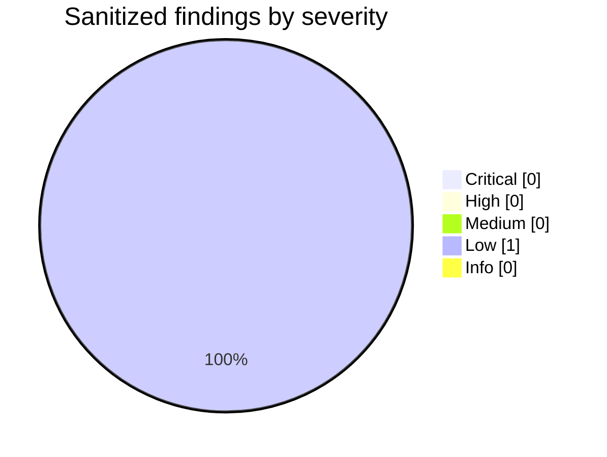
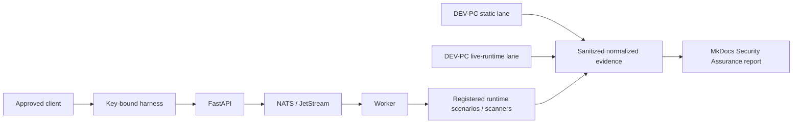

# Security Assurance Report — assurance-eb3d0c1d7d5b437b9743c9961aa722f8

!!! info "Assurance evidence, not certification"
    This report summarizes bounded Security Assurance evidence. It does not claim that Pocket Lab Lite is certified or universally secure.

## 1. Executive Security Summary

**What was tested:** the registered **deep** suite against **local_server_host_only** using the fixed harness and registered toolchain.

**Overall result:** **PARTIAL**. The run recorded 11 scenario results and 1 sanitized normalized findings.

**What needs attention:** Critical/High findings and any FAIL/PARTIAL/BLOCKED scenarios remain visible below. Human-only controls are not converted into PASS by absence of scanner findings.

**Out of scope:** destructive Recovery, unrelated network targets, user media, credential attacks, and arbitrary command execution.

## 2. Qualification Identity

| Field | Value |
| --- | --- |
| Qualification ID | assurance-eb3d0c1d7d5b437b9743c9961aa722f8 |
| Report ID | security-assurance-20260916T173302Z-4199c1e3f1-assurance-eb3d0c1d7d5b437b9743c9961aa722f8 |
| Generation timestamp UTC | 2026-09-16T17:33:11.781498Z |
| Source SHA | 4199c1e3f12392e5895901c6946c2d554e4670c7 |
| Runtime SHA | 4199c1e3f12392e5895901c6946c2d554e4670c7 |
| Environment | qualification |
| Target scope | local_server_host_only |
| Profile | security-assurance-runner |
| Suite | deep |
| Tool registry hash | sha256:38755b7f13c94ff9a37a0eccf4324455d7f05fcddc9c7dfa1b85f3fb8c657687 |
| Scenario registry hash | sha256:92310371d7c8ed9b2ff686ddb6116b471e3ba3c261988d3a66b65c15c68afbc1 |
| Suite registry hash | sha256:407d1c893f8de7579f0fd3193e262da5b8f67c612bcb9d2c76308c3f36afd164 |
| Threat-model hash | sha256:74442eb35bcd488a67b5fc995ca1d6f6f341343bb3f8c3a0663cb89e241a908c |

## 3. Overall Assurance Verdict

**PARTIAL** — this is the harness-native terminal result; no separate security score overrides it.

## 4. Security Confidence / Assurance Metrics

| Metric | Value |
| --- | --- |
| Scenario Coverage Percent | 100.0 |
| Scenario Pass Percent | 90.9 |
| Attack Path Coverage Percent | 71.4 |
| Control Coverage Percent | 100.0 |
| Tool Readiness Percent | 75.0 |
| Evidence Completeness Percent | 100.0 |

Formula: each percentage is completed applicable evidence units divided by registered applicable units; missing/blocked units are never treated as passing

## 5. Finding Counts

| Class | Count |
| --- | --- |
| Critical | 0 |
| High | 0 |
| Medium | 0 |
| Low | 1 |
| Info | 0 |
| NEW | 1 |
| EXISTING | 0 |
| REGRESSED | 0 |
| RESOLVED | 0 |
| UNCHANGED | 0 |

## 6. Severity Chart

| Severity | Findings |
| --- | --- |
| Critical | 0 |
| High | 0 |
| Medium | 0 |
| Low | 1 |
| Info | 0 |

## 7. Findings by Tool

| Tool | Finding count |
| --- | --- |
| trivy | 1 |

## 8. Findings by Suite

| Suite | Result |
| --- | --- |
| smoke | NOT_RUN |
| standard | NOT_RUN |
| adversarial | NOT_RUN |
| deep | PARTIAL |

## 9. Complete Finding Register

### assurance-eb3d0c1d7d5b437b9743c9961aa722f8-15deb392776f0f7b27d15fb1

| Field | Value |
| --- | --- |
| Severity | low |
| Status | open |
| Baseline | NEW |
| Tool | trivy |
| Scenario | security-projection |
| Rule ID | protected_runtime_secret |
| CVE |  |
| CWE |  |
| Package/component | Pocket Lab Lite |
| Asset | gitea/conf/app.runtime.ini |
| Title | Registered Security finding |
| Summary | Protected backend runtime secret found. |
| Security impact | Requires review in context |
| Evidence summary | security/evidence/security-82ad0d6b7245478f9b063330387977c9/summary.json, security/evidence/security-82ad0d6b7245478f9b063330387977c9/lynis-normalized.json, security/evidence/security-82ad0d6b7245478f9b063330387977c9/target-pocketlab-source-trivy.json, security/evidence/security-82ad0d6b7245478f9b063330387977c9/target-pocketlab_source-sbom.cdx.json, security/evidence/security-82ad0d6b7245478f9b063330387977c9/target-runtime-config.json, security/evidence/security-82ad0d6b7245478f9b063330387977c9/resource-budget.json, security/evidence/security-82ad0d6b7245478f9b063330387977c9/target-proot-ubuntu-trivy-1.json, security/evidence/security-82ad0d6b7245478f9b063330387977c9/target-proot-ubuntu-trivy-2.json, security/evidence/security-82ad0d6b7245478f9b063330387977c9/target-proot-ubuntu-trivy-3.json, security/evidence/security-82ad0d6b7245478f9b063330387977c9/target-photoprism-trivy.json, security/evidence/security-82ad0d6b7245478f9b063330387977c9/target-photoprism-config-secret.json, security/evidence/security-82ad0d6b7245478f9b063330387977c9/target-photoprism_app_files-sbom.cdx.json, security/evidence/security-82ad0d6b7245478f9b063330387977c9/target-backup-metadata.json, security/evidence/security-82ad0d6b7245478f9b063330387977c9/trivy-normalized.json, security/evidence/security-82ad0d6b7245478f9b063330387977c9/coverage-summary.json |
| STRIDE | Information Disclosure |
| OWASP | A02, A05 |
| AP path | AP-06 |
| Control | CTRL-EVIDENCE-SANITIZE |
| Remediation | Keep this server-side config locked down, exclude it from frontend assets and normal evidence, and rotate it during planned maintenance if exposure is suspected. |
| Retest guidance | Re-run scenario security-projection in suite deep after remediation. |

## 10. STRIDE Matrix

| Threat | Scenarios | Passed | Failed | Partial | Blocked | Scenario IDs |
| --- | --- | --- | --- | --- | --- | --- |
| Denial of Service | 4 | 3 | 0 | 1 | 0 | runtime-readiness, security-projection, policy-readiness, attack-path-inventory |
| Elevation of Privilege | 7 | 7 | 0 | 0 | 0 | harness-default-off, harness-auth-boundary, caddy-proof-strip, control-plane-ownership, policy-readiness, source-boundaries, attack-path-inventory |
| Information Disclosure | 5 | 4 | 0 | 1 | 0 | runtime-readiness, evidence-redaction, security-projection, source-boundaries, attack-path-inventory |
| Repudiation | 5 | 4 | 0 | 1 | 0 | control-plane-ownership, evidence-redaction, security-projection, threat-model-integrity, attack-path-inventory |
| Spoofing | 4 | 4 | 0 | 0 | 0 | harness-default-off, harness-auth-boundary, caddy-proof-strip, attack-path-inventory |
| Tampering | 9 | 8 | 0 | 1 | 0 | harness-auth-boundary, caddy-proof-strip, control-plane-ownership, evidence-redaction, security-projection, policy-readiness, source-boundaries, threat-model-integrity, attack-path-inventory |

## 11. OWASP Top 10 Matrix

| Category | Applicability | Scenarios | Passing | Result |
| --- | --- | --- | --- | --- |
| A01 Broken Access Control | TESTED | 7 | 7 | EVIDENCE_PRESENT |
| A02 Cryptographic Failures | TESTED | 3 | 3 | EVIDENCE_PRESENT |
| A03 Injection | HUMAN_REVIEW_REQUIRED | 0 | 0 | NOT_ASSESSED |
| A04 Insecure Design | HUMAN_REVIEW_REQUIRED | 0 | 0 | NOT_ASSESSED |
| A05 Security Misconfiguration | TESTED | 5 | 4 | EVIDENCE_PRESENT |
| A06 Vulnerable and Outdated Components | TESTED | 1 | 0 | EVIDENCE_PRESENT |
| A07 Identification and Authentication Failures | TESTED | 4 | 4 | EVIDENCE_PRESENT |
| A08 Software and Data Integrity Failures | TESTED | 7 | 6 | EVIDENCE_PRESENT |
| A09 Security Logging and Monitoring Failures | TESTED | 5 | 4 | EVIDENCE_PRESENT |
| A10 Server-Side Request Forgery | HUMAN_REVIEW_REQUIRED | 0 | 0 | NOT_ASSESSED |

## 12. Attack-Path Matrix

| AP | Threat | Assets/path | Trust boundaries | Controls | Execution | Result |
| --- | --- | --- | --- | --- | --- | --- |
| AP-01 | Browser control-plane bypass | browser, nats-jetstream, worker | browser, messaging-execution | CTRL-BROWSER-NATS, CTRL-API-CONTROL | PARTIALLY_EXECUTABLE | PASS |
| AP-02 | Browser shell execution | browser, lite-api, server-host | browser, control-api, server-host | CTRL-BROWSER-SHELL, CTRL-API-CONTROL | EXECUTABLE_NOW | PASS |
| AP-03 | Forged managed-device identity | managed-device, lite-api, nats-jetstream, node-agent | managed-device, control-api, messaging-execution | CTRL-API-CONTROL, CTRL-EXECUTION-OWNERS | STATIC_EVIDENCE_ONLY | PASS |
| AP-04 | Messaging command tampering or replay | lite-api, nats-jetstream, worker, node-agent | control-api, messaging-execution, managed-device | CTRL-API-CONTROL, CTRL-EXECUTION-OWNERS | PARTIALLY_EXECUTABLE | PASS |
| AP-05 | Supply-chain artifact compromise | github-release, release-artifacts, server-host | external-release, server-host, application-container | CTRL-SUPPLY-CHAIN, CTRL-EXPLICIT-PROMOTION, CTRL-EVIDENCE-SANITIZE | STATIC_EVIDENCE_ONLY | PASS |
| AP-06 | Evidence poisoning | scanner-evidence, promoted-evidence, documentation | external-release, durable-state, server-host | CTRL-EVIDENCE-SANITIZE, CTRL-EXPLICIT-PROMOTION | EXECUTABLE_NOW | PASS |
| AP-07 | Tailnet/private-network exposure | private-network, tailscale, caddy, lite-api | private-network, control-api, server-host | CTRL-API-CONTROL, CTRL-EXECUTION-OWNERS | PARTIALLY_EXECUTABLE | PASS |
| AP-08 | Recovery state tampering | sqlite, recovery-state, lite-api | durable-state, control-api | CTRL-EVIDENCE-SANITIZE, CTRL-EXPLICIT-PROMOTION, CTRL-API-CONTROL | STATIC_EVIDENCE_ONLY | PASS |
| AP-09 | Human identity and WebAuthn assurance misuse | browser, caddy, lite-api, sqlite | browser, control-api, durable-state | CTRL-HUMAN-SESSION-CSRF, CTRL-WEBAUTHN-ASSURANCE | HUMAN_REVIEW_REQUIRED | PASS |
| AP-10 | Enterprise membership and final-Owner privilege escalation | browser, caddy, lite-api, sqlite | browser, control-api, durable-state | CTRL-WEBAUTHN-ASSURANCE, CTRL-ENTERPRISE-ROLE-FINAL-OWNER | HUMAN_REVIEW_REQUIRED | PASS |
| AP-11 | OPA authorization decision integrity failure | browser, caddy, lite-api | browser, control-api | CTRL-API-CONTROL, CTRL-OPA-FAIL-CLOSED | PARTIALLY_EXECUTABLE | PASS |
| AP-12 | Policy revision activation and recovery integrity | browser, caddy, lite-api, sqlite | browser, control-api, durable-state | CTRL-POLICY-REVISION-LIFECYCLE, CTRL-OPA-FAIL-CLOSED | STATIC_EVIDENCE_ONLY | PASS |
| AP-13 | Approval and continuation integrity | browser, caddy, lite-api, sqlite | browser, control-api, durable-state | CTRL-WEBAUTHN-ASSURANCE, CTRL-INDEPENDENT-APPROVAL-CONTINUATION | HUMAN_REVIEW_REQUIRED | PASS |
| AP-14 | Temporary-exception scope and expiry bypass | browser, caddy, lite-api, sqlite | browser, control-api, durable-state | CTRL-TEMPORARY-EXCEPTION-SCOPE, CTRL-OPA-FAIL-CLOSED | HUMAN_REVIEW_REQUIRED | PASS |

## 13. Toolchain Matrix

| Tool | Version | Lane | Run status | Findings | Duration |
| --- | --- | --- | --- | --- | --- |
| pocketlab-security | UNAVAILABLE | server_phone_worker | PARTIAL | 0 | 518335 |
| trivy | dev | server_phone_worker | PASS | 1 | UNAVAILABLE |
| lynis | 3.1.6 | server_phone_worker | PASS | 0 | UNAVAILABLE |
| bandit | UNAVAILABLE | dev_pc_static | NOT_RUN | 0 | UNAVAILABLE |
| gitleaks | UNAVAILABLE | dev_pc_static | NOT_RUN | 0 | UNAVAILABLE |
| pip-audit | UNAVAILABLE | dev_pc_static | NOT_RUN | 0 | UNAVAILABLE |
| npm-audit | UNAVAILABLE | dev_pc_static | NOT_RUN | 0 | UNAVAILABLE |
| opa | UNAVAILABLE | server_phone_worker | PASS | 0 | UNAVAILABLE |
| schemathesis | UNAVAILABLE | dev_pc_live_runtime | NOT_RUN | 0 | UNAVAILABLE |
| cosign | UNAVAILABLE | dev_pc_static | NOT_RUN | 0 | UNAVAILABLE |
| semgrep | UNAVAILABLE | dev_pc_static | NOT_RUN | 0 | UNAVAILABLE |
| osv-scanner | UNAVAILABLE | dev_pc_static | NOT_RUN | 0 | UNAVAILABLE |
| syft | UNAVAILABLE | dev_pc_static | NOT_RUN | 0 | UNAVAILABLE |
| grype | UNAVAILABLE | dev_pc_static | NOT_RUN | 0 | UNAVAILABLE |
| testssl.sh | UNAVAILABLE | dev_pc_live_runtime | NOT_RUN | 0 | UNAVAILABLE |
| nuclei | UNAVAILABLE | dev_pc_live_runtime | NOT_RUN | 0 | UNAVAILABLE |
| nmap | UNAVAILABLE | dev_pc_live_runtime | NOT_RUN | 0 | UNAVAILABLE |
| owasp-zap | UNAVAILABLE | dev_pc_live_runtime | NOT_RUN | 0 | UNAVAILABLE |

## 14. Runtime / Resource Metrics

| Metric | Value |
| --- | --- |
| Duration ms | 595502 |
| Available memory | 2732548096 |
| Battery percent | 38.0 |
| Temperature C | 33.8 |
| Free storage | 136734990336 |
| System load ratio | UNAVAILABLE |
| Retries | UNAVAILABLE |
| Checkpoint/resume | UNAVAILABLE |

## 15. Security Architecture

## 16. Trust Boundaries

Browser/Caddy; Caddy/FastAPI; machine/harness; FastAPI/OPA; FastAPI/NATS; NATS/worker; worker/scanner; scanner/evidence; and DEV PC/Server Phone are explicit review boundaries.

## 17. Controls Validated

| Control | Scenarios | Attack paths | Result |
| --- | --- | --- | --- |
| CTRL-API-CONTROL | harness-default-off, harness-auth-boundary, caddy-proof-strip, runtime-readiness, control-plane-ownership, source-boundaries | AP-01, AP-02, AP-03, AP-04, AP-05, AP-06, AP-07, AP-09, AP-10, AP-11, AP-12 | PASS |
| CTRL-EVIDENCE-SANITIZE | harness-default-off, evidence-redaction, security-projection, source-boundaries, threat-model-integrity, attack-path-inventory | AP-01, AP-02, AP-03, AP-04, AP-05, AP-06, AP-07, AP-08, AP-09, AP-10, AP-11, AP-12, AP-13, AP-14 | PARTIAL |
| CTRL-EXECUTION-OWNERS | harness-auth-boundary, control-plane-ownership, security-projection, source-boundaries | AP-01, AP-02, AP-03, AP-04, AP-05, AP-06, AP-07, AP-08, AP-09, AP-10 | PARTIAL |
| CTRL-POLICY-REVISION-LIFECYCLE | policy-readiness | AP-11, AP-12, AP-14 | PASS |

## 18. Human Review Required

Physical WebAuthn ceremonies, Enterprise membership/final Owner authority, approval ceremonies, and protected runtime-secret ownership/rotation remain human-governed where applicable.

| AP | Reason |
| --- | --- |
| AP-03 | Managed-device identity forgery is not performed against enrolled device state. |
| AP-05 | Release and dependency controls are represented by existing Security evidence and source checks. |
| AP-08 | Recovery replacement/restore mutation is excluded from normal assurance. |
| AP-09 | Human WebAuthn ceremonies are not impersonated by the synthetic machine principal. |
| AP-10 | Enterprise membership and final-Owner review remain human-governed. |
| AP-12 | Policy revision activation/recovery is not mutated by this safe profile. |
| AP-13 | Independent approval and requester continuation require human review. |
| AP-14 | Temporary exception issuance and expiry bypass are not attempted. |

## 19. Out of Scope

- Destructive production Recovery or restore execution
- Unrelated LAN or Tailnet hosts and public Internet targets
- User media and PhotoPrism media contents
- Credential attacks or password guessing
- Arbitrary shell execution, caller-selected targets, ports, templates, scanner arguments, or NATS subjects

## 20. Remediation Priorities

| Severity | Finding | Remediation |
| --- | --- | --- |
| low | assurance-eb3d0c1d7d5b437b9743c9961aa722f8-15deb392776f0f7b27d15fb1 | Keep this server-side config locked down, exclude it from frontend assets and normal evidence, and rotate it during planned maintenance if exposure is suspected. |

## 21. Retest Plan

| Finding | Scenario | Suite | Expected fixed invariant |
| --- | --- | --- | --- |
| assurance-eb3d0c1d7d5b437b9743c9961aa722f8-15deb392776f0f7b27d15fb1 | security-projection | deep | The registered scenario reaches its expected invariant without the finding recurring. |

## 22. Sanitization Statement

This publication contains normalized sanitized evidence only. It excludes: private keys, session tokens, provisioning tokens, passwords, authorization headers, cookies, CSRF tokens, NATS credentials, Tailscale credentials, Recovery encryption material, raw secret matches, user/PhotoPrism media, raw scanner output.
