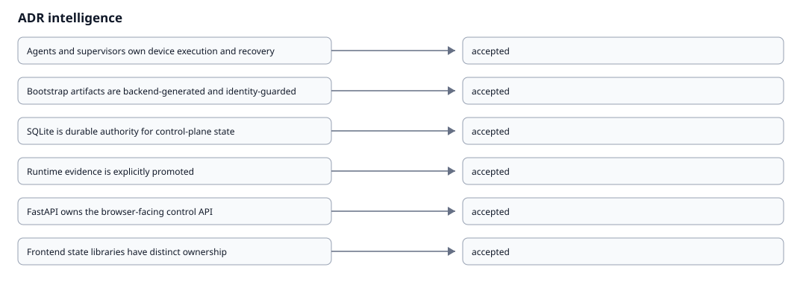

# ADR Intelligence

{ loading=lazy }

## Agents and supervisors own device execution and recovery

**Status:** accepted
**Context:** The canonical architecture separates command execution, reconnect recovery, and stopped-agent recovery.
**Alternatives:** Frontend process control, FastAPI directly managing remote device processes
**Consequences:** Restart Agent progress must reflect actual delivery and recovery, Supervisor absence produces guidance rather than fake repair
**Trade-offs:** Requires heartbeat/recovery evidence, Keeps remote execution local to the managed device
**Security implications:** Protected agent identity stays on the managed device
**Runtime implications:** Running-but-disconnected and stopped-agent recovery remain distinct
**Source:** architecture/metadata/pocket-lab-architecture.json, pocket-lab-final-structure/runtime/agents/pocketlab_agent_supervisor.py, pocket-lab-final-structure/runtime/agents/pocketlab_node_agent.py

## Bootstrap artifacts are backend-generated and identity-guarded

**Status:** accepted
**Context:** Device onboarding must fail closed on identity mismatch and prevent duplicate or protected-host enrollment conflicts.
**Alternatives:** Frontend-generated bootstrap, Unverified environment overwrite
**Consequences:** Repair and rejoin remain explicit, Blocked consumption generates audit evidence
**Trade-offs:** Requires durable invite state, Prevents browser-held enrollment secrets and unsafe identity overwrite
**Security implications:** Invite/bootstrap secrets are not exported into documentation
**Runtime implications:** Identity mismatches fail before environment or PM2 mutation
**Source:** architecture/metadata/pocket-lab-architecture.json, pocket-lab-final-structure/runtime/api_fastapi/services/lite_invites.py

## SQLite is durable authority for control-plane state

**Status:** accepted
**Context:** The architecture model distinguishes durable-state components from projections and requires truthful reconciliation.
**Alternatives:** Browser-local authority, Ephemeral process-memory authority
**Consequences:** Prepared projections may be stale while durable state remains authoritative, Operational health and semantic parity remain independent
**Trade-offs:** Requires migrations and reconciliation, Preserves durable recovery and auditable state
**Security implications:** Sensitive durable records stay server-side
**Runtime implications:** Projection freshness can gate writes without deleting durable history
**Source:** architecture/metadata/pocket-lab-architecture.json, contracts/generated/lite-sqlite-schema.json

## Runtime evidence is explicitly promoted

**Status:** accepted
**Context:** Runtime verification has backend, Termux, desktop, and mobile lanes and promotion is release- and source-bound.
**Alternatives:** Track raw live captures, Generate tracked docs directly from the current phone
**Consequences:** Observed does not automatically mean verified, Promotion preflight fails closed on binding or semantic mismatches
**Trade-offs:** Promotion is an explicit operator step, Tracked documentation stays deterministic, sanitized, and reviewable
**Security implications:** Transient raw capture stays outside tracked outputs
**Runtime implications:** Documentation generation does not mutate runtime state
**Source:** contracts/parity/runtime-verification-baseline.json, scripts/test/parity/preflight_runtime_promotion.py, scripts/test/parity/promote_runtime_verification.py

## FastAPI owns the browser-facing control API

**Status:** accepted
**Context:** The canonical architecture requires UI to Caddy to FastAPI before NATS, workers, agents, supervisors, and evidence.
**Alternatives:** Browser direct messaging access, Browser-side execution
**Consequences:** Frontend never talks directly to NATS, Frontend never executes shell commands
**Trade-offs:** Adds a control API hop, Centralizes validation, authorization, write safety, and audit evidence
**Security implications:** Backend secrets remain outside the browser, Command admission stays server-side
**Runtime implications:** FastAPI availability is part of write readiness
**Source:** architecture/metadata/pocket-lab-architecture.json, pocket-lab-final-structure/runtime/api_fastapi/routers/lite.py

## Frontend state libraries have distinct ownership

**Status:** accepted
**Context:** The frontend must remain responsive without becoming an execution engine or durable backend authority.
**Alternatives:** One global frontend store for backend truth, Browser-side offline write queue
**Consequences:** FastAPI remains source of truth, Offline/degraded state is read-only
**Trade-offs:** Multiple focused state layers, Clearer authority and failure semantics
**Security implications:** Safe snapshots exclude secrets and write responses
**Runtime implications:** Saved state never proves current operational health
**Source:** contracts/parity/parity-model.json, src/lib/liteOfflineDb.js, src/lib/liteQueryClient.js, src/machines, src/stores/liteUiStore.js
