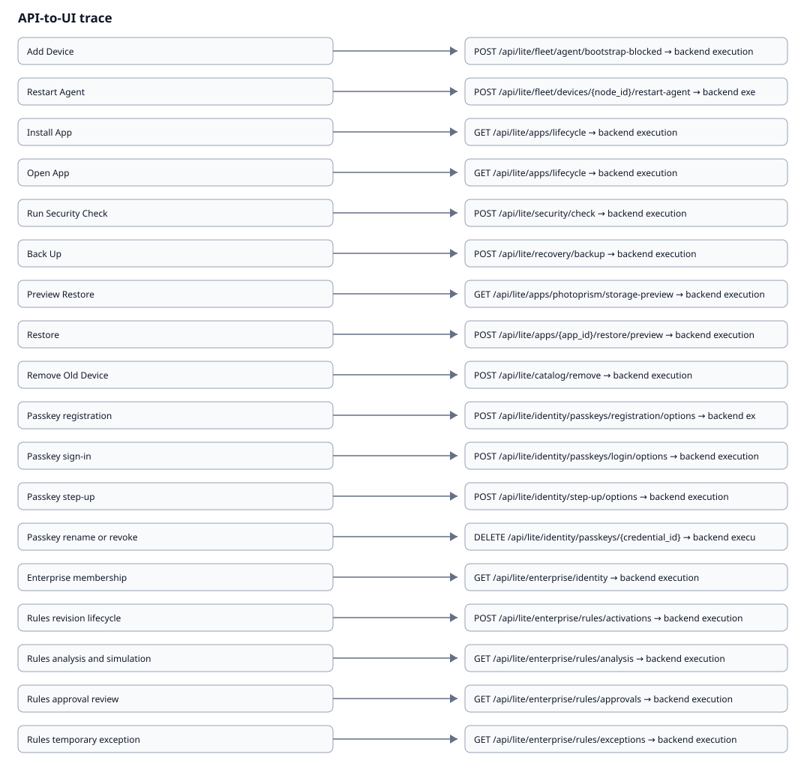

# API-to-UI Trace Explorer

{ loading=lazy }

## Add Device

**UI:** src/mocks/handlers.js, src/lib/liteApi.js
**API:** POST /api/lite/fleet/agent/bootstrap-blocked, POST /api/lite/fleet/agent/bootstrap.env, GET /api/lite/fleet/agent/bootstrap.sh, GET /api/lite/fleet/invites/latest, POST /api/lite/fleet/invites/{invite_id}/revoke
**FastAPI handler:** pocket-lab-final-structure/runtime/api_fastapi/routers/fleet.py, pocket-lab-final-structure/runtime/api_fastapi/routers/lite.py
**NATS/event:** pocketlab.events.fleet.bootstrap_blocked, pocketlab.events.fleet.invite_accepted, pocketlab.events.fleet.invite_created, pocketlab.events.fleet.invite_revoked, pocketlab.events.fleet.invite_started
**Execution:** worker for queued domain actions; node agent/supervisor for device execution/recovery; exact owner remains endpoint-specific
**Projection:** FastAPI/TanStack safe read projection
**Reason codes:** contracts/generated/reason-codes.json
**Tests:** test:tests/backend/test_lite_development_documentation_platform.py, test:tests/parity/test_api_contract_fences.py
**Evidence:** backend-owned sanitized evidence/projection

## Restart Agent

**UI:** src/mocks/handlers.js, src/lib/liteApi.js, src/lib/liteQueryClient.js
**API:** POST /api/lite/fleet/devices/{node_id}/restart-agent, GET /api/lite/fleet/devices/{node_id}/restart-agent/status
**FastAPI handler:** pocket-lab-final-structure/runtime/api_fastapi/routers/fleet.py
**NATS/event:** pocketlab.commands.lite.device.restart, pocketlab.commands.node.{normalized_node_id}.agent.restart, pocketlab.events.lite.database.restore.started, pocketlab.events.lite.restore.service_restart_checked, pocketlab.events.lite.restore.started
**Execution:** worker for queued domain actions; node agent/supervisor for device execution/recovery; exact owner remains endpoint-specific
**Projection:** FastAPI/TanStack safe read projection
**Reason codes:** contracts/generated/reason-codes.json
**Tests:** test:tests/backend/test_lite_development_documentation_platform.py, test:tests/parity/test_api_contract_fences.py
**Evidence:** backend-owned sanitized evidence/projection

## Install App

**UI:** src/mocks/handlers.js, src/lib/liteApi.js, src/lib/liteSafeSnapshots.js, src/lib/liteOfflineReadPolicy.test.js, src/lib/liteQueryClient.js
**API:** GET /api/lite/apps/lifecycle, GET /api/lite/apps/lifecycle/{app_id}, GET /api/lite/apps/photoprism/storage-mappings, POST /api/lite/apps/photoprism/storage-mappings, DELETE /api/lite/apps/photoprism/storage-mappings/{mapping_id}, GET /api/lite/apps/photoprism/storage-preview, GET /api/lite/apps/{app_id}/action-history, GET /api/lite/apps/{app_id}/actions, POST /api/lite/apps/{app_id}/actions/{action_id}, GET /api/lite/apps/{app_id}/backup
**FastAPI handler:** pocket-lab-final-structure/runtime/api_fastapi/routers/lite.py
**NATS/event:** pocketlab.commands.lite.app.safety, pocketlab.commands.lite.catalog.install, pocketlab.events.lite.catalog.install_completed, pocketlab.events.lite.catalog.install_failed, pocketlab.events.lite.catalog.install_started
**Execution:** worker for queued domain actions; node agent/supervisor for device execution/recovery; exact owner remains endpoint-specific
**Projection:** FastAPI/TanStack safe read projection
**Reason codes:** contracts/generated/reason-codes.json
**Tests:** test:tests/backend/test_lite_development_documentation_platform.py, test:tests/parity/test_api_contract_fences.py
**Evidence:** backend-owned sanitized evidence/projection

## Open App

**UI:** src/mocks/handlers.js, src/lib/liteApi.js, src/lib/liteSafeSnapshots.js, src/lib/liteOfflineReadPolicy.test.js, src/lib/liteQueryClient.js
**API:** GET /api/lite/apps/lifecycle, GET /api/lite/apps/lifecycle/{app_id}, GET /api/lite/apps/photoprism/storage-mappings, POST /api/lite/apps/photoprism/storage-mappings, DELETE /api/lite/apps/photoprism/storage-mappings/{mapping_id}, GET /api/lite/apps/photoprism/storage-preview, GET /api/lite/apps/{app_id}/action-history, GET /api/lite/apps/{app_id}/actions, POST /api/lite/apps/{app_id}/actions/{action_id}, GET /api/lite/apps/{app_id}/backup
**FastAPI handler:** pocket-lab-final-structure/runtime/api_fastapi/routers/lite.py
**NATS/event:** pocketlab.commands.catalog.refresh, pocketlab.commands.lite.app.safety, pocketlab.commands.lite.catalog.install, pocketlab.events.catalog.refresh_started, pocketlab.events.catalog.refreshed, pocketlab.events.lite.catalog.install_completed, pocketlab.events.lite.catalog.install_failed, pocketlab.events.lite.catalog.install_started
**Execution:** worker for queued domain actions; node agent/supervisor for device execution/recovery; exact owner remains endpoint-specific
**Projection:** FastAPI/TanStack safe read projection
**Reason codes:** contracts/generated/reason-codes.json
**Tests:** test:tests/backend/test_lite_development_documentation_platform.py, test:tests/parity/test_api_contract_fences.py
**Evidence:** backend-owned sanitized evidence/projection

## Run Security Check

**UI:** src/mocks/handlers.js, src/lib/liteApi.js
**API:** POST /api/lite/security/check
**FastAPI handler:** pocket-lab-final-structure/runtime/api_fastapi/routers/lite.py
**NATS/event:** no exact channel binding source-derived for this action
**Execution:** worker for queued domain actions; node agent/supervisor for device execution/recovery; exact owner remains endpoint-specific
**Projection:** FastAPI/TanStack safe read projection
**Reason codes:** contracts/generated/reason-codes.json
**Tests:** test:tests/backend/test_lite_development_documentation_platform.py, test:tests/parity/test_api_contract_fences.py
**Evidence:** backend-owned sanitized evidence/projection

## Back Up

**UI:** src/mocks/handlers.js, src/lib/liteApi.js, src/lib/liteSafeSnapshots.js, src/lib/liteOfflineDb.js, src/lib/liteOfflineReadPolicy.test.js, src/lib/liteRecoveryStateIntegration.test.js, src/lite/recovery/RecoveryBackupHistory.jsx
**API:** POST /api/lite/recovery/backup, GET /api/lite/recovery/backup-targets, GET /api/lite/recovery/backups, GET /api/lite/recovery/backups/{backup_id}, POST /api/lite/recovery/backups/{backup_id}/verify
**FastAPI handler:** pocket-lab-final-structure/runtime/api_fastapi/routers/lite.py
**NATS/event:** no exact channel binding source-derived for this action
**Execution:** worker for queued domain actions; node agent/supervisor for device execution/recovery; exact owner remains endpoint-specific
**Projection:** FastAPI/TanStack safe read projection
**Reason codes:** contracts/generated/reason-codes.json
**Tests:** test:tests/backend/test_lite_development_documentation_platform.py, test:tests/parity/test_api_contract_fences.py
**Evidence:** backend-owned sanitized evidence/projection

## Preview Restore

**UI:** src/mocks/handlers.js, src/lib/liteRecoveryR3R4.test.js, src/lib/liteApi.js, src/lib/liteSafeSnapshots.js, src/lib/liteOfflineReadPolicy.test.js, src/lib/liteQueryClient.js
**API:** GET /api/lite/apps/photoprism/storage-preview, POST /api/lite/apps/{app_id}/restore/preview, GET /api/lite/apps/{app_id}/restore/previews/{preview_id}, POST /api/lite/recovery/apps/{app_id}/restore/preview, POST /api/lite/recovery/database/backups/{backup_id}/preview, GET /api/lite/recovery/database/restore/previews/{preview_id}, POST /api/lite/recovery/restore/preview, GET /api/lite/recovery/restore/previews/{preview_id}
**FastAPI handler:** pocket-lab-final-structure/runtime/api_fastapi/routers/lite.py
**NATS/event:** pocketlab.commands.drift.preview, pocketlab.commands.lite.app.restore.preview, pocketlab.commands.lite.database.restore.preview, pocketlab.commands.lite.restore.preview, pocketlab.events.drift.previewed, pocketlab.events.lite.app.restore.preview_created, pocketlab.events.lite.app.restore.preview_failed, pocketlab.events.lite.app.restore.preview_started, pocketlab.events.lite.database.restore.preview_ready, pocketlab.events.lite.restore.preview_created
**Execution:** worker for queued domain actions; node agent/supervisor for device execution/recovery; exact owner remains endpoint-specific
**Projection:** FastAPI/TanStack safe read projection
**Reason codes:** contracts/generated/reason-codes.json
**Tests:** test:tests/backend/test_lite_development_documentation_platform.py, test:tests/parity/test_api_contract_fences.py
**Evidence:** backend-owned sanitized evidence/projection

## Restore

**UI:** src/mocks/handlers.js, src/lib/liteRecoveryR3R4.test.js, src/lib/liteApi.js, src/lib/liteSafeSnapshots.js, src/lib/liteOfflineReadPolicy.test.js, src/lib/liteQueryClient.js
**API:** POST /api/lite/apps/{app_id}/restore/preview, GET /api/lite/apps/{app_id}/restore/previews/{preview_id}, POST /api/lite/recovery/apps/{app_id}/restore, POST /api/lite/recovery/apps/{app_id}/restore/preview, POST /api/lite/recovery/database/backups/{backup_id}/restore, GET /api/lite/recovery/database/restore/previews/{preview_id}, GET /api/lite/recovery/database/restore/{restore_id}, POST /api/lite/recovery/restore, GET /api/lite/recovery/restore/checkpoints/{checkpoint_id}, POST /api/lite/recovery/restore/preview
**FastAPI handler:** pocket-lab-final-structure/runtime/api_fastapi/routers/lite.py
**NATS/event:** pocketlab.commands.lite.app.restore.preview, pocketlab.commands.lite.database.restore, pocketlab.commands.lite.database.restore.preview, pocketlab.commands.lite.restore.apply, pocketlab.commands.lite.restore.preview, pocketlab.events.lite.app.restore.preview_created, pocketlab.events.lite.app.restore.preview_failed, pocketlab.events.lite.app.restore.preview_started, pocketlab.events.lite.database.restore.preview_ready, pocketlab.events.lite.database.restore.started
**Execution:** worker for queued domain actions; node agent/supervisor for device execution/recovery; exact owner remains endpoint-specific
**Projection:** FastAPI/TanStack safe read projection
**Reason codes:** contracts/generated/reason-codes.json
**Tests:** test:tests/backend/test_lite_development_documentation_platform.py, test:tests/parity/test_api_contract_fences.py
**Evidence:** backend-owned sanitized evidence/projection

## Remove Old Device

**UI:** src/mocks/handlers.js, src/lib/liteApi.js
**API:** POST /api/lite/catalog/remove, POST /api/lite/fleet/remove-device
**FastAPI handler:** pocket-lab-final-structure/runtime/api_fastapi/routers/lite.py
**NATS/event:** pocketlab.events.fleet.device_removed
**Execution:** worker for queued domain actions; node agent/supervisor for device execution/recovery; exact owner remains endpoint-specific
**Projection:** FastAPI/TanStack safe read projection
**Reason codes:** contracts/generated/reason-codes.json
**Tests:** test:tests/backend/test_lite_development_documentation_platform.py, test:tests/parity/test_api_contract_fences.py
**Evidence:** backend-owned sanitized evidence/projection
