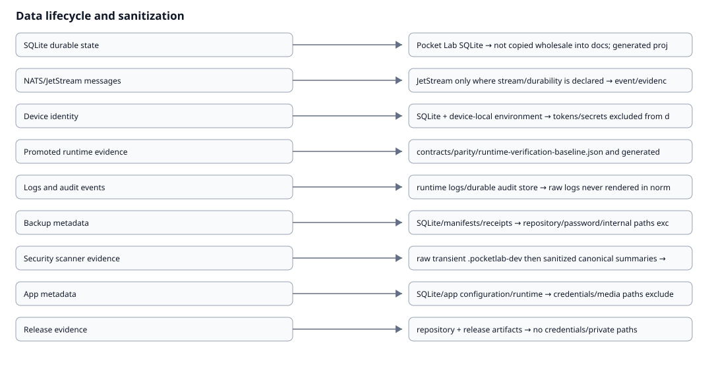

# Data Lifecycle & Privacy Map

{ loading=lazy }

| Category | Storage | Retention | Sanitization | Access | Network exposure | Backup | Deletion | Privacy risk |
| --- | --- | --- | --- | --- | --- | --- | --- | --- |
| SQLite durable state | Pocket Lab SQLite | domain lifecycle policy; device/audit history retained independently from connectivity | not copied wholesale into docs; generated projections are bounded | backend services/FastAPI | same-origin API projection only | included according to Recovery policy | explicit transactional lifecycle | identity/operational metadata |
| NATS/JetStream messages | JetStream only where stream/durability is declared | stream policy | event/evidence payload redaction rules | FastAPI/workers/agents; never browser direct | private runtime/Tailnet only | not treated as primary durable backup state | stream retention policy | command/event metadata |
| Device identity | SQLite + device-local environment | until explicit retirement/rejoin lifecycle | tokens/secrets excluded from docs | backend/device agent | private control paths | identity metadata subject to recovery policy; invite secrets excluded | explicit retirement/repair | device identifiers and enrollment state |
| Promoted runtime evidence | contracts/parity/runtime-verification-baseline.json and generated projections | release/evidence lifecycle | required before promotion | repository/docs generators | none from MkDocs generation | repository history | explicit evidence lifecycle | host/runtime metadata |
| Logs and audit events | runtime logs/durable audit store | bounded/operator policy | raw logs never rendered in normal docs | backend/operator diagnostics | not public | policy-dependent | retention/rotation | operational context may contain identifiers |
| Backup metadata | SQLite/manifests/receipts | backup retention policy | repository/password/internal paths excluded | FastAPI/worker | safe summaries only | metadata accompanies verified recovery state | explicit retention/cleanup | backup existence/timestamps |
| Security scanner evidence | raw transient .pocketlab-dev then sanitized canonical summaries | raw transient; promoted summary explicit | raw findings/paths/secrets excluded from docs | worker/developer CI then generated docs summary | none required by docs | canonical summaries may be versioned | raw capture removable after promotion | scanner output may reveal paths/secrets |
| App metadata | SQLite/app configuration/runtime | app lifecycle policy | credentials/media paths excluded | FastAPI/worker/app runtime | same-origin /apps route and safe API | app settings/metadata per Recovery policy | explicit remove lifecycle | app/media configuration |
| Release evidence | repository + release artifacts | release history | no credentials/private paths | developers/operators | GitHub release only when explicitly published | release archive | release governance | low; build metadata |
