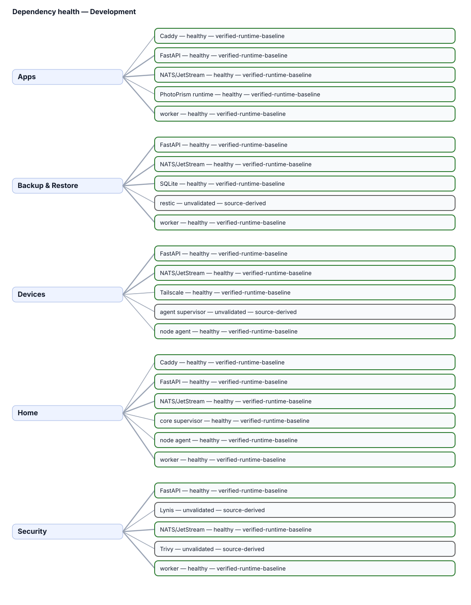

# Dependency Health

A domain state never silently promotes a child dependency to healthy. Unknown evidence remains unvalidated.

{ loading=lazy }

| Domain | Dependency | State | Evidence authority | Blocking | Root cause |
| --- | --- | --- | --- | --- | --- |
| Apps | Caddy | healthy | verified-runtime-baseline | no | Runtime baseline reports healthy. |
| Apps | FastAPI | healthy | verified-runtime-baseline | yes | Runtime baseline reports online. |
| Apps | NATS/JetStream | healthy | verified-runtime-baseline | yes | Runtime baseline reports ready. |
| Apps | worker | healthy | verified-runtime-baseline | yes | Runtime baseline reports online. |
| Apps | PhotoPrism runtime | healthy | verified-runtime-baseline | no | Runtime baseline reports online. |
| Devices | FastAPI | healthy | verified-runtime-baseline | yes | Runtime baseline reports online. |
| Devices | NATS/JetStream | healthy | verified-runtime-baseline | yes | Runtime baseline reports ready. |
| Devices | node agent | healthy | verified-runtime-baseline | no | Runtime baseline reports online. |
| Devices | agent supervisor | unvalidated | source-derived | no | Dependency is canonical, but no dedicated promoted runtime health signal is available. |
| Devices | Tailscale | healthy | verified-runtime-baseline | no | Runtime baseline reports ready. |
| Home | Caddy | healthy | verified-runtime-baseline | no | Runtime baseline reports healthy. |
| Home | FastAPI | healthy | verified-runtime-baseline | yes | Runtime baseline reports online. |
| Home | NATS/JetStream | healthy | verified-runtime-baseline | yes | Runtime baseline reports ready. |
| Home | worker | healthy | verified-runtime-baseline | yes | Runtime baseline reports online. |
| Home | node agent | healthy | verified-runtime-baseline | no | Runtime baseline reports online. |
| Home | core supervisor | healthy | verified-runtime-baseline | no | Runtime baseline reports online. |
| Backup & Restore | FastAPI | healthy | verified-runtime-baseline | yes | Runtime baseline reports online. |
| Backup & Restore | NATS/JetStream | healthy | verified-runtime-baseline | yes | Runtime baseline reports ready. |
| Backup & Restore | worker | healthy | verified-runtime-baseline | yes | Runtime baseline reports online. |
| Backup & Restore | SQLite | healthy | verified-runtime-baseline | yes | Runtime baseline reports healthy. |
| Backup & Restore | restic | unvalidated | source-derived | no | Dependency is canonical, but no dedicated promoted runtime health signal is available. |
| Security | FastAPI | healthy | verified-runtime-baseline | yes | Runtime baseline reports online. |
| Security | NATS/JetStream | healthy | verified-runtime-baseline | yes | Runtime baseline reports ready. |
| Security | worker | healthy | verified-runtime-baseline | yes | Runtime baseline reports online. |
| Security | Lynis | unvalidated | source-derived | no | Dependency is canonical, but no dedicated promoted runtime health signal is available. |
| Security | Trivy | unvalidated | source-derived | no | Dependency is canonical, but no dedicated promoted runtime health signal is available. |
