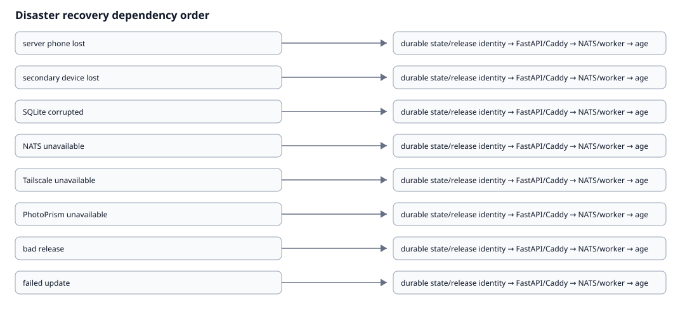

# Disaster Recovery Architecture

{ loading=lazy }

| Scenario | Survives | Lost | Recoverability | Dependency order | Evidence | Verification | Rollback |
| --- | --- | --- | --- | --- | --- | --- | --- |
| server phone lost | release artifacts, external verified backups | unreplicated local state | recoverable when listed prerequisites are verified; otherwise evidence-limited | durable state/release identity, FastAPI/Caddy, NATS/worker, agent/supervisor, Tailscale, apps | replacement Termux host, release identity, backup verification | health/readiness, parity, device/app/recovery readiness | use last-known-good release/backup and explicit domain rollback |
| secondary device lost | server durable enrollment/audit history | device-local data not backed up | recoverable when listed prerequisites are verified; otherwise evidence-limited | durable state/release identity, FastAPI/Caddy, NATS/worker, agent/supervisor, Tailscale, apps | retire stale identity, explicit rejoin | health/readiness, parity, device/app/recovery readiness | use last-known-good release/backup and explicit domain rollback |
| SQLite corrupted | release artifacts, verified backup | unbacked durable state | recoverable when listed prerequisites are verified; otherwise evidence-limited | durable state/release identity, FastAPI/Caddy, NATS/worker, agent/supervisor, Tailscale, apps | stop writes, restore verified backup, run parity/health | health/readiness, parity, device/app/recovery readiness | use last-known-good release/backup and explicit domain rollback |
| NATS unavailable | SQLite durable state, agents may retain local state | in-flight delivery until recovery | recoverable when listed prerequisites are verified; otherwise evidence-limited | durable state/release identity, FastAPI/Caddy, NATS/worker, agent/supervisor, Tailscale, apps | restore NATS/JetStream, verify consumer health, reconcile commands | health/readiness, parity, device/app/recovery readiness | use last-known-good release/backup and explicit domain rollback |
| Tailscale unavailable | local control plane | remote access during outage | recoverable when listed prerequisites are verified; otherwise evidence-limited | durable state/release identity, FastAPI/Caddy, NATS/worker, agent/supervisor, Tailscale, apps | restore tailscaled/Tailnet, verify Tailnet IPv4 and NATS reachability | health/readiness, parity, device/app/recovery readiness | use last-known-good release/backup and explicit domain rollback |
| PhotoPrism unavailable | Pocket Lab control state, app backup metadata | unbacked app-local changes | recoverable when listed prerequisites are verified; otherwise evidence-limited | durable state/release identity, FastAPI/Caddy, NATS/worker, agent/supervisor, Tailscale, apps | check route/runtime, repair non-destructively, restore only after preview | health/readiness, parity, device/app/recovery readiness | use last-known-good release/backup and explicit domain rollback |
| bad release | last-known-good release, backup/checksums | changes after bad release if unbacked | recoverable when listed prerequisites are verified; otherwise evidence-limited | durable state/release identity, FastAPI/Caddy, NATS/worker, agent/supervisor, Tailscale, apps | rollback release, verify API/UI/runtime parity | health/readiness, parity, device/app/recovery readiness | use last-known-good release/backup and explicit domain rollback |
| failed update | checkpoint/backup, release evidence | partial uncheckpointed app/runtime mutation | recoverable when listed prerequisites are verified; otherwise evidence-limited | durable state/release identity, FastAPI/Caddy, NATS/worker, agent/supervisor, Tailscale, apps | follow explicit update rollback, verify health and evidence | health/readiness, parity, device/app/recovery readiness | use last-known-good release/backup and explicit domain rollback |
