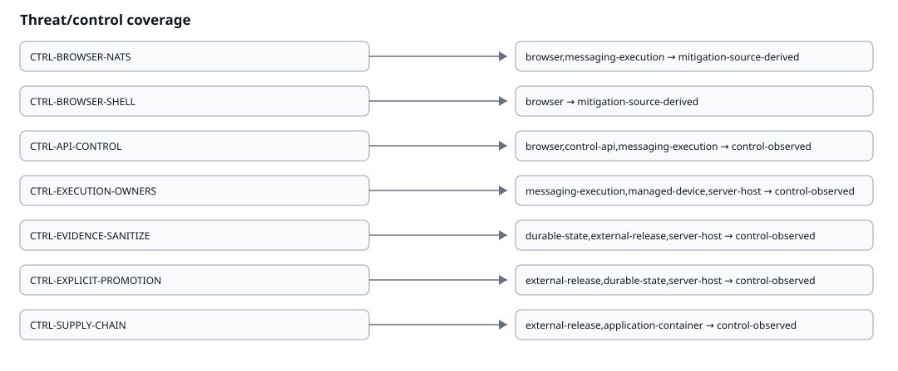

# Security Controls Catalog

{ loading=lazy }

| Control | Description | Boundaries | Threats | Implementation | Tests | Runtime evidence | Status | Freshness | Owner |
| --- | --- | --- | --- | --- | --- | --- | --- | --- | --- |
| CTRL-BROWSER-NATS | Frontend does not connect directly to NATS. | browser, messaging-execution | Spoofing, Tampering, Elevation of Privilege | src/, pocket-lab-final-structure/runtime/api_fastapi/ | tests/backend/test_lite_api.py, security/static-analysis/pocketlab-architecture.yml | — | mitigation-source-derived | source-current | frontend/control-api |
| CTRL-BROWSER-SHELL | Frontend does not execute shell commands. | browser | Tampering, Elevation of Privilege | src/ | security/static-analysis/pocketlab-architecture.yml | — | mitigation-source-derived | source-current | frontend |
| CTRL-API-CONTROL | FastAPI remains the frontend-facing control API. | browser, control-api, messaging-execution | Spoofing, Tampering, Elevation of Privilege | pocket-lab-final-structure/runtime/api_fastapi/ | tests/backend/test_lite_api.py, tests/parity/test_api_contract_fences.py | contracts/parity/runtime-verification-baseline.json | control-observed | promoted-observation | FastAPI |
| CTRL-HUMAN-SESSION-CSRF | Human browser writes require an authenticated local-owner session plus a separate same-site CSRF proof; session credentials remain HttpOnly and hash-only at rest. | browser, control-api, durable-state | Spoofing, Tampering, Elevation of Privilege | pocket-lab-final-structure/runtime/api_fastapi/deps.py, pocket-lab-final-structure/runtime/api_fastapi/services/lite_identity_auth.py, pocket-lab-final-structure/runtime/api_fastapi/routers/lite.py, src/lib/liteApi.js | tests/backend/test_lite_identity_rules_authorization.py | — | mitigation-source-derived | source-current | FastAPI Identity/session boundary |
| CTRL-OPA-FAIL-CLOSED | FastAPI preserves hard domain invariants, then requires a valid loopback OPA allow decision for registered protected actions before NATS/worker execution; unavailable, timed-out, malformed, or unregistered decisions fail closed. | control-api, messaging-execution | Spoofing, Tampering, Elevation of Privilege | pocket-lab-final-structure/runtime/api_fastapi/services/lite_policy_opa.py, security/policies/opa/pocketlab/pocketlab.rego, pocket-lab-final-structure/runtime/api_fastapi/routers/lite.py | tests/backend/test_lite_identity_rules_authorization.py, security/policies/opa/pocketlab/pocketlab_test.rego | — | mitigation-source-derived | source-current | FastAPI Rules/OPA authorization boundary |
| CTRL-EXECUTION-OWNERS | Workers, agents and supervisors own execution and recovery. | messaging-execution, managed-device, server-host | Tampering, Denial of Service, Elevation of Privilege | pocket-lab-final-structure/runtime/workers/, pocket-lab-final-structure/runtime/agents/ | tests/backend/test_lite_worker_recovery.py | contracts/parity/runtime-verification-baseline.json | control-observed | promoted-observation | worker/agent/supervisor |
| CTRL-EVIDENCE-SANITIZE | Runtime/scanner evidence is sanitized before canonical documentation ingestion. | durable-state, external-release, server-host | Information Disclosure, Repudiation | scripts/docs/runtime/, scripts/docs/enterprise/supply_chain_automation.py | tests/docs/test_enterprise_documentation.py | contracts/parity/runtime-verification-baseline.json | control-observed | 2026-08-12T16:00:40Z | evidence pipeline |
| CTRL-EXPLICIT-PROMOTION | Runtime and scanner evidence promotion is explicit; MkDocs does not capture or promote. | external-release, durable-state, server-host | Tampering, Repudiation, Information Disclosure | scripts/docs/runtime/promote_termux_runtime.py, scripts/docs/enterprise/supply_chain_automation.py | tests/docs/test_enterprise_documentation.py | contracts/parity/runtime-verification-baseline.json | control-observed | 2026-08-12T16:00:40Z | developer/CI explicit promotion |
| CTRL-SUPPLY-CHAIN | Pinned WSL2/CI tooling produces sanitized normalized SBOM/security evidence before docs consumption. | external-release, application-container | Tampering, Information Disclosure, Elevation of Privilege | scripts/dev/lite/documentation_security_tools.py, scripts/docs/enterprise/supply_chain_automation.py | tests/docs/test_enterprise_completion.py | contracts/generated/supply-chain/automation-summary.json | control-observed | canonical artifact dependent | WSL2/CI security automation |
