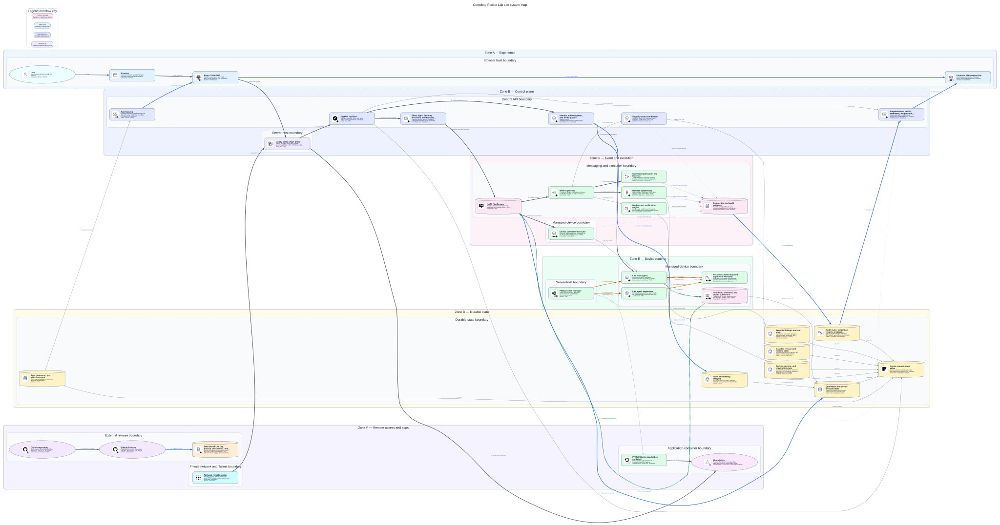
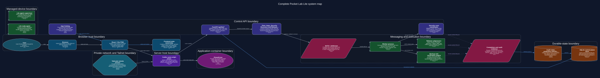

<div class="pl-page-meta"><span class="pl-status pl-status--verified">Source verified</span><span class="pl-status pl-status--patch-provided">Generated from one canonical model</span></div>

# Pocket Lab Lite Architecture

<div class="pl-architecture-summary-grid"><article class="pl-architecture-summary-card"><span class="pl-architecture-icon pl-architecture-icon--summary pl-architecture-icon--brand"><span>React</span></span><h3>Self-hosted workspace</h3><p>React/Vite PWA with safe saved summaries</p></article><article class="pl-architecture-summary-card"><span class="pl-architecture-icon pl-architecture-icon--summary pl-architecture-icon--brand"><span>FastAPI</span></span><h3>FastAPI control plane</h3><p>Validated reads, guards, and command admission</p></article><article class="pl-architecture-summary-card"><span class="pl-architecture-icon pl-architecture-icon--summary pl-architecture-icon--brand"><span>NATS</span></span><h3>NATS event backbone</h3><p>Durable command, event, and heartbeat transport</p></article><article class="pl-architecture-summary-card"><span class="pl-architecture-icon pl-architecture-icon--summary pl-architecture-icon--semantic"><span>Evidence</span></span><h3>Auditable evidence</h3><p>Sanitized lifecycle evidence and prepared projections</p></article><article class="pl-architecture-summary-card"><span class="pl-architecture-icon pl-architecture-icon--summary pl-architecture-icon--brand"><span>Android</span></span><h3>Android/Termux edge</h3><p>PM2-managed agents and supervisor recovery</p></article><article class="pl-architecture-summary-card"><span class="pl-architecture-icon pl-architecture-icon--summary pl-architecture-icon--brand"><span>Tailscale</span></span><h3>Private remote access</h3><p>Tailscale and same-origin Caddy routes</p></article></div>

## Pocket Lab Lite in one view

<figure class="pl-architecture-diagram pl-architecture-diagram--system pl-architecture-diagram--wide pl-architecture-diagram--poster">
  <div class="pl-architecture-diagram__viewport">
    <a class="pl-architecture-diagram__link" href="../../../assets/diagrams/production/views/complete-system.light.svg" aria-label="Open full-size Complete Pocket Lab Lite executive architecture poster">
      
      
    </a>
  </div>
  <figcaption>Complete Pocket Lab Lite executive architecture poster. <a href="../../../assets/diagrams/production/views/complete-system.light.svg">View full-size diagram</a></figcaption>
</figure>


```text
React/Vite PWA
→ Caddy
→ FastAPI /api/lite/*
→ NATS/JetStream
→ worker / agent / supervisor
→ lifecycle events / evidence / heartbeats
→ FastAPI prepared projections
→ PWA
```

## Security / threat-model overlay

The [generated Threat Model](../../enterprise/threat-model/index.md) is a security overlay on this same canonical architecture. Its diagram binds threat nodes back to canonical component IDs and trust boundaries, then adds promoted control/runtime posture without redefining topology ownership.

{ loading=lazy }

## How to read the infrastructure map

- **Experience surface** — Browser, React/Vite PWA, and frontend state provide the self-hosted workspace experience.
- **Control plane** — Caddy fronts FastAPI /api/lite/*, prepared reads, and guarded write surfaces.
- **Event runtime** — NATS / JetStream, worker subprocesses, command lifecycle, and evidence flows coordinate execution.
- **Durable state** — SQLite prepared projections and lifecycle tables preserve truthful, auditable state.
- **Device runtime** — Node agent, supervisor, PM2, and recovery loops run on enrolled Android/Termux or Ubuntu devices.
- **Remote access and apps** — Tailscale, tailscaled, PROot Ubuntu, and PhotoPrism show remote-access and app-hosting boundaries.

## Generated architecture facts

| Measure | Count |
| --- | ---: |
| Components | 57 |
| Connections | 95 |
| Trust boundaries | 9 |
| Domain views | 15 |
| Component mini diagrams | 53 |
| Verified source references | 146 |

**Architecture source fingerprint:** `765d187cae484a494c7f2602216f3c7ab49cafc2bdffd1ea1b8900f7d1e8e672`

**Repository source inventory fingerprint:** `8791913cc3ef44abdc29554c7c634158fd6845a89ccdfc7ff3ddcdb8ace4851d`

## Operational guarantees

- Frontend never talks directly to NATS.
- Frontend never executes shell commands.
- FastAPI remains the control API.
- Agents and supervisors own execution and recovery.
- Bootstrap scripts are backend-generated.
- Secrets are not exposed.
- Offline enrolled devices remain represented.
- Lifecycle changes produce audit evidence.
- Read APIs remain side-effect-free.
- Startup scripts own safe startup side effects.

## Trust-boundary summary

- **Application-container boundary** — PROot Ubuntu and managed application runtime.
- **Browser trust boundary** — User device, browser, PWA, and safe local frontend state.
- **Control API boundary** — FastAPI validation, side-effect-free reads, and command admission.
- **Durable-state boundary** — SQLite canonical state, indexes, revisions, and prepared projections.
- **External release boundary** — GitHub source and immutable release assets.
- **Managed-device boundary** — Joined-device PM2 agent/supervisor runtime.
- **Messaging and execution boundary** — NATS/JetStream, workers, subprocesses, queues, and lifecycle execution.
- **Server-host boundary** — Android/Termux or Ubuntu host processes and local networking.
- **Private network and Tailnet boundary** — LAN and Tailscale private connectivity.

## Architecture views

- [Complete Pocket Lab Lite system map](complete-system.md)
- [App Catalog lifecycle](apps.md)
- [Audit and evidence flow](audit-evidence.md)
- [Backup and restore](backup-recovery.md)
- [Command acknowledgement and reconciliation](command-reconciliation.md)
- [Device onboarding](device-onboarding.md)
- [Devices and offline recovery](device-recovery.md)
- [Frontend state ownership](frontend-state.md)
- [Network and trust boundaries](network-boundaries.md)
- [Release subprocess and atomic rollback](release-rollback.md)
- [Request and control flow](request-control.md)
- [Runtime and PM2 process topology](runtime-topology.md)
- [SQLite and projection architecture](data-projections.md)
- [Security and safety](security.md)
- [Tailscale readiness](remote-access.md)

## Repository implementation map

Use the [Codebase Map](../../development/knowledge/codebase-map.md) to move from canonical architecture components and trust boundaries to the Git-tracked files that map to them. The Codebase Map consumes this architecture model; it does not redefine architecture ownership.

## Component catalog

Open the [generated component catalog](component-catalog.md) for component function, protocols, ownership, runtime placement, health signals, evidence, source verification, and per-component mini diagrams.
