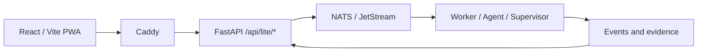

<div class="pl-hero" markdown>

# Pocket Lab Lite Documentation

Operate, develop, validate, and recover your private edge-first workspace through repository-owned guidance.

[Production guide](generated/production/index.md){ .md-button .md-button--primary }
[Development guide](generated/development/index.md){ .md-button }

</div>

<div class="pl-page-meta" markdown>
<span class="pl-status pl-status--verified">Verified</span>
<span class="pl-status pl-status--patch-provided">Repository generated</span>
</div>

<div class="pl-card-grid" markdown>

<div class="pl-card" markdown>

### Devices

Enroll, inspect, repair, and retire Lite devices safely.

[Open Devices documentation](generated/production/devices.md)

</div>

<div class="pl-card" markdown>

### Apps

Install and manage private self-hosted apps through Pocket Lab Lite.

[Open Apps documentation](generated/production/apps.md)

</div>

<div class="pl-card" markdown>

### Recovery

Create backups, verify restore points, and perform safe recovery.

[Open Recovery documentation](generated/production/recovery.md)

</div>

<div class="pl-card" markdown>

### Development

Use the canonical Task, Storybook, Playwright, API-contract, and evidence workflows.

[Open Development documentation](generated/development/index.md)

</div>

</div>

## Architecture



!!! info "Repository-owned documentation"
    Generated pages include source fingerprints and validation metadata. Development and Production tracks are checked independently.

## Validate before merging

```bash title="Development-PC validation"
task lite:contracts:check
task lite:docs:check
task lite:check:quick
```
