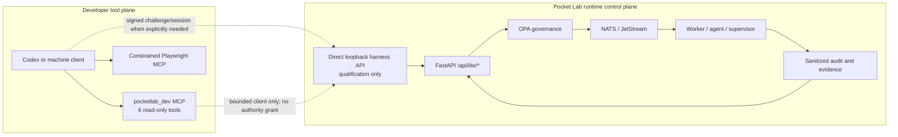

# Pocket Lab Qualification & Maintenance Harness

Status: `IMPLEMENTED` for the local qualification surface; production
maintenance activation is `DEFERRED`.

This page is for developers, testers, debuggers, maintainers, release
engineers, security engineers, automation authors, Codex users, CI services,
and other explicitly provisioned machine clients. It describes an operator
surface, not a Pocket Lab Lite user feature. The normal PWA has no harness
route, state, control, badge, navigation item, or credential flow.

## Overview

The harness is a backend-owned synthetic-principal system for controlled
qualification. It solves the problem of exercising real FastAPI authorization
and operation paths without borrowing a human password, passkey, browser
cookie, CSRF token, Enterprise membership, or personal API credential.

The harness is always:

```text
default off · explicitly activated · synthetic · capability based
short lived · target scoped · auditable · revocable · fail closed · non-browser
```

It is deliberately narrower than a permanent machine Owner. A machine asks
for a named purpose and profile; the backend intersects that request with the
registered profile, derives the effective authority, and sends the resulting
synthetic context through the normal authorization boundary. The caller never
chooses `Owner`, `owner_authority`, capabilities, a device target, or a policy
decision.

### Problems this solves

- Qualification scripts can authenticate without fabricating a human record.
- Tests can prove real API admission, OPA input, operation correlation, and
  sanitized audit evidence.
- Security and recovery qualification can use different least-privilege
  profiles.
- A lost client key can be revoked without changing human Identity.
- A stale challenge, session, target, or environment fails closed.

### What it does not solve

It is not a second control plane, a browser login, a generic remote shell, a
replacement for human approval, or a production maintenance daemon. It does
not make an unsupported backend operation supported. It does not interrupt a
transaction that has already been admitted; operation and worker transaction
safety remain authoritative after admission.

## Security model

Synthetic principals are a distinct identity class. Registration stores only a
public Ed25519 verification key and bounded policy metadata. The private key is
created and held by the client, outside Git, SQLite, audit evidence, MCP
responses, and model context. The server never turns a synthetic principal
into a human identity or Enterprise member.

Authentication and authorization are separate:

```text
registered public key
  → signed, single-use challenge
  → short-lived harness session
  → server-owned profile and capabilities
  → OPA / existing operation guards
```

The exceptional `qualification-owner` profile may derive an internal Owner
role only when the explicit qualification environment, harness flag, Owner
flag, signed session, purpose, target, and normal operation safeguards all
agree. It has no human membership. It is not the default profile.

## Architecture

The developer tool plane and the Pocket Lab runtime control plane remain
separate:



The existing developer MCP remains outside this graph's runtime path. It does
not connect the browser to NATS, invoke worker internals, mutate PM2, or
provide a generic SSH interface.

## Trust boundaries

The machine owns its private key and is responsible for protecting it. The
loopback harness surface verifies the public-key proof and server-generated
context. FastAPI resolves the session, enforces target/capability gates, and
keeps synthetic provenance. OPA remains the policy decision point for governed
actions. NATS, workers, agents, and supervisors retain execution and recovery
ownership. Audit/evidence receives bounded classifications and stable
correlation IDs, never reusable secrets.

The harness listener is direct loopback only. Requests with forwarded or
proxied transport markers are rejected. Caddy strips every known harness proof
header from all FastAPI-forwarding handlers, including API, health, readiness,
SSE, WebSocket, OpenAPI, docs, and ReDoc handlers. Therefore a normal browser
or Caddy path cannot activate synthetic authority.

## Default-off guarantees

Normal Lite startup explicitly defaults to:

```text
POCKETLAB_ENVIRONMENT=production
POCKETLAB_HARNESS_ENABLED=0
POCKETLAB_HARNESS_DESTRUCTIVE=0
POCKETLAB_QUALIFICATION_OWNER=0
POCKETLAB_TEST_AUTH_BYPASS=0
```

The FastAPI lifespan validates these flags before database, NATS, worker, or
other runtime startup. Any harness, destructive, Owner, or test-bypass flag in
`production`, `release`, or `prod` raises a fatal
`harness_forbidden_in_production` configuration error. Harness authority in a
non-qualification environment raises `harness_environment_required`.

The safe state is observable through the direct operator status endpoint or
the CLI, never through the PWA.

## Principal classes

| Class | Intended use | Default environment | Authority |
| --- | --- | --- | --- |
| `debug` | Sanitized diagnosis and read-only inspection | qualification | No mutation |
| `test` | Safe integration probes and bounded refreshes | qualification | No destructive action |
| `qualification` | Security, recovery, release, or exceptional qualification | qualification | Profile-specific |
| `maintenance` | Future bounded production maintenance | maintenance | `DEFERRED` in this increment |

Every record has a server-owned `principal_id`, `principal_type`, class,
display name, allowed profiles, public-key fingerprint, environment scope,
fixed target scope, expiry, and revocation state. A machine principal has no
password, password hash, passkey, WebAuthn credential, cookie, CSRF value,
human membership, or browser session.

## Capability profiles

Profiles are defined in `runtime/api_fastapi/services/lite_harness.py` and are
returned by `GET /api/lite/harness/capabilities`. The caller can request a
profile identifier, but the server validates it against the registered
principal and current environment.

| Profile | Class | Current availability | Capabilities |
| --- | --- | --- | --- |
| `debug-observer` | `debug` | qualification-only | `status.read`, `fleet.read`, `recovery.read`, `security.read`, `identity.read_sanitized`, `rules.read`, `diagnostics.read`, `projection.read`, `evidence.read_sanitized` |
| `test-runner` | `test` | qualification-only | `diagnostics.read`, `test.safe`, `projection.refresh`, `health.probe` |
| `security-qualifier` | `qualification` | qualification-only | `security.read`, `security.scan.quick`, `security.scan.full`, `security.scan.app`, `security.evidence.read` |
| `recovery-qualifier` | `qualification` | qualification-only | `recovery.read`, `backup.create`, `backup.verify`, `restore.preview` |
| `release-qualifier` | `qualification` | qualification-only | `release.read`, `health.probe`, `diagnostics.read`, `evidence.read_sanitized` |
| `maintenance-runner` | `maintenance` | `DEFERRED` | `status.read`, `diagnostics.read`, `agent.restart`, `projection.refresh`, `backup.verify`, `health.probe` |
| `qualification-owner` | `qualification` | qualification-only and separately gated | `qualification.read`, `status.read`, `fleet.read`, `recovery.read`, `security.read`, `diagnostics.read`, `evidence.read_sanitized`, `health.probe`, `backup.create`, `backup.verify`, `backup.location.manage`, `restore.preview`, `restore.apply`, `device.remove`, `catalog.install`, `identity.passkey.revoke`, `rules.read`, `rules.simulate`, `rules.draft`, `rules.activate`, `rules.rollback` |

Profile names and capability lists are backend data. They are not accepted as
arbitrary permissions from a request body, and unknown action/profile pairs
fail closed.

## Authority levels

1. **Read-only diagnostics** — the safe synthetic default.
2. **Safe maintenance** — explicitly profiled, bounded, and reversible where
   the backend operation exists.
3. **Qualification mutation** — only in the explicit qualification
   environment and still subject to normal operation guards.
4. **Destructive qualification** — requires an allowed profile plus the
   independent destructive gate and every action-specific confirmation,
   preview, revision, checkpoint, and OPA guard.

Authentication alone never crosses these levels.

## Qualification Owner

The existing Qualification Owner behavior remains compatible behind its
original three gates and direct-local proof. The generalized path represents
it as the explicit `qualification-owner` profile with `harness_session`
authentication, synthetic-machine identity class, no membership, and a
server-derived Owner role only for the exceptional profile.

The legacy header path remains a compatibility shim for existing qualification
tests. It still requires `POCKETLAB_TEST_AUTH_BYPASS=1`,
`POCKETLAB_QUALIFICATION_OWNER=1`, `POCKETLAB_ENVIRONMENT=qualification`,
`X-Pocket-Lab-Test: 1`, `X-Pocket-Lab-Qualification: 1`, direct loopback, no
forwarded markers, and no caller role. It is not the generalized machine
authentication protocol.

## Authentication lifecycle

The client requests a challenge for one purpose, profile, and fixed target.
The backend creates a random 32-byte nonce and canonical payload containing:

```text
version, principal_id, challenge_id, nonce, issued_at, expires_at,
purpose, profile, target_scope, runtime_id
```

The client signs the exact canonical payload with Ed25519. FastAPI checks the
registered public key, payload hash, nonce hash, runtime, principal, profile,
purpose, target, expiry, and single-use state. A successful proof creates a
short-lived session whose raw token is returned once; SQLite stores only its
SHA-256 hash.

Default challenge TTL is 120 seconds, bounded to 30–300 seconds. Default
session TTL is 20 minutes, bounded to 60–3600 seconds. A challenge is consumed
once. Five failed signatures consume it. Replay, altered context, stale
runtime, and expired proofs fail closed.

## Registering a machine

Create key material on the client machine. Use a private directory outside the
repository and keep the resulting file at mode `0600`:

```bash
python3 scripts/dev/lite/harness.py keygen \
  --key-file '<machine-private-dir>/qualification-runner.key'
```

The command prints the public key and fingerprint, not the private bytes. Set
the provisioning token only in the local qualification environment; never put
it in Git, a task file, a fixture, or a documentation example:

```bash
export POCKETLAB_HARNESS_PROVISIONING_TOKEN='<operator-provided-token>'
task lite:harness:principal:create \
  PRINCIPAL_ID=qualification-runner \
  DISPLAY_NAME='Local recovery qualification runner' \
  KEY_FILE='<machine-private-dir>/qualification-runner.key' \
  PROFILE=recovery-qualifier
```

Provisioning is direct loopback only and requires both the explicit
provisioning marker and the configured token. The server records the public
key, fingerprint, profile, environment, and fixed target scope. It never
creates a human row.

## Using Codex

Use the established MCP first for bounded repository facts, diagnostics, and
validation. If a supported API qualification step genuinely requires a
synthetic session, use the CLI or a future bounded client to complete the
challenge/signature flow. The intended sequence is:

```text
pocketlab_dev discovery/diagnostics
  → direct loopback harness session, if required
  → existing supported FastAPI operation
  → bounded sanitized evidence by stable correlation ID
```

Do not give Codex a human password, browser cookie, API token, NATS
credential, SSH command, or private key through chat or MCP. The current
repository intentionally has no harness-specific MCP tools; see [Harness MCP
extensions](#harness-mcp-extensions).

## Existing Pocket Lab MCP

The current `pocketlab_dev` server remains exactly six read-only developer-plane
tools:

| Tool | Bounded result |
| --- | --- |
| `repo_status` | Local repository, branch, SHA, and clean-state projection |
| `changed_files` | Classified `working_tree` or `branch_vs_origin_main` paths |
| `validation_targets` | Immutable validation target catalog |
| `run_validation` | One allow-listed validation target |
| `diagnostic_targets` | Immutable diagnostic target catalog |
| `diagnostic_summary` | One bounded semantic diagnostic result |

The current diagnostic catalog is:

```text
docs_health generated_drift runtime_capture pm2_status nats_health
openapi_routes security_summary pm2_summary security_run_summary
```

Diagnostics do not accept a command, argv, shell, path, URL, host, NATS
subject, process name, credential, or environment override. They remain
read-only. `pm2_summary` and the live portion of `nats_health` use the fixed
machine-owned `pocketlab-termux` SSH alias only for bounded Server Phone
observation; they do not mutate the consumer.

## Harness MCP extensions

**New harness-specific MCP tools: NOT REQUIRED / NOT IMPLEMENTED.** The
current CLI and direct loopback API are sufficient for the implemented
qualification surface. Adding a tool would require a reviewed machine-key
custody model that does not put a private key in MCP arguments, output, logs,
or model context. The existing MCP therefore remains six tools and cannot grant
authority, bypass FastAPI, publish NATS messages, call workers, mutate PM2, or
accept arbitrary shell/SSH/path/host/URL input.

## Using pytest

Use an isolated SQLite state directory and test-generated Ed25519 keys. Keep
the provisioning token and private key in the test process only; do not commit
fixtures containing real-looking credentials. A minimal protocol call uses
the public backend contract:

```python
keygen()                         # client-only Ed25519 key
POST /api/lite/harness/principals  # public key plus named profile
POST /api/lite/harness/challenge  # purpose/profile/fixed target
sign(exact signing_payload)      # client-only
POST /api/lite/harness/session    # challenge/signature
GET  /api/lite/status             # normal authenticated read
DELETE /api/lite/harness/session/{id}
```

The repository regression matrix is in
`tests/backend/test_lite_harness.py`. It proves transactionally persisted
failure evidence, replay/expiry, profile resolution, target isolation,
destructive-session limits, human-table isolation, and no frontend/MCP
projection.

## Using Playwright live qualification

The constrained Playwright MCP is separate from `pocketlab_dev` and remains a
developer browser observer. Use it only for supporting evidence such as a
single mocked navigation and accessibility snapshot proving there is no
Harness or Maintenance UI. Do not use arbitrary browser evaluation, inject
machine proof into a page, or treat mocked UI behavior as Server Phone
qualification.

The repository-level security property is proved by source and Caddy tests:
normal proxied traffic strips harness headers and FastAPI rejects forwarded
proof. A live browser check remains supplemental and is `UNVALIDATED` unless
run against the intended development surface.

## Using GitHub Actions

No GitHub Actions harness integration is enabled in this increment. Do not
place a private key or provisioning token in repository variables, artifacts,
logs, or a workflow command line. A future CI integration must use an isolated
runner, a protected environment secret, direct loopback transport, a
disposable principal, a bounded session, and explicit cleanup; it must not
turn the developer MCP into a remote control plane.

## Debugging workflow

Start with bounded, read-only observations:

```bash
task lite:harness:profiles
task lite:harness:status
task lite:harness:verify-off
```

For a qualification runtime, inspect source and the sanitized status before
requesting a session. If the MCP result is incomplete or truncated, retain
that label and escalate only to the smallest direct read-only probe needed for
the missing fact.

## Maintenance workflow

`maintenance-runner` is present as a server-owned profile definition but
production activation is `DEFERRED`. It cannot be registered by the current
qualification runtime. No hidden production Owner or test-bypass path is
provided. Until a separate transport, provisioning, rollback, and operational
review proves the boundary, use normal operator procedures and the existing
read-only MCP diagnostics.

## Security qualification workflow

Use `security-qualifier` only in an explicit qualification runtime. Start with
read-only security summaries and bounded evidence. A security scan or evidence
operation still uses its existing backend admission, workload, OPA, and
retention rules. The harness only authenticates the synthetic caller; it does
not bypass those controls.

## Recovery qualification workflow

Use `recovery-qualifier` for Recovery reads, backup creation/verification, and
restore preview. A real restore requires the existing selected-backup,
manifest, confirmation, checkpoint, revision, protected-target, and worker
guards. The profile does not include `restore.apply` or device removal.

The existing [Server Phone Recovery qualification record](../recovery/server-phone-backup-restore-live-qualification.md)
remains the source for its historical live evidence. A local harness test or a
mocked browser test is not a live Server Phone result.

## Destructive qualification

Destructive authority requires all of the following:

```text
POCKETLAB_HARNESS_ENABLED=1
POCKETLAB_ENVIRONMENT=qualification
POCKETLAB_HARNESS_DESTRUCTIVE=1
valid registered principal and signed short-lived session
profile capability and exact local target scope
normal action-specific confirmation/preview/revision/OPA guards
```

The independent destructive gate is evaluated when the session is created and
stored as a bounded boolean. One active destructive session is allowed per
runtime. A profile alone, an environment flag alone, or a caller-supplied role
does not admit a destructive operation. Do not run Level 4 live actions
without explicit authorization for that exact action and target.

## Target scoping

The only implemented target scope is:

```text
local_server_host_only
```

It is included in the challenge, session, capability check, OPA input, and
audit record. A device target is accepted only for the fixed server-host
identifiers already recognized by the backend. Arbitrary secondary device IDs
cannot broaden authority. A future secondary-device qualification requires a
new profile and target contract; it is not implied by this harness.

## Session expiry

Challenges expire after a bounded TTL and are single-use. Sessions expire after
their bounded TTL or when the principal expires. The next operation admission
after expiry is denied with `harness_session_expired` or a principal expiry
reason. Expiry does not cancel an already-admitted transaction halfway through;
the operation's transaction and worker recovery guards remain authoritative.

## Revocation

`DELETE /api/lite/harness/session/{id}` revokes one active session. The
provisioning-only principal revoke endpoint disables the principal and revokes
all active sessions. Revocation applies immediately to new challenge/session
and operation admission. Revocation is durable and auditable.

## Key rotation

Generate a new client key with `harness.py keygen`, register a new disposable
principal or use an explicitly reviewed replacement procedure, verify the new
fingerprint, then revoke the old principal. Never overwrite a working key in
SQLite or place it in a repository artifact. The registry currently models
rotation as new public-key registration plus old-principal revocation, which
keeps the audit trail unambiguous.

## Audit/evidence

The `harness_audit_events` table stores bounded lifecycle and admission
metadata. Current event types include:

```text
principal_registered principal_revoked challenge_issued
authentication_succeeded authentication_rejected session_created
session_expired session_revoked capability_denied
destructive_operation_admitted
```

Each event can carry `principal_id`, `principal_class`,
`harness_session_id`, `purpose`, capability/profile, target scope, environment,
operation ID, result, reason code, and a stable correlation ID. Retention is
bounded by `POCKETLAB_HARNESS_AUDIT_RETENTION` (100–10,000; default 1,000).

No event stores a private key, raw signature, nonce, challenge payload, raw
session token, authorization header, browser cookie, CSRF value, password,
NATS credential, or machine-local key contents.

## Qualification session correlation

The session ID is carried in the backend auth context and bounded operation
actor provenance. Policy inputs expose the synthetic class, profile, purpose,
target, runtime, and destructive admission state. Operation/audit consumers can
therefore answer which machine principal requested an action, which profile it
held, which local target was involved, and whether admission failed or passed.

## Fault injection

No generic fault-injection capability is exposed by this increment. Existing
repository-owned deterministic fault seams remain governed by their own tests
and are not made callable through an arbitrary harness or MCP argument. Fault
injection in a future increment requires a named capability, explicit gate,
qualification environment, fixed target, bounded input, and cleanup proof.

## Concurrent session control

The runtime limits active sessions to three per principal and eight globally.
Only one session with destructive admission may be active. Active challenges
are bounded to eight per principal, failed signatures are limited, and old
challenge/audit state is cleaned within bounded retention windows. Clients do
not bypass these limits.

## API reference

All harness routes are under `/api/lite/harness` and require direct loopback
transport. The intended default FastAPI port is `8080`; the CLI accepts only an
HTTP loopback URL.

| Method and path | Purpose | Extra authority |
| --- | --- | --- |
| `GET /capabilities` | Read server-owned profile manifest | None; loopback |
| `GET /status` | Read bounded enabled/environment/session counts | None; loopback |
| `POST /principals` | Register public key and profiles | Provisioning marker plus provisioning token |
| `POST /principals/{id}/revoke` | Revoke principal and sessions | Provisioning marker plus provisioning token |
| `DELETE /principals/{id}` | Alias for principal revocation | Provisioning marker plus provisioning token |
| `POST /challenge` | Issue a bound challenge | Enabled qualification runtime |
| `POST /session` | Verify signature and issue short-lived session | Enabled qualification runtime |
| `GET /session/{id}` | Read session metadata | Matching session proof |
| `DELETE /session/{id}` | Revoke matching session | Matching session proof |

The registration body accepts `principal_id`, `display_name`, `public_key`,
`profiles` (or the compatibility input name `allowed_profiles`), `algorithm`,
and bounded expiry. Challenge/session bodies accept only typed bounded fields.
There is no role, capability, permission, arbitrary host, arbitrary path,
arbitrary URL, shell, argv, NATS subject, or environment field.

The session header is `X-Pocket-Lab-Harness-Session`. Provisioning uses
`X-Pocket-Lab-Harness-Provisioning: 1` and
`X-Pocket-Lab-Harness-Provisioning-Token`. All other known harness proof
headers are rejected at FastAPI and stripped at Caddy.

## CLI and task reference

| Command | Purpose |
| --- | --- |
| `python3 scripts/dev/lite/harness.py keygen --key-file <path>` | Create a `0600` raw Ed25519 private key; prints public fingerprint only |
| `... profiles` | Fetch the bounded profile manifest |
| `... status` | Fetch bounded harness status |
| `... verify-off` | Fail unless all harness/Owner/test flags are off |
| `... principal-create ...` | Register public key and named profile |
| `... principal-revoke --principal-id <id>` | Revoke principal and active sessions |
| `... session-start ...` | Obtain challenge, sign locally, and create session |
| `... session-status --session-id <id>` | Read session status |
| `... session-stop --session-id <id>` | Revoke session |

Equivalent Taskfile entries are `lite:harness:profiles`,
`lite:harness:status`, `lite:harness:verify-off`,
`lite:harness:principal:create`, `lite:harness:session:start`, and
`lite:qualification:start`.

## Environment variables

| Variable | Meaning | Safe default / bound |
| --- | --- | --- |
| `POCKETLAB_ENVIRONMENT` | Runtime environment name | normal Lite sets `production` |
| `POCKETLAB_HARNESS_ENABLED` | Enable qualification harness | `0` |
| `POCKETLAB_HARNESS_DESTRUCTIVE` | Independent destructive gate | `0`; only qualification with harness |
| `POCKETLAB_QUALIFICATION_OWNER` | Enable exceptional Owner profile | `0`; only qualification |
| `POCKETLAB_TEST_AUTH_BYPASS` | Existing test-only auth gate | `0` in normal Lite |
| `POCKETLAB_HARNESS_PROVISIONING_TOKEN` | Local provisioning secret | unset; never logged |
| `POCKETLAB_HARNESS_RUNTIME_ID` | Explicit runtime identity | derived from isolated state if unset |
| `POCKETLAB_HARNESS_CHALLENGE_TTL_SECONDS` | Default challenge TTL | 30–300; default 120 |
| `POCKETLAB_HARNESS_SESSION_TTL_SECONDS` | Default session TTL | 60–3600; default 1200 |
| `POCKETLAB_HARNESS_AUDIT_RETENTION` | Audit row retention | 100–10,000; default 1,000 |
| `POCKETLAB_HARNESS_API_URL` | CLI endpoint | `http://127.0.0.1:8080`; loopback-only |
| `POCKETLAB_HARNESS_CLI_TIMEOUT_SECONDS` | CLI request timeout | 1–15 seconds; default 5 |

## Reason codes

| Reason code | Meaning |
| --- | --- |
| `harness_forbidden_in_production` | Unsafe harness/Owner/test flag in a production-like environment |
| `harness_environment_required` | Harness is enabled outside qualification |
| `destructive_harness_requires_qualification` | Destructive flag lacks enabled qualification harness |
| `qualification_owner_requires_qualification` | Owner flag is outside qualification |
| `harness_disabled` | Harness proof/session requested while disabled |
| `harness_not_disabled` | The negative off-state check found authority enabled |
| `harness_runtime_id_invalid`, `harness_runtime_mismatch` | Runtime identity is invalid or proof belongs to another runtime |
| `harness_transport_rejected` | Request was not direct loopback or contained forwarded transport proof |
| `harness_provisioning_rejected` | Provisioning marker/token was missing or invalid |
| `principal_id_invalid`, `principal_display_name_invalid` | Registration identifier/display name failed bounds |
| `principal_algorithm_unsupported`, `principal_public_key_invalid` | Registration crypto material is unsupported or invalid |
| `principal_profiles_invalid`, `principal_profiles_incompatible` | Profile list is empty, too large, or crosses classes |
| `principal_exists`, `principal_not_found` | Principal registry conflict or missing principal |
| `principal_revoked`, `principal_expired` | Principal cannot issue or use authority |
| `harness_profile_unknown`, `harness_profile_not_allowed` | Profile is unknown or not registered for the principal |
| `maintenance_activation_deferred` | Production maintenance profile is intentionally not active |
| `harness_environment_mismatch`, `harness_target_mismatch` | Principal/session/request scope differs from the fixed runtime target |
| `harness_purpose_invalid` | Purpose failed the bounded identifier contract |
| `harness_challenge_limit`, `challenge_invalid`, `challenge_not_found` | Challenge request/state failed bounds or is unavailable |
| `challenge_expired`, `challenge_replayed` | Challenge is stale or already consumed |
| `challenge_context_mismatch`, `challenge_principal_mismatch`, `challenge_profile_mismatch` | Signed/requested context differs from the issued challenge |
| `signature_invalid` | Ed25519 signature verification failed |
| `harness_session_limit`, `harness_global_session_limit`, `harness_destructive_session_limit` | Bounded session concurrency was reached |
| `harness_session_invalid`, `harness_session_not_found` | Session proof or identifier is not recognized |
| `harness_session_revoked`, `harness_session_expired` | Session is no longer active |
| `harness_role_field_rejected`, `harness_proof_fields_rejected` | Caller attempted to provide role or derived proof metadata |
| `harness_action_unregistered`, `harness_capability_denied` | Action has no registered mapping or profile capability |
| `destructive_harness_disabled`, `destructive_admitted` | Independent destructive gate denied or admitted the action |
| `qualification_owner_profile_disabled` | Exceptional Owner profile was not explicitly enabled |
| `principal_registered`, `challenge_issued`, `signature_verified`, `session_created` | Successful lifecycle evidence |
| `session_revoked`, `session_expired`, `principal_revoked` | Lifecycle termination evidence |

Existing OPA, operation, Recovery, Identity, and workload reason codes remain
authoritative for their own boundaries. The harness does not replace them.

## Troubleshooting

| Symptom | Check |
| --- | --- |
| Harness disabled | Run `status`; confirm qualification environment and `POCKETLAB_HARNESS_ENABLED=1` only in the intended isolated runtime. |
| Production rejection | This is expected for any unsafe production-like flag; restore all five normal defaults. |
| Signature invalid | Sign the exact returned canonical payload with the private key matching the registered public key; do not reserialize it. |
| Challenge expired/replayed | Request a fresh challenge; never reuse a consumed response. |
| Session expired/revoked | Start a new bounded session or provision a replacement principal after checking audit evidence. |
| Principal revoked | Revoke is immediate; use a new reviewed key/principal, not a database edit. |
| Capability denied | Request a profile that is already registered and actually contains the action; the caller cannot add a capability. |
| Target mismatch | Use only `local_server_host_only`; secondary device authority is not implied. |
| Caddy/proxy rejection | Expected for harness proof. Use direct loopback; Caddy strips proof and forwarded requests are rejected. |
| OPA denial | Investigate the existing OPA decision, policy revision, target, and normal guard; do not bypass OPA with harness flags. |
| Maintenance action already running | Treat the backend's operation/admission result as authoritative and follow its retry/rollback guidance. |
| MCP unavailable | Use current repository-owned direct validation/diagnostic commands only within their existing allow-list; do not invent a generic shell MCP. |
| MCP result truncated/incomplete | Preserve `truncated`/`complete` labels and perform one bounded corroborating read. |
| Harness MCP tool rejected | No harness-specific MCP tool is implemented in this increment; use the direct CLI/API contract. |
| Machine key unavailable | Stop, revoke the principal if compromise is possible, and rotate through a new public key. Never recover a key from server state. |

## Security guarantees

The implementation and regression suite prove these negative properties at the
source/runtime contract level:

- Normal release startup cannot accept harness flags.
- A browser/Caddy request cannot carry synthetic proof into FastAPI.
- A caller cannot self-assign Owner, role, capabilities, or target scope.
- Synthetic registration creates zero human identity, credential, passkey,
  membership, or browser-session rows.
- Expired, replayed, altered, revoked, or cross-runtime proof fails closed.
- Destructive admission requires a separate gate and one active destructive
  session.
- Private keys are never stored server-side or emitted in audit/MCP output.
- The existing MCP exposes no arbitrary shell, SSH, NATS, PM2, path, argv, URL,
  host, or environment authority.
- The PWA contains no harness endpoint, state, navigation, or activation code.

These guarantees do not claim a physical Server Phone qualification or a live
browser result until those evidence classes are separately run.

## Threat model

| Threat | Mitigation |
| --- | --- |
| Stolen machine key | Short-lived sessions, principal/session revocation, fixed target, audit trail, key rotation |
| Challenge replay | Random nonce, payload hash, single-use `consumed_at`, expiry, failed-attempt bound |
| Browser spoofing | Direct-loopback check, forwarded-marker rejection, Caddy stripping, no PWA surface |
| Role escalation | Role/capability/Owner fields are server-derived; caller role fields are rejected |
| Caddy forwarding | All FastAPI-facing Caddy handlers strip known harness headers |
| Leaked environment variable | Production startup refuses unsafe flags; provisioning token is required and never returned |
| Malicious secondary device | Fixed local-server scope and no arbitrary device-ID expansion |
| Stale session or session theft | TTL, principal expiry, immediate revocation, bounded concurrency |
| Arbitrary capability request | Named server profile intersection and action allow-list |
| MCP allow-list bypass | Existing six-tool immutable allow-list and central runner/redaction remain unchanged |
| MCP argument injection | No command/argv/cwd/env/host/path/URL/NATS subject fields |
| Private key entering model context | Client-local key file is never read by the backend/MCP and is not returned by CLI output |
| Output/redaction failure | Bounded sanitized projections, no raw secrets in durable harness events, regression assertions |

## Observability

Use `GET /api/lite/harness/status` or the CLI for a bounded projection:

```json
{
  "status": "disabled",
  "enabled": false,
  "environment": "production",
  "active_sessions": 0,
  "principal_count": 0,
  "destructive_gate": false,
  "qualification_owner": false,
  "test_auth_bypass": false,
  "complete": true,
  "truncated": false
}
```

Counts and labels are safe operator metadata. Challenge values, signatures,
tokens, private paths, and raw database payloads are not part of this
projection.

## Cleanup

At the end of every qualification run:

1. Revoke or allow the session to expire.
2. Revoke the disposable principal if it is no longer needed.
3. Set `POCKETLAB_HARNESS_DESTRUCTIVE=0`.
4. Set `POCKETLAB_QUALIFICATION_OWNER=0`.
5. Set `POCKETLAB_TEST_AUTH_BYPASS=0`.
6. Stop the explicit qualification launcher and restore normal production
   startup.
7. Run `verify-off`, inspect sanitized audit state, and verify the normal
   Caddy path rejects proof.

Do not delete or reset unrelated state merely to tidy a qualification run.

## Verify harness is OFF

From the normal runtime's local operator environment:

```bash
unset POCKETLAB_HARNESS_ENABLED POCKETLAB_HARNESS_DESTRUCTIVE \
  POCKETLAB_QUALIFICATION_OWNER POCKETLAB_TEST_AUTH_BYPASS
export POCKETLAB_ENVIRONMENT=production
python3 scripts/dev/lite/harness.py verify-off
```

Expected bounded result includes:

```text
"enabled": false
"environment": "production"
"destructive_gate": false
"qualification_owner": false
"test_auth_bypass": false
```

The command exits non-zero with `harness_not_disabled` if any authority flag
is active. Independently, production startup must fail with
`harness_forbidden_in_production` if an unsafe flag is reintroduced.

## Developer reference

Canonical implementation files:

```text
pocket-lab-final-structure/runtime/api_fastapi/db/schema/0034_harness_synthetic_principals.sql
pocket-lab-final-structure/runtime/api_fastapi/services/lite_harness.py
pocket-lab-final-structure/runtime/api_fastapi/routers/harness.py
pocket-lab-final-structure/runtime/api_fastapi/deps.py
pocket-lab-final-structure/runtime/api_fastapi/main.py
security/policies/opa/pocketlab/pocketlab.rego
scripts/dev/lite/harness.py
scripts/dev/lite/start-qualification.sh
tests/backend/test_lite_harness.py
```

The durable entities are `synthetic_principals`, `harness_challenges`,
`harness_sessions`, and `harness_audit_events`. The FastAPI routes, CLI, and
future clients share this one backend contract; they do not implement separate
authorization logic.

## Limitations

- Production `maintenance-runner` activation is `DEFERRED`.
- No harness-specific MCP client tools are implemented.
- No GitHub Actions integration is enabled.
- No arbitrary secondary-device target is supported.
- No generic fault-injection capability is exposed.
- The direct listener is not a Tailnet, LAN, Caddy, or public endpoint.
- The local harness test suite is not live Server Phone evidence.
- Existing backend operations may still be unavailable, stale, or blocked by
  OPA, workload admission, credentials, or recovery prerequisites.
- A synthetic Owner profile does not remove normal confirmation, preview,
  checkpoint, revision, transaction, or worker recovery guards.

## Recovery from lost or revoked machine credentials

Do not attempt to read a private key from SQLite, audit logs, MCP output, or a
Server Phone. If a key is lost, revoke its principal with the provisioning-only
operation and create a new local key/principal. If compromise is suspected,
revoke first, then inspect bounded audit events for the principal and session
IDs. Re-run the default-off proof after the qualification runtime stops.

The server's public-key fingerprint and synthetic audit provenance remain
available for incident correlation, but they cannot reconstruct the lost
private key.
