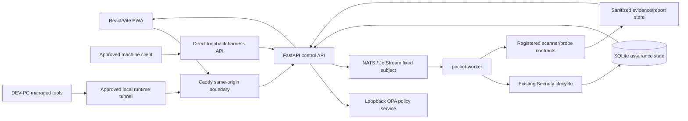

# 1. Architecture and trust boundaries

Status: **VERIFIED from current source and registries**. The implementation
sources are `scripts/dev/lite/security_assurance.py`,
`pocket-lab-final-structure/runtime/api_fastapi/routers/security_assurance.py`,
`pocket-lab-final-structure/runtime/api_fastapi/services/lite_security_assurance.py`,
and the worker/security path.

## End-to-end path

The browser path is normal product traffic. The assurance path is a direct
loopback, non-browser operator surface. FastAPI admits a fixed registered
operation, builds the NATS envelope, and records the run. The worker owns
execution and heartbeat/checkpoint updates. The client observes prepared,
sanitized results; it does not become an execution owner.

## Planes and lifecycles

| Plane | Owner | Evidence | Failure behavior |
| --- | --- | --- | --- |
| Control plane | FastAPI | admission, policy decision, operation/run correlation | reject or `BLOCKED`; no fallback shell |
| Authentication plane | harness service + Ed25519 client key | bounded principal/session audit | invalid, expired, replayed, or forwarded proof denied |
| Policy plane | OPA and policy-source lifecycle | policy revision/readiness | unavailable or stale policy fails closed |
| Messaging plane | NATS/JetStream | fixed subject, durable delivery, worker result | reconnect/reconcile; never caller-selected subjects |
| Execution plane | pocket-worker / existing Security path | tool result, heartbeat, checkpoint | timeout/interruption is `PARTIAL`, `FAIL`, or `BLOCKED` |
| Evidence plane | SQLite and sanitized evidence store | normalized findings, reports, checksums | redact or fail closed; never retain raw secrets |
| DEV-PC lane | fixed tool manager | receipt, version, checksum, lane | missing/invalid receipt is `FAILED`, not silently skipped |
| Fault plane | fixed qualification-only fault registry | one-use fault event and recovery proof | automatic restoration; injected operation may fail while invariant passes |
| Cleanup plane | authenticated self-revoke + operator stop | revocation and default-off status | authority is invalidated immediately even if physical GC waits |

## Trust-boundary table

| Boundary | Trusted side | Untrusted side | Authentication/authorization | Secrets involved | Evidence | Failure behavior |
| --- | --- | --- | --- | --- | --- | --- |
| Browser → Caddy | Caddy and normal product routes | browser input and headers | normal product session/CSRF; harness proof stripped | browser session only | normal API audit | no synthetic authority |
| Caddy → FastAPI | same-origin proxy contract | forwarded/proxied harness markers | direct-loopback checks still apply | none | sanitized rejection | `harness_transport_rejected` |
| Machine → harness loopback | harness API | approved client process | Ed25519 challenge/session; fixed profile/purpose/target | private key stays client-side; session token stays in memory | bounded identity/audit | expiry/revocation/replay denied |
| FastAPI → OPA | registered policy client | unavailable/stale policy service | fixed local policy query | no caller credential | policy revision/readiness | fail closed |
| FastAPI → NATS | backend publisher | caller request fields | server-owned fixed subject/envelope | NATS credentials remain runtime-owned | operation correlation | no arbitrary publish |
| NATS → worker | JetStream consumer | malformed/redelivered messages | worker-owned durable consumer | runtime NATS credential | delivery/result/checkpoint | reconcile; no duplicate terminal execution |
| Worker → scanner | worker process | registered tool output | registry command contract; bounded argv/cwd/target | tool-specific runtime secrets excluded | normalized tool result | timeout, missing, or parser failure is truthful |
| DEV PC → Server Phone tunnel | approved local tunnel | unrelated network targets | fixed ports and target allowlist | SSH/tunnel custody outside reports | lane/target metadata | reject unregistered target |

## Non-negotiable boundaries

- The PWA never talks directly to NATS, OPA, scanners, or a shell.
- The PWA never stores a harness private key, provisioning authority, or raw
  session token.
- Caddy is not a harness authorization path; proof/header injection through
  Caddy must not activate synthetic authority.
- The client cannot choose a binary, command, argv, target, path, URL, port,
  NATS subject, ruleset, template, or environment.
- A normal production startup remains harness-disabled and cannot create a
  bootstrap grant or synthetic machine Owner.
