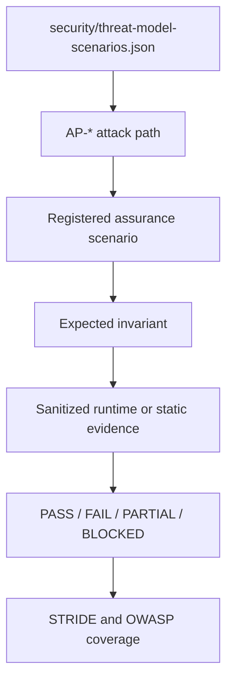

# STRIDE, OWASP, and attack-path playbook

This page explains how the registered assurance scenarios relate to the
canonical threat model. The machine-readable registries are authoritative:
`security/assurance/scenarios.yaml` and `security/threat-model-scenarios.json`.
This page is reviewer guidance, not a second threat model.

## Evaluation relationship



For every executed scenario, review the asset, trust boundary, control,
exact registered execution, expected invariant, observed evidence, result,
and residual risk. A modeled or static-only path is not runtime proof.

## STRIDE coverage

| Category | Pocket Lab assurance focus | Typical evidence |
| --- | --- | --- |
| Spoofing | Ed25519 possession, runtime binding, forwarded-proof rejection, browser isolation | challenge/session decision, reason code, Caddy boundary result |
| Tampering | fixed registry inputs, revision/policy binding, NATS/worker ownership, evidence integrity | manifest, operation correlation, checkpoint, sanitized audit |
| Repudiation | admitted and rejected operations remain attributable and bounded | principal class, run ID, timestamps, decision and result |
| Information Disclosure | redaction, same-origin boundary, excluded media, no reusable credentials | sanitization artifact, bounded file references, header checks |
| Denial of Service | readiness gates, bounded timeouts, resource admission, safe recovery | preflight, heartbeat, timeout/partial state, resource facts |
| Elevation of Privilege | fixed profile/capability gates and Owner boundary | authorization denial, capability set, profile and target binding |

The `harness-auth-boundary`, `caddy-proof-strip`, `control-plane-ownership`,
`evidence-redaction`, `runtime-readiness`, `policy-readiness`, and
`attack-path-inventory` scenarios provide the current registered coverage.
The exact mapping belongs to `scenarios.yaml`; do not add an ad hoc scenario
by editing this page.

## OWASP Top 10 2021 reference mapping

OWASP is a secondary lens. The codes below are the repository-owned mappings;
the harness does not force an irrelevant category onto a scenario.

| Category | Pocket Lab surface | Coverage interpretation |
| --- | --- | --- |
| A01 Broken Access Control | harness capability/profile/target gates, Caddy boundary, Owner denial | Runtime and static evidence where registered; inspect scenario results. |
| A02 Cryptographic Failures | Ed25519/session handling, redaction, protected evidence | Runtime/static evidence; secret material is never reproduced. |
| A03 Injection | bounded malformed-input and API-boundary probes | Runtime only when the registered probe executes; otherwise static evidence. |
| A04 Insecure Design | threat model, fixed execution ownership, recovery boundaries | Human review may be required for governance and destructive paths. |
| A05 Security Misconfiguration | Caddy headers, default-off state, listeners, tool posture | Runtime/static evidence according to the executed tool lane. |
| A06 Vulnerable and Outdated Components | dependency, SBOM, Trivy, OSV, Grype, pip-audit, npm audit | Scanner findings require triage; a finding is not automatically an exploit. |
| A07 Identification and Authentication Failures | challenge/session expiry, replay, revocation, key binding | Runtime negative and positive authentication evidence. |
| A08 Software and Data Integrity Failures | revision/policy binding, worker result and evidence integrity | Runtime/static evidence; compare manifest and checksums. |
| A09 Security Logging and Monitoring Failures | audit, operation correlation, heartbeats, sanitized reports | Runtime evidence must show bounded attribution and lifecycle. |
| A10 Server-Side Request Forgery | no caller-selected URL/host and fixed local targets | `NOT_APPLICABLE` for the registered local-only assurance surface unless the registry changes. |

Use `TESTED`, `STATIC_EVIDENCE`, `NOT_APPLICABLE`, and
`HUMAN_REVIEW_REQUIRED` in reports. Do not call an uncovered category PASS.

## Current AP-* catalog

The following is the current classification of the 14 canonical attack paths.
The IDs and names come from `security/threat-model-scenarios.json`; the
qualification classification is the harness operating decision for this
documentation set.

| ID | Name | Current qualification classification | Primary evidence or review |
| --- | --- | --- | --- |
| AP-01 | Browser control-plane bypass | EXECUTABLE_NOW | `harness-default-off`, `harness-auth-boundary`, `caddy-proof-strip`; browser/Caddy denial evidence. |
| AP-02 | Browser shell execution | EXECUTABLE_NOW | `harness-default-off`, `caddy-proof-strip`, `source-boundaries`; no browser shell path. |
| AP-03 | Forged managed-device identity | EXECUTABLE_NOW | `harness-auth-boundary`, `adversarial-negative-auth-probes`; invalid proof and binding rejection. |
| AP-04 | Messaging command tampering or replay | PARTIALLY_EXECUTABLE | fixed subject, operation correlation, worker ownership; message-level tampering remains bounded by the registered path. |
| AP-05 | Supply-chain artifact compromise | STATIC_EVIDENCE_ONLY | tool receipts, lockfiles, SBOM, provenance checks; artifact-specific signature review. |
| AP-06 | Evidence poisoning | EXECUTABLE_NOW | `control-plane-ownership` and `evidence-redaction`; normalized evidence and correlation. |
| AP-07 | Tailnet/private-network exposure | PARTIALLY_EXECUTABLE | readiness, Caddy, fixed listener checks; unrelated network scanning is prohibited. |
| AP-08 | Recovery state tampering | HUMAN_REVIEW_REQUIRED | destructive Recovery is outside this playbook; review supported Recovery evidence separately. |
| AP-09 | Human identity and WebAuthn assurance misuse | HUMAN_REVIEW_REQUIRED | physical/user ceremony is not automated by this harness. |
| AP-10 | Enterprise membership and final-Owner privilege escalation | HUMAN_REVIEW_REQUIRED | governance and final-Owner ceremonies require a human reviewer. |
| AP-11 | OPA authorization decision integrity failure | EXECUTABLE_NOW | `policy-readiness` and the fixed OPA fault control when explicitly authorized. |
| AP-12 | Policy revision activation and recovery integrity | PARTIALLY_EXECUTABLE | policy revision/readiness and restart evidence; broader release recovery remains review. |
| AP-13 | Approval and continuation integrity | HUMAN_REVIEW_REQUIRED | approval ceremonies and exception acceptance require human review. |
| AP-14 | Temporary-exception scope and expiry bypass | PARTIALLY_EXECUTABLE | fixed capability/expiry checks; exception governance remains human review. |

These classifications are not risk acceptance. They state what the current
registered harness can execute safely. The final report must retain the
model's `review_status` and distinguish automated evidence from human review.

## Reviewer procedure

1. Confirm the run manifest revision and registry hashes.
2. Open `threat-coverage.json`, `owasp-coverage.json`, and
   `attack-path-results.json`.
3. For each `EXECUTABLE_NOW` or `PARTIALLY_EXECUTABLE` path, match the result
   to a scenario, tool result, control, and sanitized evidence reference.
4. Treat `STATIC_EVIDENCE_ONLY` as source/supply-chain evidence, not runtime
   exploit proof.
5. Confirm each `HUMAN_REVIEW_REQUIRED` path has a reviewer, evidence list,
   pass/fail criteria, and residual-risk statement.

Run the current catalog-driven report with `[DEV PC]`:

```bash
task lite:security:assurance:report RUN_ID=<run-id>
```

Never use a report to authorize an out-of-scope network target, arbitrary
command, human ceremony, or destructive Recovery operation.
