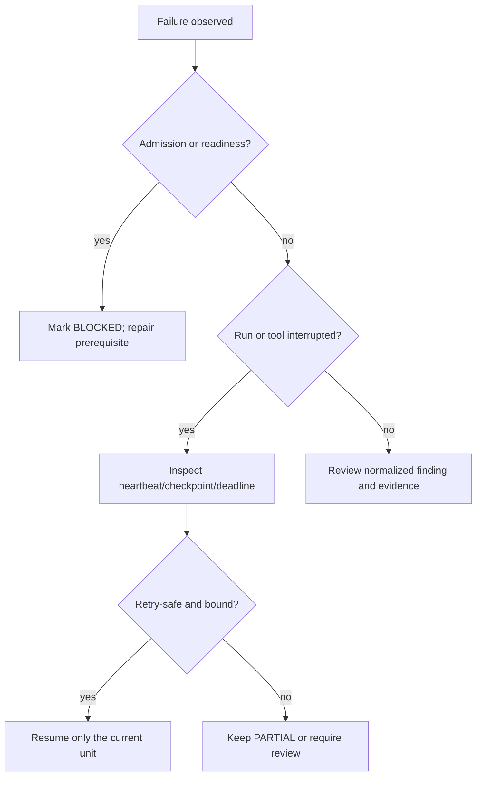

# Troubleshooting playbook

Diagnose from the environment that owns the failing step. Keep output
sanitized and stop at the first failed admission gate. A readiness or
infrastructure failure is `BLOCKED`, not a security finding.

| Symptom | Likely cause | Safe diagnostic | Safe remediation | Do not do |
| --- | --- | --- | --- | --- |
| Bootstrap blocked | qualification approval absent, wrong public-key file, or production mode | `[SERVER PHONE]` `task lite:harness:status`; inspect the public key fingerprint only | restart the supported key-bound qualification flow with the approved public key | request a bearer token, enable a bypass, or print secret environment values |
| Invalid signature | wrong key, canonical payload mismatch, or altered challenge | `[DEV PC]` rerun `task lite:harness:bootstrap PRINCIPAL_ID=<id> KEY_FILE=<path>` with the same private key | obtain a new single-use challenge and sign the exact returned payload | reuse a challenge or hand-edit a signature |
| Session expired | normal short authentication lease elapsed | `[DEV PC]` use the client renewal/reattach flow; inspect `task lite:harness:status` | create a fresh signed session for the same bounded principal | extend or persist the raw session token |
| Principal expired/revoked | qualification window ended or explicit revocation occurred | inspect sanitized principal/session status | provision a new disposable principal through operator approval | reactivate a revoked principal or grant Owner authority |
| Revision mismatch | phone is not running the reviewed SHA | `[DEV PC]` `git rev-parse HEAD`; `[SERVER PHONE]` inspect `git rev-parse HEAD` and clean status | publish and consume the exact intended revision | qualify an unpushed or mixed checkout |
| Dirty phone worktree | pre-existing local change or qualification artifact | `[SERVER PHONE]` `git status --short --branch` | stop and preserve evidence; resolve only through the established consumer workflow | edit, reset, clean, or commit the phone checkout |
| `OPA source update pending` | policy projection is not at the expected revision | `[DEV PC]` `task lite:security:assurance:policy-sync WAIT_SECONDS=120`; then `task lite:security:assurance:preflight SUITE=standard` | use the supported policy synchronization/reload process and wait for convergence; see the [preflight playbook](06-preflight.md) | bypass OPA or force an allow decision |
| OPA unavailable | policy service stopped or not ready | `task lite:security:assurance:preflight SUITE=standard` and the fixed OPA status/report | restore the supported OPA service; use the registered fault control only in explicit qualification | alter policy semantics or use a fallback Owner path |
| NATS/JetStream unavailable | broker or durable consumer not ready | `task lite:security:assurance:preflight SUITE=smoke` and inspect the sanitized run state | restore the supported service and allow reconnect/reconciliation | publish arbitrary subjects or delete streams/consumers |
| Worker unavailable | worker offline or heartbeat stale | `[SERVER PHONE]` `pm2 status`; inspect the run checkpoint/report | restart only through the supported worker/fault workflow, then reconcile | restart arbitrary processes or mark a run PASS manually |
| Scanner missing | registry tool is not discovered or receipt invalid | `[DEV PC]` `task lite:security:assurance:tools:check` | run the bounded installer/check workflow; record `FAILED` if it cannot qualify | use an unregistered binary or caller-supplied argv |
| Tool receipt invalid | checksum/signature or installation metadata mismatch | `task lite:security:assurance:tools:check` | reinstall through the pinned manager and remove temporary archives | trust an arbitrary PATH binary |
| Resource guard blocked | battery, thermal, memory, disk, or heavy-scan policy denied admission | `task lite:security:assurance:preflight SUITE=deep` | cool/charge/free resources and retry later; preserve `BLOCKED` evidence | disable the resource guard or run heavy tools concurrently |
| Run stale | heartbeat missed, worker restart, timeout, or API interruption | `task lite:security:assurance:report RUN_ID=<run-id>` and `...:compare RUN_ID=<run-id>` | use the supported resume/reconcile path and inspect checkpoint status | convert stale `RUNNING` to PASS or start a duplicate run |
| Checkpoint cannot resume | current tool is not retry-safe or revision/runtime binding changed | inspect run report and tool registry metadata | leave `PARTIAL`/`BLOCKED` and obtain operator review | rerun the entire suite without an admission decision |
| Deadline exceeded | suite run lease expired | inspect `summary.md`, performance, and current run status | preserve terminal status, triage partial evidence, and start a new explicitly admitted run if needed | extend the old deadline in place |
| Report incomplete | tool/parser failure, interrupted write, or redaction failure | inspect `sanitization.json`, `checksums.json`, and bounded logs | rerun the affected registered unit or mark `PARTIAL` | publish raw scanner output |
| Redaction failure | sensitive pattern found in candidate evidence | inspect only the sanitizer result and artifact reference | stop publication; fix the sanitizer/source on the DEV PC and rerun | view or copy the secret value |
| Cleanup failure | revoke/stop action did not complete | `task lite:harness:status`, `task lite:harness:verify-off`, health/readiness | retry supported revocation/stop and retain the failure evidence | delete database rows or reset the phone |

## Decision sequence

When a source-level defect is confirmed, return to the DEV PC, add a
regression test, publish the fix, consume that exact SHA on the phone, and
rerun the affected scenario. The Runtime Security Assurance Harness is not a
generic remote shell.
